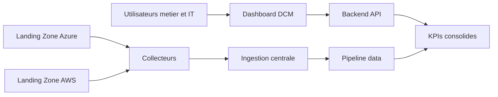
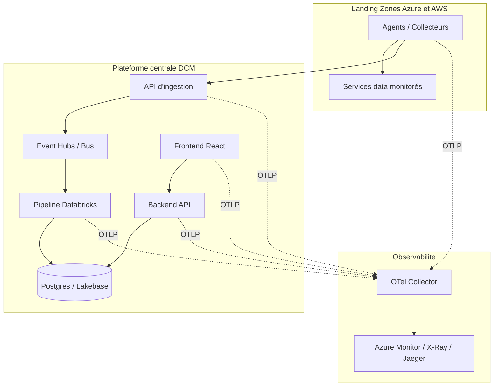
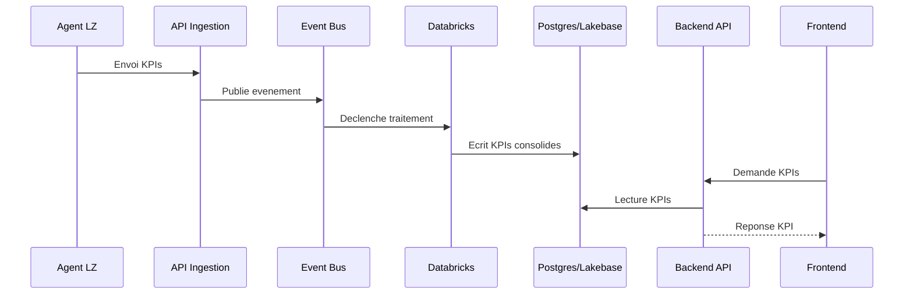

# DCM - Resume global fonctionnel et technique

## Objectif

Data Connect Monitoring (DCM) est une solution de supervision data qui collecte des KPIs depuis plusieurs Landing Zones Azure et AWS, centralise ces donnees, puis les restitue dans un dashboard pour le pilotage operationnel, FinOps et la qualite de service.

## Resume fonctionnel

- Collecter automatiquement les indicateurs data/FinOps sur des environnements cloud distribues.
- Centraliser et standardiser ces KPIs dans une plateforme unique.
- Donner une vue metier consolidée via API et dashboard.
- Detecter les anomalies de performance, de cout et de disponibilite.
- Fournir des traces end-to-end pour le diagnostic et l'amelioration continue.

### Vue fonctionnelle (Mermaid)

## Resume technique

La solution s'appuie sur une architecture distribuee de collecte (agents/collecteurs dans chaque Landing Zone) et une architecture centrale de traitement (ingestion, pipeline, stockage, API, frontend).

- **Collecte**: agents Python/.NET selon les zones Azure/AWS.
- **Ingestion**: API centrale + bus/evenements.
- **Traitement**: pipeline data (Databricks/Lakehouse selon le flux).
- **Stockage**: base transactionnelle et tables analytiques.
- **Exposition**: backend FastAPI/.NET + frontend React.
- **Observabilite**: OpenTelemetry + Collector + backends d'observabilite.

### Vue technique cible (Mermaid)

## Flux principal (de bout en bout)

## Valeur apportee

- Vision unifiee multi-cloud Azure/AWS.
- Meilleure maitrise des couts (FinOps) et des performances.
- Detection plus rapide des incidents data.
- Base solide pour la gouvernance et l'industrialisation.

## Priorites de mise en oeuvre

1. Stabiliser la collecte distribuee dans chaque Landing Zone.
2. Fiabiliser l'ingestion et le pipeline de transformation.
3. Standardiser le modele de donnees KPI.
4. Renforcer l'observabilite OpenTelemetry end-to-end.
5. Industrialiser les alertes et les tableaux de bord metier.
