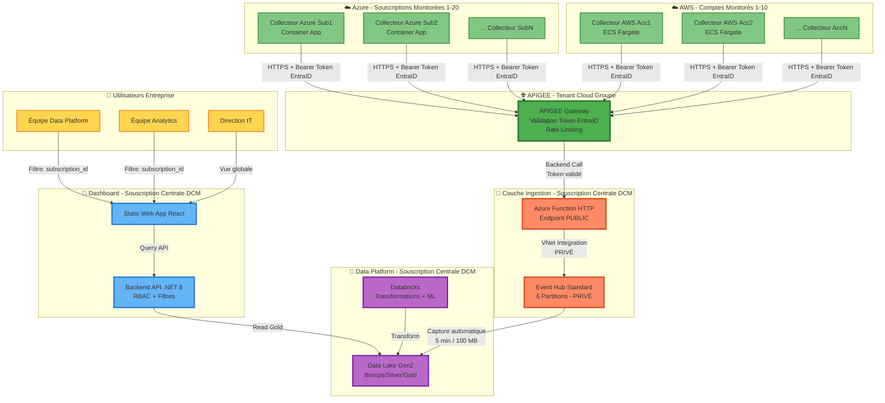
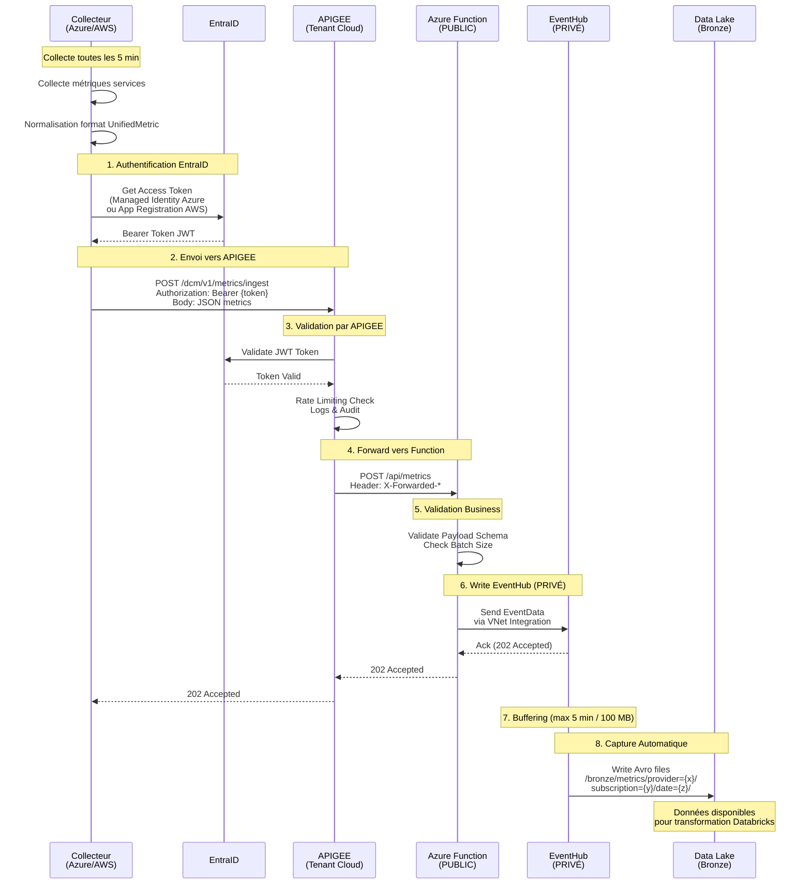

# 🏗️ Architecture DCM - Data Connect Monitoring

**Version** : 3.0 - Architecture Finale Validée  
**Date** : 14 Janvier 2026  
**Statut** : Architecture de Référence  

---

## 📋 Vue d'Ensemble

**DCM (Data Connect Monitoring)** est une plateforme centralisée de surveillance des services data déployés sur Azure et AWS, permettant à toute l'entreprise de consulter les métriques de leurs souscriptions respectives.

### Caractéristiques Principales

- **Multi-Cloud** : Azure + AWS
- **Multi-Souscriptions** : 20-50+ souscriptions/comptes monitorés
- **Multi-Tenancy** : Dashboard avec RBAC par Business Unit et souscription
- **Centralisé** : Infrastructure centrale unique sur Azure
- **Self-Service** : Les équipes visualisent leurs propres métriques

---

## 🎯 Architecture Globale de la Solution



---

## 📡 Architecture Détaillée : Couche Ingestion



---

## 🔧 Architecture Détaillée : Collecteur Azure

```mermaid
graph TB
    subgraph AzureSubscription["☁️ Souscription Azure Monitorée<br/>(Ex: data-prod-westeu)"]
        subgraph ContainerAppEnv["Container Apps Environment"]
            subgraph CollectorApp["Container App: azure-collector"]
                Worker[Worker Service .NET 8]
                Scheduler[Quartz.NET<br/>Cron: 0 */5 * * * *]
                AzureAdapter[AzureMetricsAdapter]
                Normalizer[Metrics Normalizer]
                Publisher[HTTP Event Publisher]
            end
            
            Identity[Managed Identity<br/>System Assigned]
        end
        
        subgraph VNet["VNet - data-prod-vnet"]
            subgraph PrivateSubnet["Subnet Private"]
                PE_KV[Private Endpoint<br/>→ Key Vault]
            end
        end
        
        subgraph Security["Sécurité Locale"]
            KV[Key Vault<br/>kv-collector-azure-sub1<br/>PRIVÉ]
        end
        
        subgraph MonitoredServices["Services Data Monitorés"]
            ADF[Data Factory<br/>API: Pipeline Runs]
            ADB[Databricks<br/>API: Job Runs]
            SQL[SQL Database<br/>API: Metrics]
            Synapse[Synapse Analytics<br/>API: Pipeline Activity]
        end
    end
    
    subgraph EntraID["🔐 Microsoft EntraID"]
        AppReg[App Registration<br/>DCM-Ingestion-API<br/>api://dcm-ingestion]
        TokenEndpoint[Token Endpoint<br/>OAuth 2.0]
    end
    
    subgraph External["🌐 Infrastructure Externe"]
        APIGEE[APIGEE Gateway<br/>Tenant Cloud Groupe<br/>https://apigee.groupe.com]
        DCM[DCM Central<br/>Azure Function + EventHub]
    end
    
    Worker -->|Schedule| Scheduler
    Scheduler -->|Trigger toutes les 5 min| AzureAdapter
    
    AzureAdapter -->|Read via Managed Identity| ADF
    AzureAdapter -->|Read via Managed Identity| ADB
    AzureAdapter -->|Read via Managed Identity| SQL
    AzureAdapter -->|Read via Managed Identity| Synapse
    
    AzureAdapter -->|Raw Metrics| Normalizer
    Normalizer -->|UnifiedMetric JSON| Publisher
    
    Publisher -->|Get Secrets via PE| PE_KV
    PE_KV -->|Private Link| KV
    KV -->|Return Secret| Publisher
    
    CollectorApp -->|Use| Identity
    Identity -->|Request Token<br/>Scope: api://dcm-ingestion/.default| TokenEndpoint
    TokenEndpoint -->|Validate| AppReg
    AppReg -->|JWT Bearer Token<br/>Valid 1h| Identity
    Identity -->|Token| Publisher
    
    Publisher -->|POST /dcm/v1/metrics/ingest<br/>Authorization: Bearer {token}<br/>Body: JSON metrics| APIGEE
    APIGEE -->|Forward| DCM
    
    Identity -.->|RBAC: Reader| MonitoredServices
    Identity -.->|RBAC: Key Vault Secrets User| KV
    
    classDef infrastructure fill:#E3F2FD,stroke:#1976D2,stroke-width:3px
    classDef compute fill:#B3E5FC,stroke:#0277BD,stroke-width:2px
    classDef security fill:#FFCCBC,stroke:#E64A19,stroke-width:3px
    classDef auth fill:#FFF9C4,stroke:#F57F17,stroke-width:2px
    classDef services fill:#C8E6C9,stroke:#388E3C,stroke-width:2px
    classDef external fill:#4CAF50,stroke:#2E7D32,stroke-width:3px
    
    class AzureSubscription,ContainerAppEnv infrastructure
    class CollectorApp,Worker,Scheduler,AzureAdapter,Normalizer,Publisher compute
    class KV,PE_KV,VNet security
    class Identity,EntraID,AppReg,TokenEndpoint auth
    class ADF,ADB,SQL,Synapse,MonitoredServices services
    class APIGEE,DCM external
```

---

## 🔧 Architecture Détaillée : Collecteur AWS

```mermaid
graph TB
    subgraph AWSAccount["☁️ Compte AWS Monitoré<br/>(Ex: data-prod-us-east-1)"]
        subgraph ECSCluster["ECS Cluster Fargate"]
            subgraph TaskDefinition["ECS Task Definition"]
                subgraph Container["Container: aws-collector"]
                    Worker[Worker Service .NET 8]
                    Scheduler[Quartz.NET<br/>Cron: 0 */5 * * * *]
                    AwsAdapter[AwsMetricsAdapter]
                    Normalizer[Metrics Normalizer]
                    Publisher[HTTP Event Publisher]
                end
            end
            
            TaskRole[IAM Task Role<br/>MonitoringCollectorRole]
        end
        
        subgraph VPC["VPC - data-prod-vpc"]
            subgraph PrivateSubnet["Private Subnet"]
                Task[ECS Task]
                VPCEndpoint[VPC Endpoint<br/>→ Secrets Manager]
            end
            
            subgraph PublicSubnet["Public Subnet"]
                NAT[NAT Gateway<br/>→ Internet]
            end
        end
        
        subgraph Security["Sécurité Locale"]
            SM[Secrets Manager<br/>monitoring/collector/*<br/>PRIVÉ via VPC Endpoint]
        end
        
        subgraph MonitoredServices["Services Data Monitorés"]
            Glue[AWS Glue<br/>API: GetJobs, GetJobRuns]
            EMR[EMR<br/>API: ListClusters, DescribeCluster]
            Redshift[Redshift<br/>API: DescribeClusters]
            RDS[RDS<br/>API: DescribeDBInstances]
        end
    end
    
    subgraph EntraID["🔐 Microsoft EntraID"]
        AppReg[App Registration<br/>DCM-Ingestion-API<br/>Client ID + Secret]
        TokenEndpoint[Token Endpoint<br/>OAuth 2.0]
    end
    
    subgraph External["🌐 Infrastructure Externe"]
        APIGEE[APIGEE Gateway<br/>Tenant Cloud Groupe<br/>https://apigee.groupe.com]
        DCM[DCM Central<br/>Azure Function + EventHub]
    end
    
    Worker -->|Schedule| Scheduler
    Scheduler -->|Trigger toutes les 5 min| AwsAdapter
    
    AwsAdapter -->|AWS SDK + IAM Role| Glue
    AwsAdapter -->|AWS SDK + IAM Role| EMR
    AwsAdapter -->|AWS SDK + IAM Role| Redshift
    AwsAdapter -->|AWS SDK + IAM Role| RDS
    
    AwsAdapter -->|Raw Metrics| Normalizer
    Normalizer -->|UnifiedMetric JSON| Publisher
    
    Task -->|Get Secrets via VPC Endpoint| VPCEndpoint
    VPCEndpoint -->|Private Connection| SM
    SM -->|Return Secrets| Publisher
    
    Publisher -->|Get Client ID + Secret| SM
    Publisher -->|Request Token<br/>Scope: api://dcm-ingestion/.default<br/>ClientSecretCredential| TokenEndpoint
    TokenEndpoint -->|Validate| AppReg
    AppReg -->|JWT Bearer Token<br/>Valid 1h| Publisher
    
    Task -->|Outbound via| NAT
    NAT -->|Internet HTTPS| APIGEE
    
    Publisher -->|POST /dcm/v1/metrics/ingest<br/>Authorization: Bearer {token}<br/>Body: JSON metrics| APIGEE
    APIGEE -->|Forward| DCM
    
    Container -->|Assume| TaskRole
    TaskRole -.->|IAM Policy: ReadOnlyAccess| MonitoredServices
    TaskRole -.->|IAM Policy: GetSecretValue| SM
    
    classDef infrastructure fill:#FF9800,stroke:#E65100,stroke-width:3px
    classDef compute fill:#FFE0B2,stroke:#F57C00,stroke-width:2px
    classDef security fill:#FFCCBC,stroke:#E64A19,stroke-width:3px
    classDef auth fill:#FFF9C4,stroke:#F57F17,stroke-width:2px
    classDef services fill:#C8E6C9,stroke:#388E3C,stroke-width:2px
    classDef external fill:#4CAF50,stroke:#2E7D32,stroke-width:3px
    classDef network fill:#B2DFDB,stroke:#00796B,stroke-width:2px
    
    class AWSAccount,ECSCluster infrastructure
    class TaskDefinition,Container,Worker,Scheduler,AwsAdapter,Normalizer,Publisher compute
    class SM,VPCEndpoint security
    class TaskRole,EntraID,AppReg,TokenEndpoint auth
    class Glue,EMR,Redshift,RDS,MonitoredServices services
    class APIGEE,DCM external
    class VPC,PrivateSubnet,PublicSubnet,NAT network
```

---

## 🔐 Authentification et Sécurité

### Flux d'Authentification EntraID

#### Collecteur Azure (Managed Identity)

```
1. Container App → Managed Identity activée
2. Managed Identity → EntraID Token Request
   Scope: api://dcm-ingestion/.default
3. EntraID → JWT Token (valide 1h)
4. Collecteur → POST APIGEE avec Bearer Token
5. APIGEE → Valide token auprès EntraID
6. APIGEE → Forward vers Function (token validé)
```

#### Collecteur AWS (App Registration + Client Secret)

```
1. ECS Task → Read Client Secret depuis Secrets Manager
2. Code .NET → ClientSecretCredential(tenantId, clientId, clientSecret)
3. ClientSecretCredential → EntraID Token Request
   Scope: api://dcm-ingestion/.default
4. EntraID → JWT Token (valide 1h)
5. Collecteur → POST APIGEE avec Bearer Token
6. APIGEE → Valide token auprès EntraID
7. APIGEE → Forward vers Function (token validé)
```

### App Registration EntraID pour DCM

**À créer dans EntraID du groupe :**

```yaml
App Registration:
  Name: DCM-Ingestion-API
  Application ID URI: api://dcm-ingestion
  
  API Permissions:
    - User.Read (Microsoft Graph) - pour info user
  
  Expose an API:
    - Scope: api://dcm-ingestion/Metrics.Write
    - Description: "Allow collectors to write metrics to DCM"
    - Who can consent: Admins and users
  
  App Roles (optionnel):
    - Collector.Azure
    - Collector.AWS
  
  Clients autorisés:
    - Managed Identities des Container Apps Azure (automatic)
    - Service Principals pour collecteurs AWS (à créer)
```

---

## 💾 Organisation Data Lake Multi-Souscriptions

### Structure Bronze Layer

```
/bronze/metrics/
├── provider=azure/
│   ├── subscription_id=12345678-1234-1234-1234-123456789abc/  # Sub1
│   │   ├── subscription_name=data-prod-westeu/
│   │   ├── business_unit=data-platform/
│   │   ├── environment=production/
│   │   ├── year=2026/
│   │   │   ├── month=01/
│   │   │   │   ├── day=14/
│   │   │   │   │   ├── hour=10/
│   │   │   │   │   │   ├── partition_0_2026011410_001.avro
│   │   │   │   │   │   └── partition_1_2026011410_001.avro
│   │   │   
│   ├── subscription_id=87654321-4321-4321-4321-cba987654321/  # Sub2
│   │   ├── subscription_name=analytics-dev-westeu/
│   │   ├── ...
│   
├── provider=aws/
│   ├── account_id=123456789012/  # Account1
│   │   ├── account_name=data-prod-us-east-1/
│   │   ├── business_unit=data-platform/
│   │   ├── environment=production/
│   │   ├── year=2026/...
```

### Métadonnées Collecteur dans chaque Métrique

Chaque métrique envoyée contient :

```json
{
  "metric_id": "uuid",
  "timestamp": "2026-01-14T10:05:00Z",
  "provider": "Azure",
  "subscription_id": "12345678-1234-1234-1234-123456789abc",
  "subscription_name": "data-prod-westeu",
  "business_unit": "Data Platform",
  "environment": "Production",
  "cost_center": "CC-12345",
  "owner_email": "team-data@company.com",
  "collector_id": "azure-data-prod-we-001",
  "service_type": "ETL_Orchestration",
  "service_name": "adf-data-prod",
  "metric_name": "pipeline_succeeded_runs",
  "value": 42,
  "unit": "Count",
  "status": "Success"
}
```

---

## 🏢 Configuration Multi-Instances

### Inventaire des Collecteurs (Exemple 30 Collecteurs)

**Azure : 20 Collecteurs**

| Collector ID | Subscription Name | Environment | Business Unit | Region |
|--------------|-------------------|-------------|---------------|--------|
| azure-data-prod-we-001 | data-prod-westeu | Production | Data Platform | West Europe |
| azure-data-dev-we-002 | data-dev-westeu | Development | Data Platform | West Europe |
| azure-analytics-prod-ne-003 | analytics-prod-northeu | Production | Analytics | North Europe |
| ... | ... | ... | ... | ... |

**AWS : 10 Collecteurs**

| Collector ID | Account Name | Environment | Business Unit | Region |
|--------------|--------------|-------------|---------------|--------|
| aws-data-prod-use1-001 | data-prod-us-east-1 | Production | Data Platform | us-east-1 |
| aws-analytics-dev-euw1-002 | analytics-dev-eu-west-1 | Development | Analytics | eu-west-1 |
| ... | ... | ... | ... | ... |

### Déploiement Automatisé

**Terraform Module Réutilisable :**

```hcl
module "azure_collector" {
  source = "./modules/azure-collector"
  
  for_each = { for c in var.collectors : c.subscription_id => c }
  
  collector_id      = each.value.collector_id
  subscription_id   = each.value.subscription_id
  subscription_name = each.value.subscription_name
  environment       = each.value.environment
  business_unit     = each.value.business_unit
  cost_center       = each.value.cost_center
  owner_email       = each.value.owner_email
  
  container_image   = "acrmonitoring.azurecr.io/dcm-collector:latest"
  apigee_endpoint   = "https://apigee.groupe.com/dcm/v1/metrics/ingest"
}
```

---

## 💰 Dimensionnement et Coûts

### Infrastructure Centrale (30 Collecteurs)

| Composant | Configuration | Coût/Mois |
|-----------|---------------|-----------|
| **APIGEE** | Tenant Cloud Groupe | 0€ (mutualisé) |
| **Azure Function Ingestion** | Consumption (30M exec/mois) | 5€ |
| **EventHub Standard** | 2 TU, 6 partitions, 7j retention | 37€ |
| **Data Lake Gen2** | 5 TB (Bronze 2TB, Silver 2TB, Gold 1TB) | 300€ |
| **Backend API** | App Service P1v3 Linux | 140€ |
| **Databricks Premium** | 100 DBU/jour | 1,800€ |
| **Dashboard** | Static Web App Standard | 8€ |
| **Application Insights** | 100 GB logs/mois | 80€ |
| **Key Vault Central** | Standard | 5€ |
| **Container Registry** | Premium 500GB | 60€ |
| **Divers** | Log Analytics, etc. | 45€ |
| **TOTAL CENTRAL** | | **2,480€/mois** |

### Par Collecteur

| Composant | Azure (Container App) | AWS (ECS Fargate) |
|-----------|----------------------|-------------------|
| Compute | 4€ | 4€ |
| Secrets Manager | 5€ (Key Vault) | 5€ (Secrets Manager) |
| Storage Data Lake (incrémental) | 3€ | 3€ |
| **Total/Collecteur** | **12€/mois** | **12€/mois** |

### Coût Total (30 Collecteurs)

```
Infrastructure Centrale:     2,480€/mois
Collecteurs (30 × 12€):        360€/mois
─────────────────────────────────────────
TOTAL:                       2,840€/mois
```

**Coût par souscription monitorée** : 2,840€ / 30 = **95€/mois**

### Scaling Prévisionnel

| Nombre Collecteurs | Infra Centrale | Collecteurs | Total/Mois | €/Collecteur |
|-------------------|----------------|-------------|------------|--------------|
| 10 | 2,480€ | 120€ | 2,600€ | 260€ |
| 30 | 2,480€ | 360€ | 2,840€ | 95€ |
| 50 | 2,700€ | 600€ | 3,300€ | 66€ |
| 100 | 3,500€ | 1,200€ | 4,700€ | 47€ |

*Coût dégressif avec le volume*

---

## 📊 Composants Techniques Détaillés

### Azure Function Ingestion

```yaml
Name: func-dcm-ingestion
Plan: Consumption
Region: West Europe

Function: IngestMetrics
  Trigger: HTTP
  Method: POST
  Route: /api/metrics
  AuthLevel: Anonymous (validation par APIGEE)
  
  Bindings:
    Input: HttpTrigger
    Output: EventHub (connection via VNet Integration)
  
  Configuration:
    FUNCTIONS_WORKER_RUNTIME: dotnet-isolated
    EventHub__ConnectionString: @Microsoft.KeyVault(SecretUri=https://kv-dcm-central.vault.azure.net/secrets/EventHub-ConnectionString)
    EventHub__Name: metrics-ingestion
  
  Networking:
    VNet Integration: Enabled
    Subnet: snet-functions-dcm (dans vnet-dcm-central)
    Outbound: Private vers EventHub
    Inbound: Public (appelé par APIGEE)
  
  Monitoring:
    Application Insights: Enabled
    Log Level: Information
```

### EventHub Standard

```yaml
Namespace: eh-dcm-prod
Tier: Standard
Region: West Europe

Configuration:
  Throughput Units:
    Baseline: 2 TU
    Auto-Inflate: Enabled
    Maximum: 20 TU
  
Event Hub: metrics-ingestion
  Partitions: 6
    - Partition 0-1: Azure Subscription 1
    - Partition 2-3: Azure Subscription 2-N
    - Partition 4-5: AWS Account 1-N
  
  Message Retention: 7 jours
  
  Capture:
    Enabled: true
    Encoding: Avro
    Interval: 300 seconds (5 minutes)
    Size Limit: 104,857,600 bytes (100 MB)
    Destination: Azure Storage (Data Lake Gen2)
    Path: bronze/metrics/{Namespace}/{EventHub}/{PartitionId}/{Year}/{Month}/{Day}/{Hour}/{Minute}/{Second}
  
  Network:
    Public Network Access: Disabled
    Private Endpoint: Enabled
      - VNet: vnet-dcm-central
      - Subnet: snet-private-endpoints
  
  Security:
    Authorization:
      - Azure Function: System Assigned Managed Identity
        Role: Azure Event Hubs Data Sender
```

### Data Lake Gen2

```yaml
Storage Account: stdcmprod
Tier: Standard (LRS)
Region: West Europe
Hierarchical Namespace: Enabled

Containers:
  - bronze (raw data)
  - silver (cleaned data)
  - gold (aggregated data)
  - models (ML models)

Network:
  Public Access: Disabled
  Private Endpoints:
    - pe-datalake-blob (blob service)
    - pe-datalake-dfs (ADLS Gen2 service)
  Firewall: Deny all public access

Lifecycle Management:
  Bronze:
    - Hot → Cool après 30 jours
    - Cool → Archive après 90 jours
    - Delete après 365 jours
  Silver:
    - Hot → Cool après 90 jours
    - Delete après 730 jours (2 ans)
  Gold:
    - Hot (permanent)
    - Retention 5 ans
```

---

## 🔒 Sécurité et Conformité

### Matrice d'Accès

| Composant | Accès Depuis | Type Connexion | Authentification |
|-----------|--------------|----------------|------------------|
| **APIGEE** | Internet (collecteurs) | HTTPS Public | EntraID JWT Token |
| **Function Ingestion** | APIGEE | HTTPS Public | Validation par APIGEE |
| **EventHub** | Function | VNet Integration | Managed Identity |
| **Data Lake** | Function, Databricks, API | Private Endpoint | Managed Identity |
| **Backend API** | Dashboard | Private Endpoint | Managed Identity |
| **Dashboard** | Utilisateurs | HTTPS Public | EntraID (MSAL.js) |

### Principe de Moindre Privilège

**Azure Function :**
- Droits : Azure Event Hubs Data Sender (EventHub uniquement)
- Pas d'accès : Data Lake, autres ressources

**Backend API :**
- Droits : Storage Blob Data Reader (Data Lake)
- Droits : Databricks Contributor (pour queries)

**Databricks :**
- Droits : Storage Blob Data Contributor (Data Lake)
- Droits : Read/Write toutes les couches (Bronze/Silver/Gold)

**Collecteurs :**
- Droits Azure : Reader (souscription monitorée)
- Droits AWS : ReadOnlyAccess policies
- Pas d'accès direct : Infrastructure centrale DCM

---

## 📋 Récapitulatif Architecture Validée

### Décisions Techniques

| Aspect | Décision | Justification |
|--------|----------|---------------|
| **Gateway** | APIGEE (Tenant Cloud) | Imposé groupe, valide token EntraID |
| **API Publique** | Azure Function Consumption | Simple, économique, VNet Integration |
| **Backend Ingestion** | EventHub Standard 2 TU | Private Endpoint, Capture auto, moins cher |
| **Partitions** | 6 partitions | 3 collecteurs types × 2 |
| **Authentification** | EntraID (Azure AD) | Fédérateur commun Azure + AWS |
| **Data Lake** | Medallion (Bronze/Silver/Gold) | Standard industrie |
| **Multi-Cloud** | Azure + AWS | GCP exclu (pas utilisé) |
| **Multi-Instances** | 20-50+ collecteurs | 1 collecteur par souscription/compte |

### Flux de Données Complet

```
Collecteur (Azure/AWS)
  ↓ EntraID Auth (Bearer Token)
APIGEE Gateway
  ↓ Token validé + Rate Limiting
Azure Function HTTP (Public)
  ↓ VNet Integration (Privé)
EventHub Standard (Privé)
  ↓ Capture automatique (5 min / 100 MB)
Data Lake Bronze (Privé)
  ↓ Databricks Job quotidien
Data Lake Silver (Privé)
  ↓ Databricks Job quotidien
Data Lake Gold (Privé)
  ↓ Backend API
Dashboard React
  ↓ RBAC par BU/Subscription
Utilisateurs Entreprise
```

### Conformité Building Blocs Entreprise

✅ **APIGEE** : Passage obligatoire pour tous les appels externes  
✅ **Subnet Privé** : EventHub et Data Lake en Private Endpoint uniquement  
✅ **EntraID** : Authentification centralisée pour Azure et AWS  
✅ **Isolation Réseau** : Collecteurs ne communiquent jamais en privé avec DCM  
✅ **Sécurité** : Chaque collecteur a son Key Vault/Secrets Manager local  

---

**Document d'Architecture de Référence**  
**Version** : 3.0  
**Date** : 14 Janvier 2026  
**Statut** : **ARCHITECTURE VALIDÉE - PRÊTE POUR IMPLÉMENTATION**

