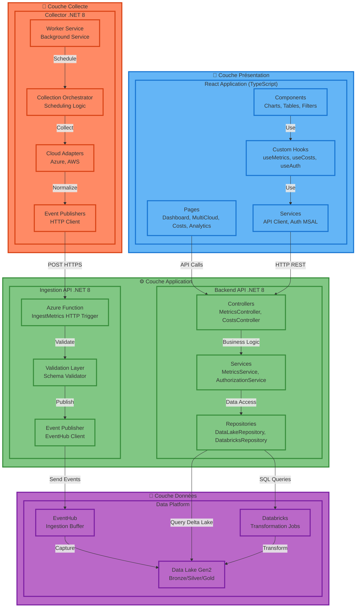
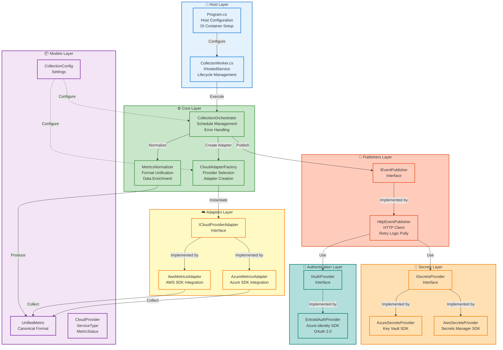
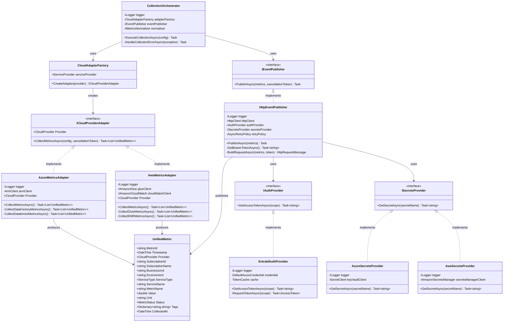
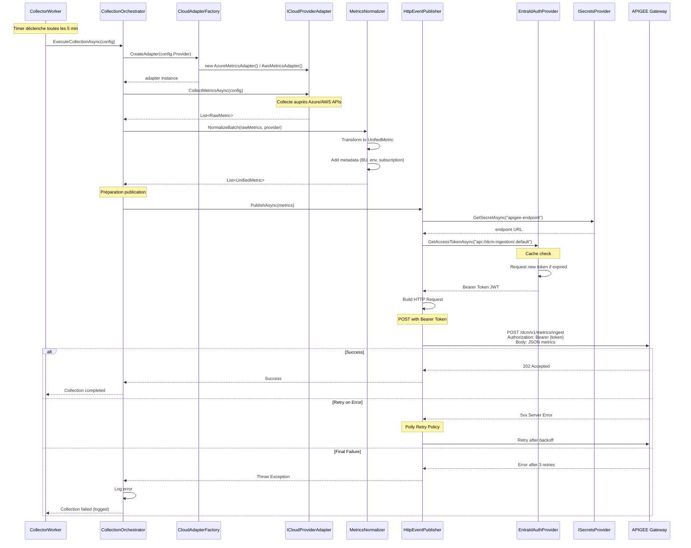

# 🧩 Architecture Logique DCM - Data Connect Monitoring

**Version** : 3.0  
**Date** : 14 Janvier 2026  
**Type** : Architecture Logique et Packages

---

## 📋 Vue d'Ensemble

Ce document décrit l'organisation logique de la solution DCM :
- **Couches logicielles** de la solution globale
- **Packages et modules** .NET et React
- **Architecture logique** des collecteurs
- **Interfaces et contrats** entre composants

---

## 🏗️ Architecture Logique Globale



---

## 📦 Structure des Packages - Solution Globale

### Backend API .NET 8

```
DataMonitoring.Solution/
│
├── DataMonitoring.Api/                      # Web API REST
│   ├── Controllers/
│   │   ├── MetricsController.cs            # GET /api/metrics
│   │   ├── CostsController.cs              # GET /api/costs
│   │   └── DatabricksController.cs         # GET /api/ml/predictions
│   ├── Middleware/
│   │   ├── AuthorizationMiddleware.cs      # RBAC par subscription
│   │   └── ExceptionHandlingMiddleware.cs
│   ├── Program.cs
│   └── appsettings.json
│
├── DataMonitoring.Application/              # Logique métier
│   ├── Services/
│   │   ├── IMetricsService.cs
│   │   ├── MetricsService.cs
│   │   ├── IAuthorizationService.cs
│   │   └── AuthorizationService.cs         # Filtrage par BU/subscription
│   ├── DTOs/
│   │   ├── MetricQueryRequest.cs
│   │   ├── MetricResponse.cs
│   │   └── CostSummaryResponse.cs
│   └── Validators/
│       └── MetricQueryValidator.cs
│
├── DataMonitoring.Domain/                   # Modèles métier
│   ├── Entities/
│   │   ├── Metric.cs
│   │   ├── Cost.cs
│   │   └── Subscription.cs
│   ├── Enums/
│   │   ├── CloudProvider.cs                # Azure, AWS
│   │   ├── ServiceType.cs
│   │   └── Environment.cs
│   └── ValueObjects/
│       ├── SubscriptionId.cs
│       └── BusinessUnit.cs
│
├── DataMonitoring.Infrastructure.DataLake/  # Accès Data Lake
│   ├── Repositories/
│   │   ├── IDataLakeRepository.cs
│   │   ├── DataLakeRepository.cs           # Queries Delta Lake
│   │   └── DatabricksRepository.cs         # SQL Warehouse queries
│   ├── Configuration/
│   │   └── DataLakeOptions.cs
│   └── Mappers/
│       └── DeltaLakeMapper.cs
│
└── DataMonitoring.Infrastructure.Auth/      # Authentification
    ├── Services/
    │   ├── ITokenValidationService.cs
    │   └── EntraIdTokenValidator.cs
    └── Models/
        └── UserClaims.cs
```

### Ingestion Function .NET 8

```
DataMonitoring.Ingestion/
│
├── Functions/
│   └── IngestMetrics.cs                     # HTTP Trigger
│
├── Services/
│   ├── IPayloadValidator.cs
│   ├── PayloadValidator.cs
│   └── IEventHubPublisher.cs
│
├── Models/
│   └── MetricBatch.cs
│
├── host.json
└── local.settings.json
```

### Frontend React TypeScript

```
dcm-dashboard/
│
├── src/
│   ├── pages/                               # Pages routes
│   │   ├── Dashboard.tsx
│   │   ├── MultiCloudView.tsx
│   │   ├── CostAnalysis.tsx
│   │   └── MLInsights.tsx
│   │
│   ├── components/                          # Composants réutilisables
│   │   ├── common/
│   │   │   ├── MetricCard.tsx
│   │   │   ├── ChartContainer.tsx
│   │   │   └── FilterBar.tsx
│   │   ├── metrics/
│   │   │   ├── MetricsTimeSeries.tsx
│   │   │   └── MetricsComparison.tsx
│   │   └── costs/
│   │       ├── CostBreakdown.tsx
│   │       └── CostTrends.tsx
│   │
│   ├── hooks/                               # Custom React Hooks
│   │   ├── useMetrics.ts
│   │   ├── useCosts.ts
│   │   ├── useAuth.ts                      # MSAL.js integration
│   │   └── useFilters.ts
│   │
│   ├── services/                            # API clients
│   │   ├── api/
│   │   │   ├── metricsApi.ts
│   │   │   ├── costsApi.ts
│   │   │   └── mlApi.ts
│   │   ├── auth/
│   │   │   └── msalConfig.ts              # EntraID config
│   │   └── httpClient.ts
│   │
│   ├── models/                              # TypeScript types
│   │   ├── Metric.ts
│   │   ├── Cost.ts
│   │   ├── CloudProvider.ts
│   │   └── User.ts
│   │
│   ├── store/                               # État global (React Query)
│   │   ├── queryClient.ts
│   │   └── cacheConfig.ts
│   │
│   └── utils/
│       ├── formatters.ts
│       ├── dateUtils.ts
│       └── chartHelpers.ts
│
├── public/
├── package.json
└── tsconfig.json
```

---

## 🔧 Architecture Logique Collecteur

### Vue d'Ensemble Packages Collecteur



### Structure Packages Collecteur

```
DataMonitoring.Collector/
│
├── Program.cs                               # Entry point + DI
├── CollectorWorker.cs                       # IHostedService
│
├── Core/                                    # Logique orchestration
│   ├── CollectionOrchestrator.cs
│   ├── CloudAdapterFactory.cs
│   └── MetricsNormalizer.cs
│
├── Interfaces/                              # Contrats
│   ├── ICloudProviderAdapter.cs
│   ├── IEventPublisher.cs
│   ├── ISecretsProvider.cs
│   ├── IAuthProvider.cs
│   └── IMetricsNormalizer.cs
│
├── Adapters/                                # Implémentations cloud
│   ├── AzureMetricsAdapter.cs              # Azure SDK
│   └── AwsMetricsAdapter.cs                # AWS SDK
│
├── Publishers/                              # Publication événements
│   ├── HttpEventPublisher.cs               # HTTP + Polly retry
│   └── RetryPolicies.cs
│
├── Authentication/                          # Auth EntraID
│   ├── EntraIdAuthProvider.cs              # Azure.Identity
│   └── TokenCache.cs
│
├── Secrets/                                 # Gestion secrets
│   ├── AzureSecretsProvider.cs             # Key Vault
│   └── AwsSecretsProvider.cs               # Secrets Manager
│
├── Models/                                  # Modèles de données
│   ├── UnifiedMetric.cs                    # Format canonique
│   ├── CollectionConfig.cs
│   ├── CloudProvider.cs                    # Enum
│   ├── ServiceType.cs                      # Enum
│   └── MetricStatus.cs                     # Enum
│
├── Configuration/                           # Configuration
│   ├── CollectorOptions.cs
│   ├── ApigeeOptions.cs
│   └── SchedulingOptions.cs
│
└── appsettings.json
```

---

## 🎯 Diagramme de Classes - Collecteur

### Classes Principales



---

## 🔄 Séquence d'Exécution Collecteur



---

## 📋 Interfaces Clés

### ICloudProviderAdapter

```csharp
public interface ICloudProviderAdapter
{
    /// <summary>
    /// Cloud provider supporté (Azure ou AWS)
    /// </summary>
    CloudProvider Provider { get; }
    
    /// <summary>
    /// Collecte les métriques du provider
    /// </summary>
    /// <param name="config">Configuration de collecte</param>
    /// <param name="cancellationToken">Token d'annulation</param>
    /// <returns>Liste de métriques au format unifié</returns>
    Task<List<UnifiedMetric>> CollectMetricsAsync(
        CollectionConfig config,
        CancellationToken cancellationToken = default);
}
```

### IEventPublisher

```csharp
public interface IEventPublisher
{
    /// <summary>
    /// Publie un batch de métriques vers APIGEE
    /// </summary>
    /// <param name="metrics">Métriques à publier</param>
    /// <param name="cancellationToken">Token d'annulation</param>
    Task PublishAsync(
        IEnumerable<UnifiedMetric> metrics,
        CancellationToken cancellationToken = default);
}
```

### IAuthProvider

```csharp
public interface IAuthProvider
{
    /// <summary>
    /// Obtient un token d'accès EntraID
    /// </summary>
    /// <param name="scope">Scope demandé (ex: api://dcm-ingestion/.default)</param>
    /// <returns>JWT Bearer token</returns>
    Task<string> GetAccessTokenAsync(string scope);
}
```

### ISecretsProvider

```csharp
public interface ISecretsProvider
{
    /// <summary>
    /// Récupère un secret depuis Key Vault ou Secrets Manager
    /// </summary>
    /// <param name="secretName">Nom du secret</param>
    /// <returns>Valeur du secret</returns>
    Task<string> GetSecretAsync(string secretName);
}
```

---

## 🎨 Patterns de Conception Utilisés

### 1. **Adapter Pattern**
- **Usage** : `ICloudProviderAdapter`, `AzureMetricsAdapter`, `AwsMetricsAdapter`
- **Objectif** : Abstraction des différences entre Azure et AWS
- **Bénéfice** : Ajout de nouveaux providers facile

### 2. **Factory Pattern**
- **Usage** : `CloudAdapterFactory`
- **Objectif** : Création dynamique d'adapters selon config
- **Bénéfice** : Découplage et testabilité

### 3. **Repository Pattern**
- **Usage** : `DataLakeRepository`, `DatabricksRepository`
- **Objectif** : Abstraction de l'accès aux données
- **Bénéfice** : Changement de storage transparent

### 4. **Strategy Pattern**
- **Usage** : `ISecretsProvider` (Azure vs AWS)
- **Objectif** : Sélection algorithme selon contexte
- **Bénéfice** : Flexibilité multi-cloud

### 5. **Dependency Injection**
- **Usage** : Partout via .NET DI Container
- **Objectif** : Inversion de contrôle
- **Bénéfice** : Testabilité et maintenabilité

---

## 🧪 Testabilité

### Tests Unitaires

```csharp
// Example: Test AzureMetricsAdapter
public class AzureMetricsAdapterTests
{
    [Fact]
    public async Task CollectMetricsAsync_WhenDataFactoryHasRuns_ReturnsMetrics()
    {
        // Arrange
        var mockArmClient = new Mock<ArmClient>();
        var adapter = new AzureMetricsAdapter(
            Mock.Of<ILogger<AzureMetricsAdapter>>(),
            mockArmClient.Object);
        
        var config = new CollectionConfig
        {
            CloudProvider = CloudProvider.Azure,
            Services = new List<ServiceTypeConfig>
            {
                new() { Type = ServiceType.ETL_Orchestration, Enabled = true }
            }
        };
        
        // Act
        var metrics = await adapter.CollectMetricsAsync(config);
        
        // Assert
        Assert.NotEmpty(metrics);
        Assert.All(metrics, m => Assert.Equal(CloudProvider.Azure, m.Provider));
    }
}
```

### Tests d'Intégration

```csharp
// Example: Test HttpEventPublisher avec APIGEE
public class HttpEventPublisherIntegrationTests : IClassFixture<WebApplicationFactory>
{
    [Fact]
    public async Task PublishAsync_WithValidToken_Returns202Accepted()
    {
        // Arrange
        var publisher = new HttpEventPublisher(
            logger, httpClient, authProvider, secretsProvider);
        
        var metrics = new List<UnifiedMetric>
        {
            new() { /* ... */ }
        };
        
        // Act
        await publisher.PublishAsync(metrics);
        
        // Assert - No exception thrown = success
    }
}
```

---

## 📦 Dépendances NuGet Principales

### Collecteur

```xml
<ItemGroup>
  <!-- Host & DI -->
  <PackageReference Include="Microsoft.Extensions.Hosting" Version="8.0.0" />
  
  <!-- Azure SDK -->
  <PackageReference Include="Azure.Identity" Version="1.10.4" />
  <PackageReference Include="Azure.ResourceManager" Version="1.9.0" />
  <PackageReference Include="Azure.ResourceManager.DataFactory" Version="1.0.0" />
  <PackageReference Include="Azure.Security.KeyVault.Secrets" Version="4.5.0" />
  
  <!-- AWS SDK -->
  <PackageReference Include="AWSSDK.Core" Version="3.7.300" />
  <PackageReference Include="AWSSDK.Glue" Version="3.7.300" />
  <PackageReference Include="AWSSDK.SecretsManager" Version="3.7.300" />
  
  <!-- Scheduling -->
  <PackageReference Include="Quartz" Version="3.8.0" />
  <PackageReference Include="Quartz.Extensions.Hosting" Version="3.8.0" />
  
  <!-- Resilience -->
  <PackageReference Include="Polly" Version="8.2.0" />
  
  <!-- Logging -->
  <PackageReference Include="Serilog.Extensions.Hosting" Version="8.0.0" />
  <PackageReference Include="Serilog.Sinks.ApplicationInsights" Version="4.0.0" />
</ItemGroup>
```

### Backend API

```xml
<ItemGroup>
  <!-- Web API -->
  <PackageReference Include="Microsoft.AspNetCore.OpenApi" Version="8.0.0" />
  <PackageReference Include="Swashbuckle.AspNetCore" Version="6.5.0" />
  
  <!-- Auth -->
  <PackageReference Include="Microsoft.Identity.Web" Version="2.15.0" />
  
  <!-- Data Access -->
  <PackageReference Include="Azure.Storage.Blobs" Version="12.19.0" />
  <PackageReference Include="Microsoft.Data.Analysis" Version="0.21.0" />
</ItemGroup>
```

### Frontend React

```json
{
  "dependencies": {
    "react": "^18.2.0",
    "react-dom": "^18.2.0",
    "typescript": "^5.3.0",
    "@azure/msal-react": "^2.0.0",
    "@azure/msal-browser": "^3.0.0",
    "@tanstack/react-query": "^5.0.0",
    "axios": "^1.6.0",
    "recharts": "^2.10.0",
    "react-router-dom": "^6.20.0"
  }
}
```

---

## 🎯 Points Clés Architecture Logique

### Principes Appliqués

1. **Separation of Concerns** : Couches distinctes (Presentation, Application, Data, Collection)
2. **Dependency Inversion** : Dépendances vers abstractions (interfaces)
3. **Single Responsibility** : Chaque classe a une responsabilité unique
4. **Open/Closed** : Extensions faciles (nouveaux adapters) sans modification code existant
5. **Interface Segregation** : Interfaces spécifiques et ciblées

### Extensibilité

**Ajout d'un nouveau Cloud Provider** (si besoin futur) :
1. Créer `NewCloudAdapter : ICloudProviderAdapter`
2. Implémenter `CollectMetricsAsync()`
3. Enregistrer dans `CloudAdapterFactory`
4. Ajouter enum value dans `CloudProvider`

**Ajout d'un nouveau type de service** :
1. Ajouter enum value dans `ServiceType`
2. Implémenter collecte dans adapter existant
3. Aucun changement dans orchestration

---

**Document d'Architecture Logique**  
**Version** : 3.0  
**Date** : 14 Janvier 2026  
**Statut** : **ARCHITECTURE VALIDÉE**


