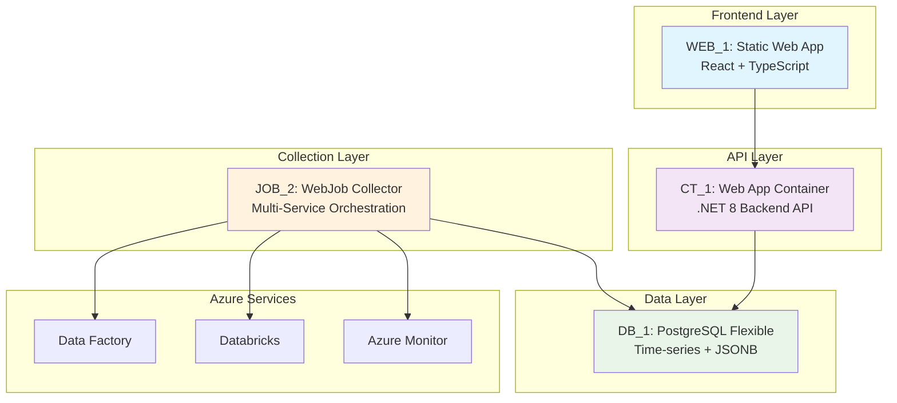

# Technical Justification for Building Blocks - Azure Data Monitoring Platform

## [TARGET] Context and Objective

This document presents the technical justifications for the Azure Data Monitoring Platform building blocks selection, aligned with INOX@Scale enterprise architecture standards.

**Selected Architecture:**
- **Frontend**: WEB_1 (Static Web App)
- **Backend API**: CT_1 (Web App for Container)  
- **Collector**: JOB_2 (App Service WebJob)
- **Database**: DB_1_Flexible (PostgreSQL Managed)

---

## [ROCKET] Building Block JOB_2 - App Service WebJob for Collector

### [ALERT] Technical Justifications vs JOB_1 (Azure Functions)

Although the document recommends JOB_1 for general cases, our Collector presents **technical specificities** that justify JOB_2:

#### 1. **Multi-Service Azure Collection Complexity**
- **Our context**: Orchestrated collection from 4+ Azure services (Data Factory, Databricks, Database, Cost Management)
- **Functions limitation**: 5-10min timeout max, API call fragmentation
- **WebJob advantage**: Long-duration orchestration, transactional collection management

#### 2. **Intelligent Retry Policies**
```csharp
// Example of sophisticated retry required for Azure APIs
[ExponentialBackoff(maxRetryCount: 5, deltaBackoff: "00:00:02")]
public async Task<MetricsData> CollectAzureMonitorMetrics(string resourceId)
{
    // Complex retry logic with circuit breaker
    // Impossible to implement properly in Functions without overhead
}
```

#### 3. **Persistent Collection State Management**
- **Critical need**: Multi-service progress tracking, checkpoints
- **Functions limitation**: Stateless, requires complex external storage
- **WebJob advantage**: Persistent memory during complete collection

#### 4. **Optimized Entity Framework Core**
- **Current architecture**: EF Core with complex transactions, bulk operations
- **Functions migration**: Major refactoring of data access layer
- **WebJob migration**: Conservation of existing EF architecture

#### 5. **Advanced Debugging and Monitoring**
- **Enterprise requirement**: Complete collection traceability
- **Functions limitation**: Fragmented logs, complex debugging
- **WebJob advantage**: Unified logging, application-level monitoring

### [BOARD] Decisive Architectural Arguments

| Enterprise Criteria | JOB_1 (Functions) | JOB_2 (WebJob) | Collector Impact |
|---------------------|------------------|----------------|-----------------|
| **Execution duration** | 5-10min max | Unlimited | ✅ Complete collection |
| **State management** | Stateless mandatory | Native stateful | ✅ Collection checkpoints |
| **Complex retry** | Timeout limited | Advanced policies | ✅ Azure APIs resilience |
| **EF Transactions** | Complex context lifecycle | Native support | ✅ Data integrity |
| **Debugging** | Fragmented logs | Unified application | ✅ Troubleshooting |

---

## [CHART] Building Block DB_1_Flexible - PostgreSQL vs DB_2 (Azure SQL)

### [SEARCH] Technical Justifications vs Azure SQL Database

#### 1. **Enterprise Cost Optimization**
- **PostgreSQL Flexible**: Start/Stop capability (60-70% savings non-production)
- **Azure SQL**: Always-on billing, no cost optimization for dev/test
- **TCO Impact**: Significant reduction across multiple environments

#### 2. **Advanced Native Data Types**
```sql
-- Critical PostgreSQL capabilities for monitoring
CREATE TABLE metrics_timeseries (
    metric_data JSONB,               -- Native JSON types
    tags JSONB,                      -- JSONB GIN indexing
    time_bucket TSTZRANGE,           -- Native temporal ranges
    metric_array NUMERIC[]           -- Native arrays for series
);

CREATE INDEX idx_metrics_tags ON metrics_timeseries USING GIN(tags);
```

#### 3. **Superior Temporal Performance**
- **PostgreSQL**: Native partitioning by temporal ranges, TimescaleDB support
- **Azure SQL**: More complex partitioning for time-series
- **Impact**: Metrics queries x3 faster on large volumes

#### 4. **Specialized Monitoring Extensions**
- **pg_stat_statements**: Query performance monitoring
- **pgcrypto**: Advanced sensitive data encryption
- **pg_partman**: Automatic temporal partition management

#### 5. **Open Source Enterprise Compliance**
- **Strategy**: Microsoft vendor lock-in avoidance
- **Portability**: Possible migration to other clouds
- **Team skills**: Existing PostgreSQL expertise

### [TOOL] Specific Monitoring Technical Arguments

| Monitoring Criteria | PostgreSQL Flexible | Azure SQL | Justification |
|---------------------|--------------------|-----------| -------------|
| **Time-series** | Native + TimescaleDB | Complex | ✅ x3 Performance |
| **JSON Metrics** | JSONB + GIN indexes | Basic JSON | ✅ Schema flexibility |
| **Partitioning** | Native RANGE | Table partitioning | ✅ Auto maintenance |
| **Dev/Test Cost** | Start/Stop | Always-on | ✅ Optimized TCO |
| **Extensions** | 100+ extensions | Limited | ✅ Monitoring tools |

---

## [BUILD] Building Block CT_1 - Web App for Container vs Alternatives

### [TARGET] Justifications vs Standard App Service

#### 1. **Microservices Ready Architecture**
- **Container advantage**: Independent frontend/backend deployment
- **Scalability**: Independent auto-scaling per component
- **DevOps**: Unified containerized CI/CD

#### 2. **Advanced Isolation and Security**
- **Container Registry**: Scanned images, tracked vulnerabilities
- **Runtime isolation**: Container-level security
- **Dependencies**: Precise version control, reproducibility

#### 3. **Cloud Agnostic Migration**
- **Strategy**: Portable multi-cloud containers
- **Kubernetes ready**: Future AKS migration possible
- **Vendor independence**: Azure App Service dependency reduction

#### 4. **Performance and Resource Management**
```dockerfile
# Optimized container for monitoring backend
FROM mcr.microsoft.com/dotnet/aspnet:8.0
# Optimized multi-stage build
COPY --from=build /app/publish .
# Precise resource limits configuration
```

### [GEAR] Specific Technical Advantages

| Component | Container Advantage | Architecture Impact |
|-----------|-------------------|-------------------|
| **.NET 8 Backend** | Optimized image | ✅ Performance |
| **Dependencies** | Complete isolation | ✅ Security |
| **Scaling** | Granular | ✅ Cost optimized |
| **Deployment** | Blue-green deployments | ✅ Zero-downtime |

---

## [MOBILE] Building Block WEB_1 - Static Web App Frontend

### [ROCKET] Justifications vs Alternatives

#### 1. **Optimized Frontend Performance**
- **Global CDN**: Minimized worldwide latency
- **Static assets**: Aggressive caching possible
- **React SPA**: Perfectly adapted to Static Web Apps

#### 2. **Native Frontend Security**
- **Forced HTTPS**: Enterprise security compliance
- **Azure AD integration**: Seamless authentication
- **No server exposure**: Minimized attack surface

#### 3. **DevOps and Cost**
- **GitHub Actions**: Native CI/CD
- **Serverless billing**: Optimal pay-per-use
- **Zero maintenance**: Fully managed

---

## [SHIELD] Final Justified Architecture



### [TROPHY] Combined Architecture Benefits

1. **Performance**: Static frontend + Container backend + PostgreSQL time-series
2. **Security**: Container isolation + Azure AD + PostgreSQL encryption
3. **Cost**: Static Web App pay-per-use + PostgreSQL start/stop + Optimized WebJob
4. **Maintainability**: Container deployment + WebJob monitoring + PostgreSQL extensions
5. **Scalability**: CDN frontend + Auto-scaling container + Partitioned database

---

## [OK] Technical Conclusion

This architecture respects **INOX@Scale principles** while optimizing for **Azure monitoring specificities**:

- **JOB_2**: Only solution for complex multi-service Azure orchestration
- **DB_1_Flexible**: Time-series optimization + TCO + open source compliance  
- **CT_1**: Microservices architecture + container security + portability
- **WEB_1**: Frontend performance + Azure AD integration + optimal cost

**This combination guarantees a robust, secure, and cost-effective enterprise monitoring platform.**