# Data Connect Monitoring (DCM) - Architecture & Design Authority

> Consolidated documentation from the **Design Authority (DA)** meeting of 19 Feb 2026 and the **Architecture Design Document (ADD)** v121 (Page ID 818054930).

---

## Table of Contents

1. [DA Record](#1-da-record)
2. [Context & Objectives](#2-context--objectives)
3. [Scope & Positioning](#3-scope--positioning)
4. [Dependencies & Observability Landscape](#4-dependencies--observability-landscape)
5. [Organization & Stakeholders](#5-organization--stakeholders)
6. [Requirements](#6-requirements)
7. [Architecture Scenarios](#7-architecture-scenarios)
8. [Target Architecture - Functional](#8-target-architecture---functional)
9. [Target Architecture - Logical](#9-target-architecture---logical)
10. [Target Architecture - Technical](#10-target-architecture---technical)
11. [Flow Matrices](#11-flow-matrices)
12. [Security & Permissions](#12-security--permissions)
13. [Conformity & Standards](#13-conformity--standards)
14. [Data Governance](#14-data-governance)
15. [Roadmap & Next Steps](#15-roadmap--next-steps)
16. [DA Meeting Minutes](#16-da-meeting-minutes)
17. [Action Items](#17-action-items)

---

## 1. DA Record

| Item | Detail |
|---|---|
| **Date** | 19 Feb 2026 |
| **Type** | Design Authority (DA) |
| **DA Status** | COMPLETED |
| **ADD Page ID** | 862604863 (v114) / 818054930 (v121) |
| **Flag Archi** | VALIDATED |
| **Flag Cyber** | GREEN (13 Feb 2026) |
| **GenAI Flag** | N/A - NO |

**Cyber comment:** Go cyber sous reserve de mise a jour du PSP pour rehosting AWS DCM Core. Mettre en oeuvre les mesures listees dans le PSP actualise (PSP0003393 a mettre a jour). Le collector ayant vocation a etre deploye dans de multiples Landing Zones, il faut prevoir d'en faire un building block valide archi/cyber.

**Data classification (AICP):** 1/2 - 1/2 - 1/2

---

## 2. Context & Objectives

**Data Connect Monitoring** aims to consolidate & contextualize metrics and expose them in a simple way for data pipelines. The platform correlates performance, cloud consumption, and compliance, providing detailed information to facilitate incident analysis and resolution.

### Key Objectives

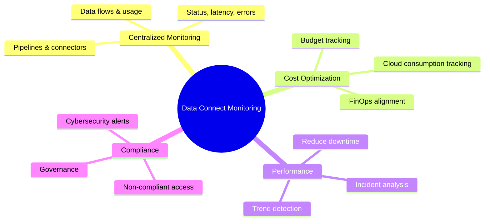

### Business Value

- Centralized monitoring of data flows & usage
- Reduce downtime
- Performance, compliance, and cost optimization
- Enable IT and business teams to optimize costs, improve pipeline performance, and reduce security risks

---

## 3. Scope & Positioning

### Included

- Monitoring pipelines and connectors (status, latency, usage, errors)
- Cloud contextualization (resources, costs, alerting)
- Cybersecurity alerts (cyber-incident prevention, non-compliant access)
- Correlation with data, infra, usage & FinOps

### Excluded

- Data quality & lineage (covered by Sifflet)
- Infra & app monitoring (covered by Dynatrace)

### Users

- Data Engineers, Product Owners
- Cloud Ops, Cyber Champions
- Captain Run IT & Business

---

## 4. Dependencies & Observability Landscape

DCM sits within a broader data observability ecosystem alongside Dynatrace and Sifflet.

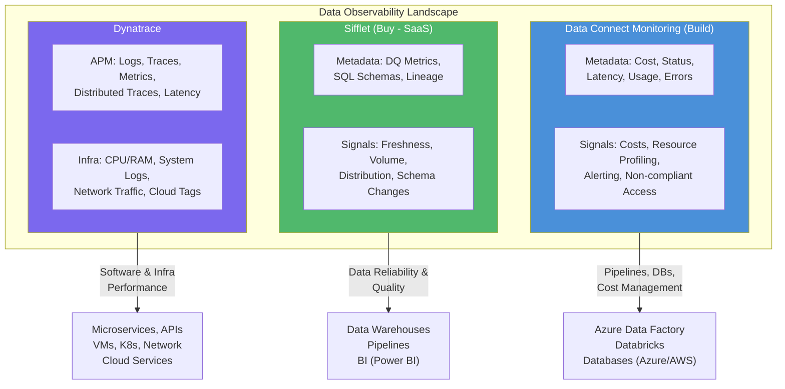

### Observability Coverage Matrix

| Observability Type | Solution | Metadata & Signals | Monitored Assets | Use Case | Users |
|---|---|---|---|---|---|
| **Data Observability** | **Sifflet** (Buy) | DQ metrics, SQL Schemas, Lineage, Freshness, Volume | Data Warehouses, Databricks, Pipelines (ADF), BI | Data Reliability: anomalies, root-cause, downstream impact | Business Experts, Data Hub Owner, Data Engineers |
| **Data Observability** | **DCM** (Build) | Cost, Status, Latency, Usage, Errors, Resource Profiling | Databases (Azure/AWS), Pipelines (ADF, Databricks) | Monitoring pipelines & connectors (cost, usage) | Data Engineers, Product Owners, Cloud Ops |
| **APM** | **Dynatrace** | Logs, Traces, Metrics, PurePath, Latency, Error rates | Microservices, APIs, Web/Mobile Apps, Serverless | Software Performance: code-level troubleshooting | Software Engineers, QA, UX |
| **Infrastructure** | **Dynatrace** | Logs, Metrics, CPU/RAM, Network traffic, Cloud tags | Network, Servers, VMs, K8s, Storage, Cloud Services | System Health: scaling, uptime, cost optimization | SRE, DevOps, Cloud Architects |

---

## 5. Organization & Stakeholders

| Role | Entity | Main Contact |
|---|---|---|
| Business Project Manager | TGITS/MTE/DS | Marie Helene Collyn |
| Product Owner / RIA | MTE/DS | Maher LEZHARI |
| IT Project Manager | TGITS/MTE/DS | Mikael MAUSSE |
| Cybercoach | TGITS/CRC/PRJ | Arnault GOYETTE |
| Referent Architect | DSI/STA/ADO | Sophanara DE LOPEZ |
| ACTE Architect | DSI/STA/ATE | Yahia ZERDOUMI |
| Foundation Architect | DSI/STA/AFO | Jonathan NEBIE |
| Data Architect | DSI/STA/ADO | Sophanara DE LOPEZ |
| Data Domain Lead | TGITS/PIT/OPE/DIT | Didier Cazettes |
| Operations Responsible | TGITS/MTE/DS | Mikael MAUSSE |

---

## 6. Requirements

### Service Level Information

| Criteria | Value |
|---|---|
| **RTO** | 2 to 5 Days |
| **RPO** | 2 to 5 Days |
| **Performance** | Near real-time for data pipelines monitoring |
| **Availability** | Working days only |
| **Service Availability** | 99.5% |

### Data Classification (AICP)

| Criteria | Classification |
|---|---|
| Availability | 1/2 |
| Integrity | 1/2 |
| Confidentiality | 1/2 |
| Proof | - |

### Regulatory

| Criteria | Status |
|---|---|
| SOX | No |
| GDPR | No |

---

## 7. Architecture Scenarios

Two scenarios were studied:

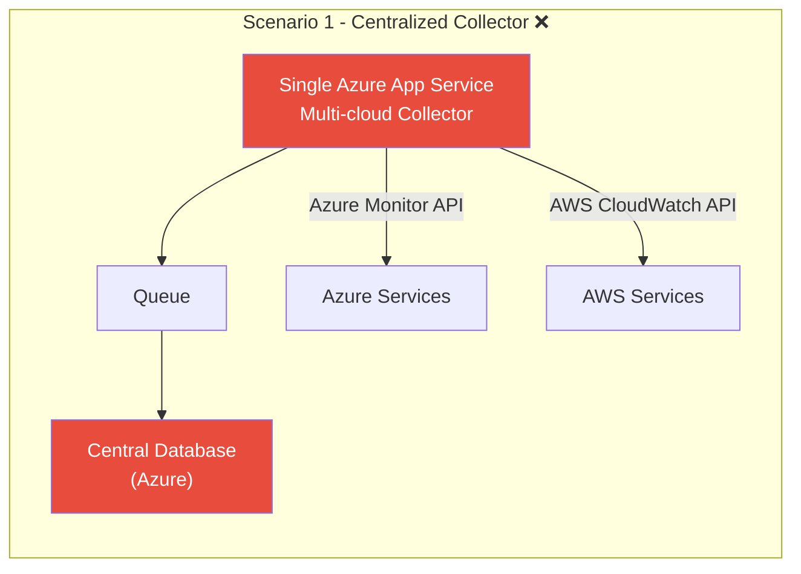

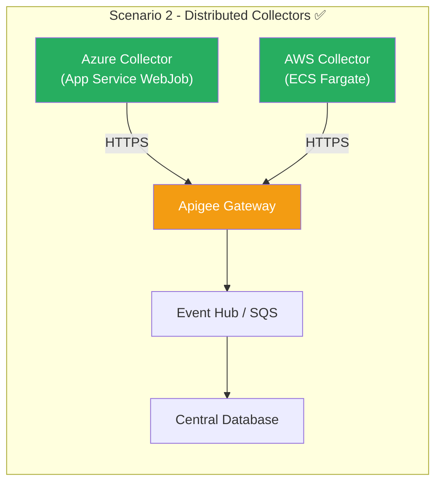

### Scenario Comparison

| Criteria | Scenario 1 - Centralized | Scenario 2 - Distributed |
|---|---|---|
| **Build Complexity** | Low | High |
| **Scalability** | Limited | Good |
| **Segmentation Rules** | Non-compliant | Compliant |
| **Cloud/AFO/ADO Rules** | Non-compliant | Fully compliant |
| **Operational Management** | Simple | More complex |
| **Architecture Recommendation** | Rejected | **Selected** |
| **Cyber Recommendation** | Rejected | **Go** |

**Decision:** Scenario 2 selected. Collectors must be qualified as **building blocks** validated archi/cyber.

---

## 8. Target Architecture - Functional

### Functional Layers Overview

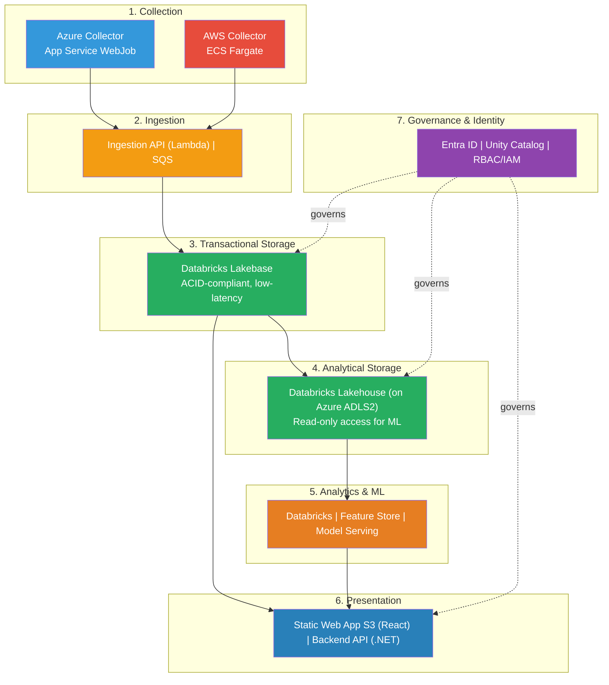

### Key Functional Flows

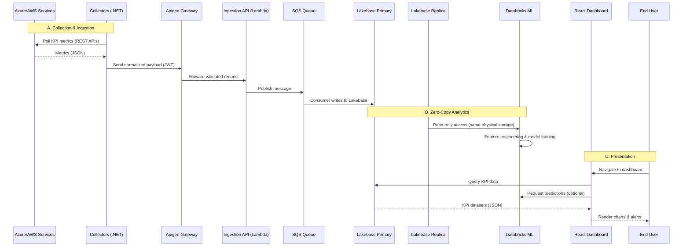

---

## 9. Target Architecture - Logical

### Logical Architecture Overview

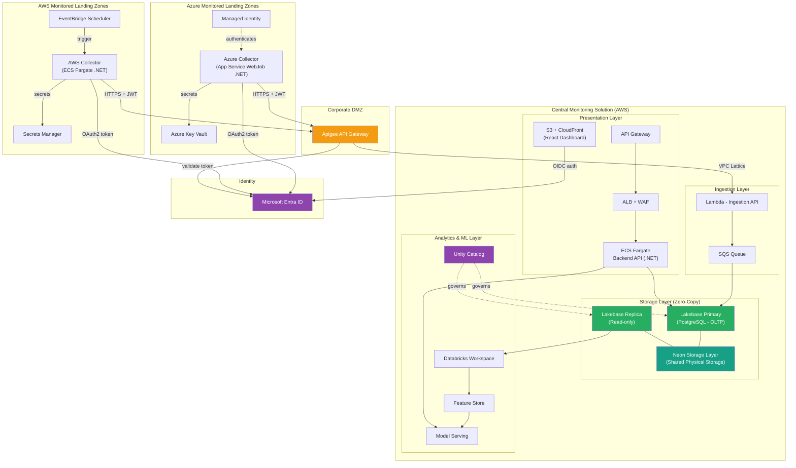

### Logical Blocks Summary

| Logical Block | Components | Responsibility |
|---|---|---|
| **Collection Layer** | .NET agents (Azure LZ / AWS LZ) | Collect raw KPI metrics from monitored services |
| **Ingestion Layer** | Apigee, Lambda, SQS | Expose secure endpoint, authenticate agents, buffer payloads |
| **Transactional Storage** | Lakebase Primary (PostgreSQL-compatible) | Single source of truth - ACID, low-latency OLTP |
| **Analytical & ML** | Lakebase Replica, Databricks, Unity Catalog, Feature Store | Isolated read access for analytics & ML - no data duplication |
| **Presentation** | S3 (React), API Gateway, Backend .NET API | Secure dashboard + RESTful APIs |
| **Governance & Identity** | Entra ID, Unity Catalog, Managed Identities | Authentication, authorization, data governance |

### Key Architectural Principles

- **Zero data duplication**: Lakebase's decoupled compute/storage - primary and replica share the same physical storage
- **Event-driven**: Decoupled ingestion via SQS absorbs traffic spikes
- **API-first**: All inter-zone communication through Apigee
- **Separation of concerns**: Presentation, storage, and analytics scale independently
- **Unified governance**: Unity Catalog applies consistent access policies

---

## 10. Target Architecture - Technical

The architecture is divided into three distinct zones:

### Technical Zones Overview

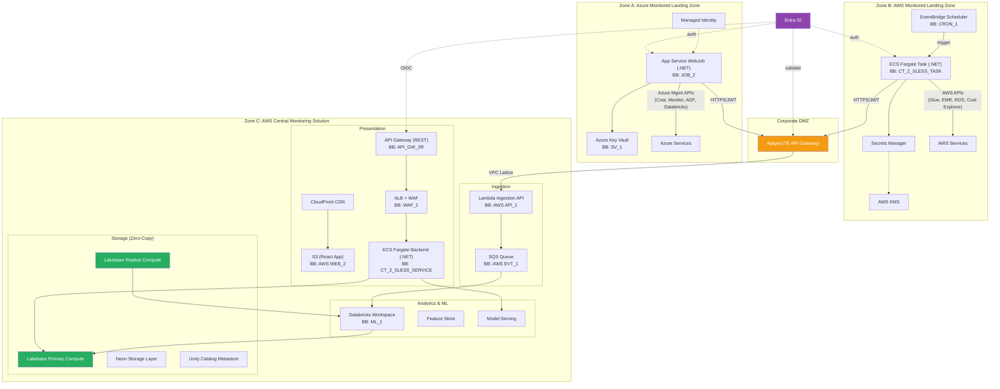

### Building Blocks Used

| Zone | Building Blocks |
|---|---|
| **DCM Core (AWS)** | API_GW_2R, API_1, WAF_1, CT_2_SLESS_SERVICE, ML_1, SV_1, MQS_1 |
| **Azure Collector** | JOB_2, SV_1 |
| **AWS Collector** | NAT_1, CT_2_SLESS_TASK, CRON_1, SV_1 |

---

## 11. Flow Matrices

### Metric Ingestion Flow (Central Solution)

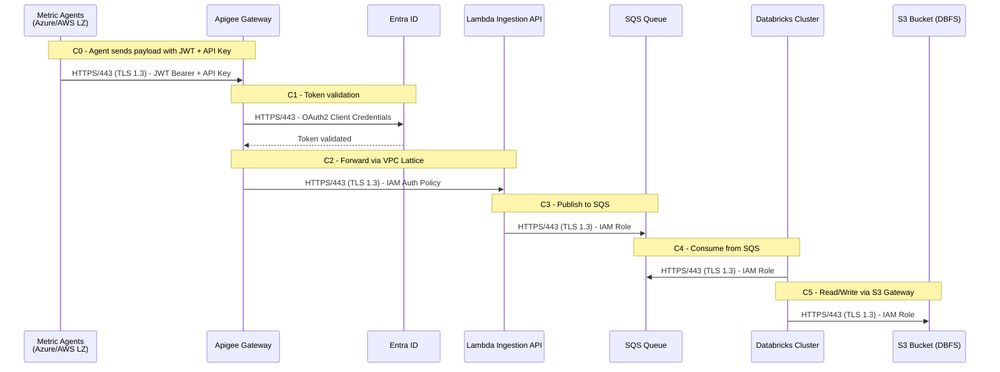

### User Access Flow

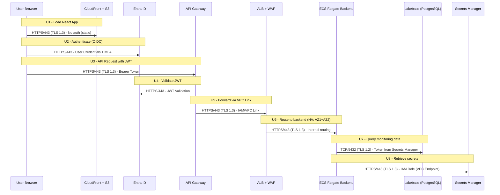

### Azure Collector Flow Matrix

| # | Description | Source | Destination | Protocol | Port | Encryption | Authentication |
|---|---|---|---|---|---|---|---|
| 1 | Retrieve App Registration secrets | WebJob (.NET) | Azure Key Vault | HTTPS | 443 | TLS 1.2+ | Managed Identity |
| 2 | Obtain OAuth2 token | WebJob (.NET) | Entra ID | HTTPS | 443 | TLS 1.2+ | Client ID + Secret |
| 3 | Collect KPI metrics from Azure | WebJob (.NET) | Azure Management API | HTTPS | 443 | TLS 1.2+ | Bearer token (JWT) |
| 4 | Send KPI payload to central solution | WebJob (.NET) | Apigee (TE APIM) | HTTPS | 443 | TLS 1.2+ | Bearer token (JWT) |

### AWS Collector Flow Matrix

| # | Description | Source | Destination | Protocol | Port | Encryption | Authentication |
|---|---|---|---|---|---|---|---|
| 1 | Scheduled trigger | EventBridge Scheduler | ECS Fargate Task | AWS API | 443 | TLS 1.2+ | IAM Role |
| 2 | Retrieve App Registration secrets | ECS Fargate (.NET) | Secrets Manager (VPC Endpoint) | HTTPS | 443 | TLS 1.2+ | IAM Role |
| 3 | Decrypt secrets (optional) | ECS Fargate | AWS KMS (VPC Endpoint) | HTTPS | 443 | TLS 1.2+ | IAM Role |
| 4 | Obtain OAuth2 token | ECS Fargate | Entra ID | HTTPS | 443 | TLS 1.2+ | Client ID + Secret |
| 5 | Collect KPI metrics from AWS | ECS Fargate | AWS Service APIs | HTTPS | 443 | TLS 1.2+ | IAM Role (Signature V4) |
| 6 | Send KPI payload to central solution | ECS Fargate | Apigee (TE APIM) | HTTPS | 443 | TLS 1.2+ | Bearer token (JWT) |

---

## 12. Security & Permissions

### Authentication Architecture

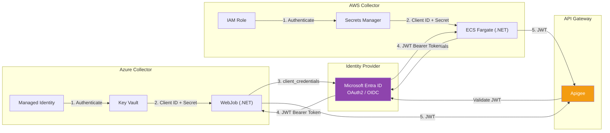

### Azure Collector - RBAC Least Privilege

| Monitored Service | Required RBAC Role | Scope | Justification |
|---|---|---|---|
| Azure Cost Management + Billing | Cost Management Reader | Subscription | Read usage details, reservations, budgets |
| Azure Monitor (Metrics, Logs, Alerts) | Monitoring Reader | Subscription / RG | Read monitoring data, metrics, diagnostics |
| Azure Data Factory | Reader | Data Factory instance | Read pipeline runs, activity runs, triggers |
| Azure Databricks | Reader | Databricks workspace | Read workspace metadata, job runs, cluster metrics |
| Azure SQL / PostgreSQL / MySQL | Reader | Database server | Read server state, query performance insights |
| Azure Cosmos DB | Reader | Cosmos DB account | Read account metrics, throughput, region status |
| Azure Key Vault | Key Vault Reader | Key Vault instance | Read secret metadata (no secret value access) |
| Azure Subscription | Reader | Subscription | Enumerate resource groups, resources, tags |
| Azure Reservations | Reservation Reader | Subscription / Billing | Read reservation utilization, recommendations |

### AWS Collector - IAM Least Privilege

| Monitored Service | Required Actions | Resource Scope | Justification |
|---|---|---|---|
| AWS Glue | `glue:Get*`, `glue:List*`, `glue:BatchGet*` | Specific crawlers/jobs or `*` | Read job runs, crawler metrics |
| Amazon EMR | `elasticmapreduce:List*`, `elasticmapreduce:Describe*` | Specific clusters or `*` | Read cluster status, step execution |
| Amazon RDS | `rds:Describe*`, `rds:List*` | Specific instances or `*` | Read DB instance health |
| AWS Cost Explorer | `ce:Get*`, `ce:List*` | `*` | Read cost and usage data |
| Amazon Redshift | `redshift:Describe*`, `redshift:View*` | Specific clusters or `*` | Read cluster health, workload metrics |
| AWS Secrets Manager | `secretsmanager:GetSecretValue`, `secretsmanager:DescribeSecret` | Specific secret ARNs | Retrieve Azure client secret |
| AWS KMS | `kms:Decrypt` | Specific KMS key ARN | Decrypt encrypted secrets |
| CloudWatch / CloudTrail | `logs:Describe*`, `logs:Get*`, `cloudtrail:LookupEvents` | Specific log groups or `*` | Read log data, audit events |

### Security Controls

- Client secrets are **never hardcoded** - retrieved at runtime from secure vaults
- Secrets are **rotated regularly** (automatic rotation recommended)
- All token requests over **TLS 1.2+**
- Token includes **custom claims** (subscription ID, cloud provider) for routing and tenant isolation
- All internal Azure communications use **Managed Identities** and **Private Endpoints**
- All internal AWS communications use **IAM Roles** and **VPC Endpoints**

### Cyber Flag

| Flag | Date | Comments |
|---|---|---|
| **GREEN** | 13 Feb 2026 | Go cyber subject to PSP update for AWS DCM Core rehosting. Implement measures listed in updated PSP (PSP0003393). Collectors to be qualified as archi/cyber validated building blocks. |

---

## 13. Conformity & Standards

### Architecture Principles (CR-GR-INF-001)

| Principle | Conformity | Comments |
|---|---|---|
| Strategic Alignment | Yes | - |
| Visibility | Yes | - |
| Re-use | Yes | - |
| Standard Solutions | Yes | No market solution meets all requirements; in-house build decision |
| Centralized Solutions | Yes | - |
| Mobile Devices | Yes | - |
| Resilience | Yes | - |
| Modularity | Yes | - |
| Durability | Yes | - |
| Cloud First | Yes | - |
| Shared Infrastructures | Yes | - |
| Security by Design | Yes | - |
| DevSecOps | Yes | - |
| Interoperability | Yes | - |
| Data Consistency | Yes | - |

### Architecture Framework Compliance

| Item | Status |
|---|---|
| Architecture in line with framework | **YES** |
| Temporary deviation | NO |
| Risk mitigation possible | - |
| Framework adjustment needed | - |
| Derogation required | **NO** |
| Standard patterns used | YES |
| Building blocks used | YES |
| Decision trees respected | YES |
| Non-standard components | NO |

---

## 14. Data Governance

### Data Sources (Consumed)

| Business Object | Data Source | Master Data | Comments |
|---|---|---|---|
| Pipeline execution metrics, resource utilization | Azure Data Factory | N | Investigate integration with Dynatrace/Sifflet |
| Cluster performance, job execution, Unity Catalog governance | Databricks (Azure, AWS) | N | Investigate integration with Dynatrace/Sifflet |
| Performance metrics, security alerts, cost attribution | Database Services (Azure/AWS) | N | Investigate integration with Dynatrace/Sifflet |
| Spend analysis, budget tracking, resource optimization | Cost Management APIs (Azure/AWS) | N | Check consistency with official FinOps monitoring |

### Data Exposition (Produced)

| Business Object | Exposition | Master Data | Comments |
|---|---|---|---|
| Aggregated metrics (FinOps, job status, access) | Dashboard (Dataviz) | N | Document in Collibra if relevant |
| Aggregated metrics (FinOps, job status, access) | API (via Apigee) | N | Future integration with Dynatrace, Sifflet |

### Data Management Maturity (AS-IS vs TO-BE)

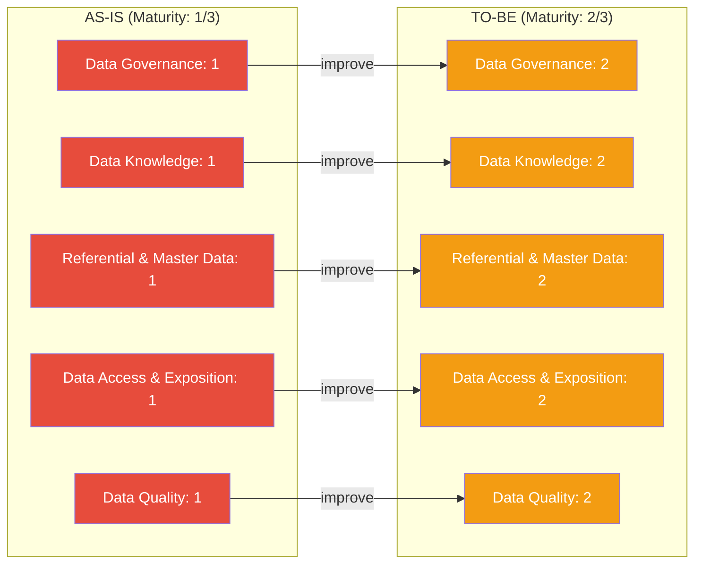

### User Authorization Model

| Model | Used |
|---|---|
| Authorization built in the application | YES |
| Based on Azure Entra ID Groups | NO |
| Based on Azure Entra ID AppRoles | YES |
| No authorization model | NO |

---

## 15. Roadmap & Next Steps

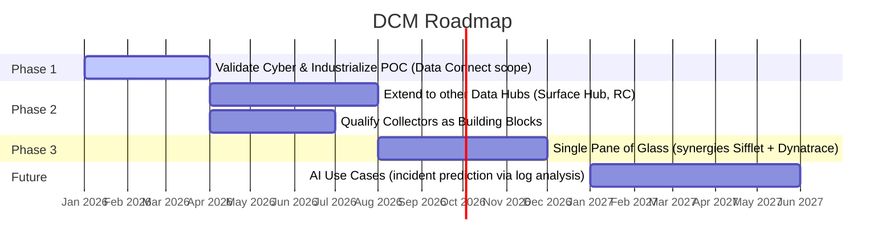

### Phase Details

| Phase | Description | Key Activities |
|---|---|---|
| **Phase 1** | Validate & Industrialize | Cyber validation, PSP implementation, industrialize POC on Data Connect scope |
| **Phase 2** | Extend Coverage | Deploy to Surface Hub, RC; qualify Azure/AWS collectors as building blocks |
| **Phase 3** | Unified Observability | Create single pane of glass with Sifflet and Dynatrace synergies |
| **Future** | AI-Powered | Incident prediction via log analysis (not in current scope) |

---

## 16. DA Meeting Minutes

> AI-generated meeting summary from the DA session of 19 Feb 2026.

### Topics Discussed

**1. Presentation & Positioning of DCM**
- Maher, Mikael, and others presented the context, needs, and positioning of DCM
- Explained DCM's role in covering data observability needs (costs & usage)
- Distinguished DCM from Dynatrace (infra/APM) and Sifflet (data quality/pipeline health)
- Originally developed by MTE Data Squad for internal needs, now extended to other projects

**2. Functional & Technical Presentation**
- Mikael detailed DCM's operation: UI, data collection model, architecture scenarios, technical choices
- Interface provides overview of monitored elements (Databricks, ADF, databases, AWS), trend indicators, and costs
- Solution relies on collectors deployed in landing zones, centralized via API-first architecture
- Two scenarios studied: centralized (rejected) and distributed (selected, compliant with architecture rules)

**3. Organizational Aspects, Governance & Security**
- Importance of metadata valorization in coordination with data offices and project teams
- Cost monitoring must align with FinOps practices (Pascal Soudan)
- Solution complies with company architecture rules without derogation
- Collectors must be qualified as building blocks (similar to Dynatrace approach)
- PSP completed with security actions to follow

**4. Roadmap & Next Steps**
- Phase 1: Cyber validation + industrialize POC on Data Connect scope
- Phase 2: Extend to other data hubs + reflection on single pane of glass with Sifflet/Dynatrace
- Future: AI use cases for incident prediction (not in current scope)
- Sifflet SaaS validation planned to complement observability coverage

---

## 17. Action Items

| # | Action | Holder | Status |
|---|---|---|---|
| 1 | **Qualify Azure & AWS collectors as building blocks** - Define technical components and associated roles for DCM | Architecture Team | Pending |
| 2 | **Align monitored costs with FinOps tracking** - Ensure DCM costs are aligned with FinOps monitoring by Pascal Soudan's teams | Architecture Team | Pending |
| 3 | **Valorize generated metadata** - Evaluate interest with data offices for integrating DCM metadata into data management processes | Architecture Team | Pending |
| 4 | **Implement PSP cyber actions** - Execute actions defined during PSP cyber review for definitive Go cyber (PSP0003393 update) | Project Team | Pending |
| 5 | **Manage collector & API evolution** - Set up tracking for collector and API evolution to integrate new components over time | Project Team | Pending |
| 6 | **Update PSP for AWS DCM Core rehosting** - Update PSP0003393 for rehosting DCM Core on AWS | Project Team | Pending |

---

## Appendix: End-to-End Architecture Diagram

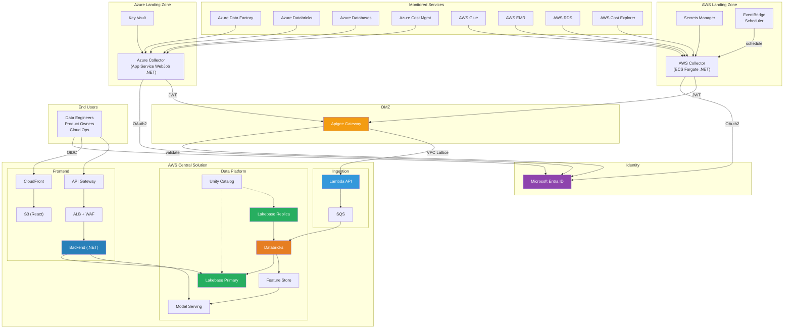

---

*Document generated from DA meeting minutes (19 Feb 2026) and ADD v121 (Page 818054930, last updated 13 Mar 2026).*
