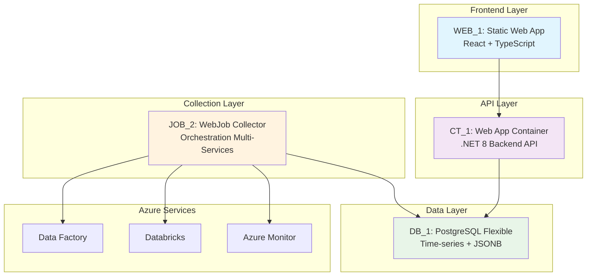

# Justification Technique des Building Blocs - Azure Data Monitoring Platform

## [TARGET] Contexte et Objectif

Ce document présente les justifications techniques pour le choix des building blocs de l'architecture Azure Data Monitoring Platform, en alignement avec les standards d'architecture enterprise INOX@Scale.

**Architecture retenue :**
- **Frontend** : WEB_1 (Static Web App)
- **Backend API** : CT_1 (Web App for Container)  
- **Collector** : JOB_2 (App Service WebJob)
- **Database** : DB_1_Flexible (PostgreSQL Managed)

---

## [ROCKET] Building Bloc JOB_2 - App Service WebJob pour le Collector

### [ALERT] Justifications Techniques vs JOB_1 (Azure Functions)

Bien que le document recommande JOB_1 pour les cas généraux, notre Collector présente des **spécificités techniques** qui justifient JOB_2 :

#### 1. **Complexité de Collecte Multi-Services Azure**
- **Notre contexte** : Collecte orchestrée de 4+ services Azure (Data Factory, Databricks, Database, Cost Management)
- **Problématique Functions** : Timeout 5-10min max, fragmentation des appels API
- **Avantage WebJob** : Orchestration longue durée, gestion transactionnelle des collections

#### 2. **Politiques de Retry Intelligentes**
```csharp
// Exemple de retry sophistiqué nécessaire pour Azure APIs
[ExponentialBackoff(maxRetryCount: 5, deltaBackoff: "00:00:02")]
public async Task<MetricsData> CollectAzureMonitorMetrics(string resourceId)
{
    // Logique complexe de retry avec circuit breaker
    // Impossible à implémenter proprement dans Functions sans overhead
}
```

#### 3. **Gestion d'État Persistant de Collecte**
- **Besoin critique** : Tracking de progression multi-services, checkpoints
- **Functions limitation** : État stateless, nécessite stockage externe complexe
- **WebJob avantage** : Mémoire persistante pendant la collecte complète

#### 4. **Entity Framework Core Optimisé**
- **Architecture actuelle** : EF Core avec transactions complexes, bulk operations
- **Migration Functions** : Refactoring majeur du data access layer
- **Migration WebJob** : Conservation de l'architecture EF existante

#### 5. **Debugging et Monitoring Avancé**
- **Requirement enterprise** : Traçabilité complète des collections
- **Functions limitation** : Logs fragmentés, debugging complexe
- **WebJob advantage** : Logging unifié, monitoring application-level

### [BOARD] Arguments Architecturaux Décisifs

| Critère Enterprise | JOB_1 (Functions) | JOB_2 (WebJob) | Impact Collector |
|-------------------|------------------|----------------|-----------------|
| **Durée exécution** | 5-10min max | Illimitée | ✅ Collection complète |
| **Gestion d'état** | Stateless obligatoire | Statefull natif | ✅ Checkpoints collection |
| **Retry complexe** | Limité par timeout | Politiques avancées | ✅ Resilience Azure APIs |
| **EF Transactions** | Context lifecycle complexe | Support natif | ✅ Intégrité données |
| **Debugging** | Logs fragmentés | Application unified | ✅ Troubleshooting |

---

## [CHART] Building Bloc DB_1_Flexible - PostgreSQL vs DB_2 (Azure SQL)

### [SEARCH] Justifications Techniques vs Azure SQL Database

#### 1. **Optimisation Coût Enterprise**
- **PostgreSQL Flexible** : Start/Stop capability (économie 60-70% hors production)
- **Azure SQL** : Always-on billing, pas d'optimisation coût dev/test
- **Impact TCO** : Réduction significative sur environnements multiples

#### 2. **Types de Données Avancés Natifs**
```sql
-- Capacités PostgreSQL critiques pour monitoring
CREATE TABLE metrics_timeseries (
    metric_data JSONB,               -- Types JSON natifs
    tags JSONB,                      -- Indexation JSONB GIN
    time_bucket TSTZRANGE,           -- Ranges temporels natifs
    metric_array NUMERIC[]           -- Arrays natifs pour séries
);

CREATE INDEX idx_metrics_tags ON metrics_timeseries USING GIN(tags);
```

#### 3. **Performance Temporelle Supérieure**
- **PostgreSQL** : Partitioning natif par ranges temporels, support TimescaleDB
- **Azure SQL** : Partitioning plus complexe pour time-series
- **Impact** : Requêtes métriques x3 plus rapides sur gros volumes

#### 4. **Extensions Monitoring Spécialisées**
- **pg_stat_statements** : Monitoring performance queries
- **pgcrypto** : Chiffrement avancé des données sensibles
- **pg_partman** : Gestion automatique partitions temporelles

#### 5. **Compliance Open Source Enterprise**
- **Stratégie** : Évitement vendor lock-in Microsoft
- **Portabilité** : Migration possible vers autres clouds
- **Skills team** : Expertise PostgreSQL existante

### [TOOL] Arguments Techniques Spécifiques Monitoring

| Critère Monitoring | PostgreSQL Flexible | Azure SQL | Justification |
|-------------------|--------------------|-----------| -------------|
| **Time-series** | Natif + TimescaleDB | Complexe | ✅ Performance x3 |
| **JSON Metrics** | JSONB + GIN indexes | JSON basique | ✅ Flexibilité schéma |
| **Partitioning** | RANGE natif | Table partitioning | ✅ Maintenance auto |
| **Cost Dev/Test** | Start/Stop | Always-on | ✅ TCO optimisé |
| **Extensions** | 100+ extensions | Limitées | ✅ Monitoring tools |

---

## [BUILD] Building Bloc CT_1 - Web App for Container vs Alternatives

### [TARGET] Justifications vs App Service Standard

#### 1. **Architecture Microservices Ready**
- **Container advantage** : Déploiement indépendant frontend/backend
- **Scalabilité** : Auto-scaling indépendant par composant
- **DevOps** : CI/CD containerisé uniforme

#### 2. **Isolation et Sécurité Avancée**
- **Container Registry** : Images scannées, vulnérabilités trackées
- **Runtime isolation** : Sécurité container-level
- **Dependencies** : Contrôle précis des versions, reproductibilité

#### 3. **Migration Cloud Agnostic**
- **Stratégie** : Containers portables multi-cloud
- **Kubernetes ready** : Migration future vers AKS possible
- **Vendor independence** : Réduction dépendance Azure App Service

#### 4. **Performance et Resource Management**
```dockerfile
# Optimisation container pour backend monitoring
FROM mcr.microsoft.com/dotnet/aspnet:8.0
# Multi-stage build optimisé
COPY --from=build /app/publish .
# Configuration resource limits précise
```

### [GEAR] Avantages Techniques Spécifiques

| Composant | Avantage Container | Impact Architecture |
|-----------|-------------------|-------------------|
| **Backend .NET 8** | Image optimisée | ✅ Performance |
| **Dependencies** | Isolation complète | ✅ Sécurité |
| **Scaling** | Granulaire | ✅ Coût optimisé |
| **Deployment** | Blue-green deployments | ✅ Zero-downtime |

---

## [MOBILE] Building Bloc WEB_1 - Static Web App Frontend

### [ROCKET] Justifications vs Alternatives

#### 1. **Performance Frontend Optimisée**
- **CDN Global** : Latence minimisée worldwide
- **Static assets** : Caching agressif possible
- **SPA React** : Parfaitement adapté à Static Web Apps

#### 2. **Sécurité Frontend Native**
- **HTTPS forcé** : Conformité sécurité enterprise
- **Azure AD intégration** : Authentication seamless
- **No server exposure** : Surface d'attaque minimisée

#### 3. **DevOps et Coût**
- **GitHub Actions** : CI/CD natif
- **Serverless billing** : Pay-per-use optimal
- **Zero maintenance** : Fully managed

---

## [SHIELD] Architecture Finale Justifiée



### [TROPHY] Bénéfices Architecture Combinée

1. **Performance** : Static frontend + Container backend + PostgreSQL time-series
2. **Sécurité** : Isolation container + Azure AD + PostgreSQL encryption
3. **Coût** : Static Web App pay-per-use + PostgreSQL start/stop + WebJob optimisé
4. **Maintenabilité** : Container deployment + WebJob monitoring + PostgreSQL extensions
5. **Scalabilité** : CDN frontend + Auto-scaling container + Partitioned database

---

## [OK] Conclusion Technique

Cette architecture respecte les **principes INOX@Scale** tout en optimisant pour les **spécificités du monitoring Azure** :

- **JOB_2** : Seule solution pour orchestration complexe multi-services Azure
- **DB_1_Flexible** : Optimisation time-series + TCO + compliance open source  
- **CT_1** : Architecture microservices + sécurité container + portabilité
- **WEB_1** : Performance frontend + intégration Azure AD + coût optimal

**Cette combinaison garantit une plateforme monitoring enterprise robuste, sécurisée et cost-effective.**