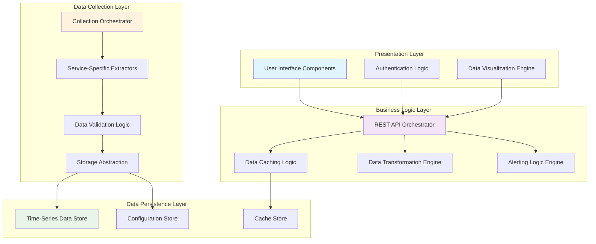
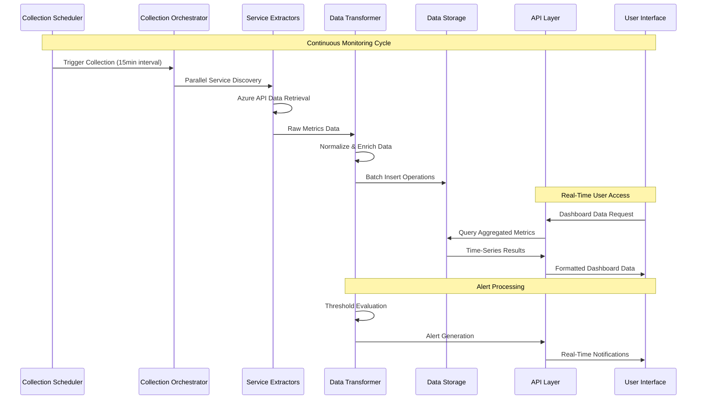
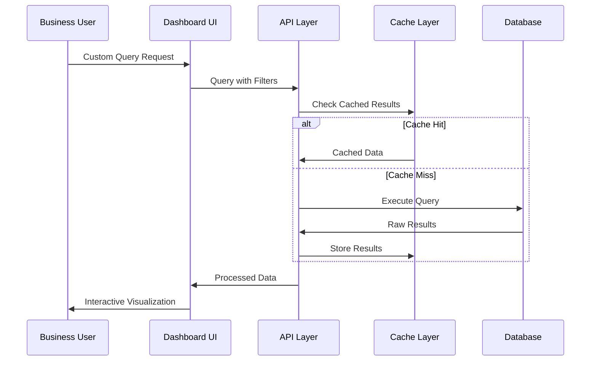

# Logical Architecture - Azure Data Monitoring Platform

## Logical Architecture Overview

The Azure Data Monitoring Platform implements a **three-tier logical architecture** with clear separation between presentation, business logic, and data collection layers. The system orchestrates monitoring workflows across multiple Azure services while providing unified data visualization and alerting capabilities.

## Logical Components and Flows

### Core Logical Components



## Intra-Application Flows

### 1. User Interaction Flow

**Dashboard Request Flow:**
```
User Request → Authentication Logic → API Orchestrator → Data Aggregation → Cache Check → Response Assembly → UI Rendering
```

**Data Flow Elements:**
- **User Context**: User identity, permissions, time range preferences
- **Query Parameters**: Service filters, metric types, aggregation periods
- **Response Data**: Aggregated metrics, charts data, alert status
- **UI State**: Dashboard layout, active filters, real-time refresh status

### 2. Data Collection Orchestration Flow

**Scheduled Collection Workflow:**
```
Timer Trigger → Collection Orchestrator → Service Discovery → Parallel Extraction → Data Validation → Transformation → Storage Persistence
```

**Collection Flow Elements:**
- **Service Inventory**: Dynamic discovery of Azure resources to monitor
- **Extraction Tasks**: Parallel collection jobs per Azure service type
- **Raw Metrics**: Native Azure API responses with service-specific schemas
- **Normalized Data**: Standardized metric format for cross-service analysis
- **Storage Commands**: Batch insert operations with conflict resolution

### 3. Real-Time Alerting Flow

**Alert Evaluation Workflow:**
```
Metric Ingestion → Threshold Evaluation → Rule Engine → Alert Generation → Notification Dispatch → State Management
```

**Alert Flow Elements:**
- **Metric Streams**: Real-time data feeds from collection layer
- **Rule Definitions**: Business rules for threshold monitoring
- **Alert Context**: Service details, metric values, trend analysis
- **Notification Payloads**: Formatted messages for different channels

## Functional Flows

### Data Factory Monitoring Flow

**Pipeline Monitoring Logic:**
1. **Discovery Phase**: Enumerate Data Factories across subscriptions
2. **Pipeline Inventory**: List active pipelines with metadata
3. **Execution Tracking**: Monitor pipeline runs and activity status
4. **Performance Analysis**: Calculate duration trends and failure patterns
5. **Cost Attribution**: Map resource consumption to pipeline executions

**Data Exchanged:**
- Pipeline definitions, execution logs, resource metrics, cost allocations

### Databricks Analytics Flow

**Workspace Monitoring Logic:**
1. **Workspace Discovery**: Identify Databricks workspaces and access permissions
2. **Cluster Management**: Track cluster lifecycle and utilization patterns
3. **Job Orchestration**: Monitor Spark job execution and resource consumption
4. **Unity Catalog Governance**: Track data lineage and access patterns
5. **Cost Optimization**: Analyze cluster efficiency and cost per workload

**Data Exchanged:**
- Cluster configurations, job definitions, execution metrics, governance events

### Database Performance Flow

**Multi-Database Monitoring Logic:**
1. **Service Discovery**: Identify SQL, PostgreSQL, MySQL, Cosmos DB instances
2. **Performance Metrics**: Collect DTU/RU consumption, query performance
3. **Security Assessment**: Monitor access patterns and compliance status
4. **Capacity Analysis**: Track storage utilization and scaling requirements
5. **Cost Tracking**: Attribute costs to applications and business units

**Data Exchanged:**
- Performance counters, query statistics, security events, capacity metrics

### FinOps Cost Management Flow

**Financial Monitoring Logic:**
1. **Cost Data Ingestion**: Aggregate spend data across all monitored services
2. **Budget Tracking**: Compare actual vs. planned spending by service
3. **Trend Analysis**: Identify cost anomalies and optimization opportunities
4. **Chargeback Calculation**: Allocate costs to business units and projects
5. **Recommendation Engine**: Generate cost optimization suggestions

**Data Exchanged:**
- Billing data, budget definitions, cost allocations, optimization recommendations

## Overall Application Workflow

### Primary Workflow: Continuous Monitoring



### Secondary Workflow: On-Demand Analysis



## Data Exchange Patterns

### Cross-Service Data Correlation

**Multi-Service Analysis Logic:**
- **Resource Tagging**: Correlate resources across services using Azure tags
- **Cost Attribution**: Map infrastructure costs to specific data workloads
- **Performance Impact**: Analyze cross-service dependencies and bottlenecks
- **Governance Alignment**: Ensure consistent policies across all monitored services

### Temporal Data Processing

**Time-Series Analysis Patterns:**
- **Real-Time Ingestion**: Process metrics as they arrive from Azure APIs
- **Historical Trending**: Aggregate data over configurable time windows
- **Anomaly Detection**: Compare current patterns against historical baselines
- **Forecasting Logic**: Predict future resource needs based on trends

### Alert Correlation Logic

**Multi-Dimensional Alerting:**
- **Service Health Correlation**: Connect alerts across related services
- **Business Impact Assessment**: Prioritize alerts based on business criticality
- **Root Cause Analysis**: Correlate infrastructure events with application issues
- **Escalation Management**: Route alerts to appropriate teams based on severity

This logical architecture ensures **data consistency**, **processing efficiency**, and **business alignment** while maintaining clear separation of concerns between data collection, processing, and presentation layers.