# DCM — Modèles de Données (Reference Workshop)

**Périmètre :** Toutes les couches de persistance du pipeline de données DCM.
**Date :** 2026-04-13
**Architecture initiale :** Medallion 3 couches — RAW (Delta) → CURATED (Delta) → SERVING (Lakebase PostgreSQL)  
**Architecture active au 2026-05-27 :** RAW/CURATED/GOLD/ADMIN dans Unity Catalog, lecture backend directe via Databricks SQL Warehouse  
**Statut :** Document workshop historique avec note d'actualisation Warehouse

---

> **Dernier check datamodel backend : 2026-04-30**
>
> Refactoring complet effectué (Sprint 8) :
> - Suppression des alias legacy (ClusterMetric, ComplianceMetric, etc.)
> - Alignement total des requêtes, mappings et API sur le schéma SQL à jour (lakebase_ddl.sql)
> - Ajout des champs manquants dans les endpoints (pipelines, security, etc.)
> - Backend prêt pour Unity Catalog, plus aucune dette technique legacy.

> **Mise à jour Warehouse : 2026-05-27**
>
> La cible backend a changé depuis ce workshop : Lakebase/PostgreSQL a été retiré du chemin applicatif.
> Le backend lit maintenant directement Unity Catalog via Databricks SQL Warehouse (`DatabricksWarehousePool`).
> Les tables SERVING décrites plus bas doivent donc être comprises comme des tables Unity Catalog prêtes pour l'API, pas comme des tables PostgreSQL. Pour l'état implémenté, voir [`../MIGRATION-LAKEBASE-TO-WAREHOUSE.md`](../MIGRATION-LAKEBASE-TO-WAREHOUSE.md).

---

## Sommaire

- [0. À propos de ce document](#0-à-propos-de-ce-document)
- [1. Architecture Medallion — Principes](#1-architecture-medallion--principes)
- [2. Principe de Cloisonnement Multi-LZ / Multi-Subscription](#2-principe-de-cloisonnement-multi-lz--multi-subscription)
- [3. Contrat Central : MetricPayload (l'enveloppe universelle)](#3-contrat-central--metricpayload-lenveloppe-universelle)
- [4. Couche 1 — RAW Delta Lake](#4-couche-1--raw-delta-lake)
- [5. Couche 2 — CURATED Delta Lake — 8 domaines](#5-couche-2--curated-delta-lake--8-domaines)
- [6. Couche API — Unity Catalog via SQL Warehouse](#6-couche-api--unity-catalog-via-sql-warehouse)
- [7. Stratégie d'Index PostgreSQL historique](#7-stratégie-dindex-postgresql-historique)
- [8. Modèles Python ↔ Tables (correspondance complète)](#8-modèles-python--tables-correspondance-complète)
- [9. Valeurs d'Énumérations](#9-valeurs-dénumérations)
- [10. Exemple de Flux Complet (end-to-end)](#10-exemple-de-flux-complet-end-to-end)
- [11. Cycle de Vie des Données & Rétention](#11-cycle-de-vie-des-données--rétention)
- [12. Ajouter une Nouvelle Landing Zone (zero-downtime)](#12-ajouter-une-nouvelle-landing-zone-zero-downtime)
- [13. Roadmap Données — Phases suivantes](#13-roadmap-données--phases-suivantes)

---

## 0. À propos de ce document

Ce document est le **dossier de référence complet** pour le workshop technique DCM du 2026-04-13. Il couvre :

- La logique de l'architecture Medallion et pourquoi ce choix (pédagogie pour non-experts Databricks)
- Le principe d'isolation multi-LZ / multi-cloud / multi-subscription
- Tous les modèles de données aux 3 couches (RAW, CURATED, SERVING)
- Les **8 domaines** actuels et futurs avec leurs modèles Python correspondants
- Un exemple de flux complet de bout en bout avec données JSON réelles
- La roadmap d'implémentation par sprint

**Public cible :** Développeurs Python/SQL connaissant les APIs REST et les bases de données relationnelles. Aucune expérience Databricks requise.

**Mises à jour clés par rapport à la version précédente (2026-03-19) :**
- Ajout de 3 nouveaux domaines : `activity_run`, `user`, `compliance`
- Ajout de `subscription_or_account_id` dans `MetricPayload` et toutes les tables SERVING
- Diagrammes Mermaid mis à jour pour les 8 domaines
- Exemple end-to-end enrichi avec données JSON concrètes
- Section cloisonnement multi-LZ avec exemples concrets

**Mises à jour clés par rapport à la version précédente (2026-03-26) — atelier experts Databricks 2026-04-13 :**
- Renommage domaine `cluster` → `compute` : `MetricDomain.COMPUTE`, `ComputeMetric`, tables `curated_compute_metrics` / `compute_metrics`, colonnes `compute_resource_id`, `resource_name`, `compute_type`
- Ajout colonnes calculées `avg_cpu_utilization_pct` et `avg_mem_utilization_pct` dans `ComputeMetric`
- Renommage domaine `compliance` → `standard_check` : `MetricDomain.STANDARD_CHECK`, `StandardCheckMetric`, tables `curated_standard_checks` / `standard_checks`, colonnes `check_id`, `check_name`, `check_state`, `check_effect`, `non_check_reasons`
- Standard Check promu en **couche Gold** Databricks : agrégation sémantique avant écriture SERVING
- Nouvelle table `dim_landing_zone` avec SCD Type 2 (historique métadonnées LZ, `ba_name` depuis tags)
- Ajout colonnes SCD Type 2 à `user_metrics` : `valid_from`, `valid_to`, `is_current`
- Enrichissement `database_metrics` : `storage_cost_impact_usd`, `availability_zone`

---

## 1. Architecture Medallion — Principes

### 1.1 Qu'est-ce que Delta Lake ?

**Delta Lake** est un format de stockage de fichiers. Concrètement, c'est comme du CSV ou du Parquet (colonnes compressées), mais avec une **couche transactionnelle ACID par-dessus** : chaque écriture est journalisée dans un `_delta_log`, ce qui permet de :

- **Relire une version passée** (`TIME TRAVEL`) : `SELECT * FROM raw_metrics VERSION AS OF 5`
- **Annuler une écriture** en cas d'erreur (ROLLBACK)
- **Écrire en parallèle** depuis plusieurs workers Spark sans corruption
- **Faire des mises à jour / suppressions** (ce que Parquet pur ne supporte pas)

Les fichiers Delta sont stockés physiquement sur **Amazon S3** (ou Azure ADLS). Databricks les lit via Unity Catalog comme si c'était des tables SQL classiques.

```
S3: s3://dcm-databricks-bucket/
    ├── raw_metrics/
    │   ├── _delta_log/        ← Journal des transactions
    │   │   ├── 00000.json
    │   │   ├── 00001.json
    │   │   └── ...
    │   ├── part-00000.snappy.parquet
    │   └── part-00001.snappy.parquet
    ├── curated_pipeline_metrics/
    └── curated_compute_metrics/
```

### 1.2 Qu'est-ce que Unity Catalog ?

**Unity Catalog** est le système de gouvernance des données de Databricks. Il fonctionne comme un annuaire (namespace) à 3 niveaux :

```
catalog.schema.table
dcm.monitoring.raw_metrics
dcm.monitoring.curated_pipeline_metrics
```

- **catalog** = `dcm` — le catalogue du projet
- **schema** = `monitoring` — le schéma fonctionnel
- **table** = `raw_metrics`, `curated_pipeline_metrics`, etc.

Unity Catalog gère les permissions, la lignée des données (data lineage) et l'accès depuis d'autres outils Databricks.

### 1.3 Qu'est-ce que Databricks SQL Warehouse ?

**Databricks SQL Warehouse** est le moteur SQL utilisé maintenant par DCM pour lire Unity Catalog. Il remplace la couche Lakebase/PostgreSQL dans le chemin backend :

- Le backend utilise `databricks-sql-connector`, pas `asyncpg`.
- Les requêtes ciblent directement les tables Unity Catalog (`catalog.schema.table`).
- L'authentification se fait par SPN OAuth M2M en production, ou PAT en local.
- Les placeholders SQL sont `?`, comme attendu par le connecteur Databricks.

```
dcm-backend (FastAPI + DatabricksWarehousePool)
         │
         ▼  Databricks SQL connector
    SQL Warehouse
         │
         ▼  Unity Catalog
    it.ba_data_connect_monitoring__a.curated_pipeline_metrics
```

### 1.4 Pourquoi plusieurs couches et pas une seule table applicative ?

C'est la question la plus naturelle. La réponse tient en 3 points :

**Raison 1 — Survivre aux changements de modèle (RAW)**

Si on écrivait directement dans une seule table applicative, tout changement du schéma `MetricPayload` nécessiterait une migration immédiate. Avec la couche RAW qui stocke le **JSON brut opaque**, on peut :
- Changer le format de `MetricPayload` côté Python sans toucher RAW
- Rejouer le Transformer sur des données historiques avec un nouveau schéma

**Raison 2 — Isolation et performance analytique (CURATED)**

Les tables CURATED sont des tables Delta partitionnées, optimisées pour les jointures et agrégations Spark. Le Transformer peut lire des millions de lignes en quelques secondes grâce au format colonne Parquet/Delta. Le backend lit ensuite ces tables via SQL Warehouse.

**Raison 3 — API directe sur Unity Catalog (CURATED/GOLD)**

Le Backend FastAPI a besoin de réponses stables pour l'API REST. Les tables consommées par l'API sont les tables `curated_*` et `gold_*` Unity Catalog, conçues pour exposer uniquement les données nécessaires à l'UI — pas de blobs JSON bruts, pas de colonnes inutiles.

```
Résumé des couches :
┌─────────────────────────────────────────────────────────┐
│ RAW      = archive immuable, schema-on-read, 90 jours   │
│           → survit à tout changement de modèle           │
├─────────────────────────────────────────────────────────┤
│ CURATED  = données parsées, normalisées, par domaine     │
│           → optimisé pour transformations Spark           │
├─────────────────────────────────────────────────────────┤
│ GOLD/API = données prêtes pour l'API, Unity Catalog       │
│           → lecture directe via SQL Warehouse             │
└─────────────────────────────────────────────────────────┘
```

### 1.5 Vue d'ensemble du flux complet

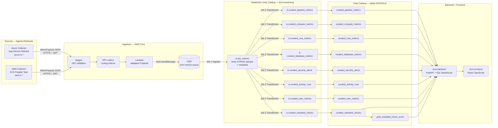

---

## 2. Principe de Cloisonnement Multi-LZ / Multi-Subscription

### 2.1 Concept fondamental

DCM est une plateforme **multi-tenant par Landing Zone**. Chaque Landing Zone (LZ) est un périmètre cloud isolé — soit une Subscription Azure, soit un Account AWS. Chaque LZ a :

- Son propre **agent déployé** (Azure WebJob ou ECS Fargate)
- Ses propres **secrets locaux** (App Registration Entra ID ou IAM Role) — gérés par l'équipe de la LZ
- Un identifiant unique `source_lz_id` qui traverse toutes les couches de données

Le core central DCM **ne connaît jamais** les secrets des LZ. Il reçoit des payloads signés (JWT) depuis Apigee. La rotation d'un secret se fait côté LZ uniquement, sans aucun impact sur le core.

### 2.2 Exemple concret — 3 LZ coexistant

| LZ | `source_lz_id` | `cloud_provider` | `subscription_or_account_id` | Agent |
|---|---|---|---|---|
| Azure France Production | `azure-lz-prod-fr` | `azure` | `fa5abbc4-02eb-416f-a75f-f8f6c5cc7d8a` | App Service WebJob |
| Azure France Dev | `azure-lz-dev-fr` | `azure` | `05ea2e78-1234-5678-abcd-ef0123456789` | App Service WebJob |
| AWS Data EU West | `aws-lz-data-eu` | `aws` | `551656632516` | ECS Fargate Task |

Ces 3 LZ envoient des métriques vers le même SQS. Toutes leurs données atterrissent dans les mêmes tables. Le cloisonnement se fait **par filtre SQL** dans les requêtes du Backend.

```sql
-- Vue de l'équipe Azure France Production uniquement
SELECT * FROM pipeline_metrics
WHERE source_lz_id = 'azure-lz-prod-fr'
  AND start_time >= NOW() - INTERVAL '24 hours'
ORDER BY start_time DESC;

-- Vue agrégée multi-cloud du tableau de bord
SELECT
    cloud_provider,
    source_lz_id,
    COUNT(*) FILTER (WHERE status = 'failed') AS failed_count,
    COUNT(*) FILTER (WHERE status = 'succeeded') AS success_count
FROM pipeline_metrics
WHERE start_time >= NOW() - INTERVAL '24 hours'
GROUP BY cloud_provider, source_lz_id;

-- Coûts par subscription Azure (isolation billing)
SELECT
    subscription_or_account_id,
    SUM(cost_usd) AS total_usd
FROM cost_metrics
WHERE cloud_provider = 'azure'
  AND period_start >= DATE_TRUNC('month', NOW())
GROUP BY subscription_or_account_id;
```

### 2.3 Gestion des secrets — responsabilité locale

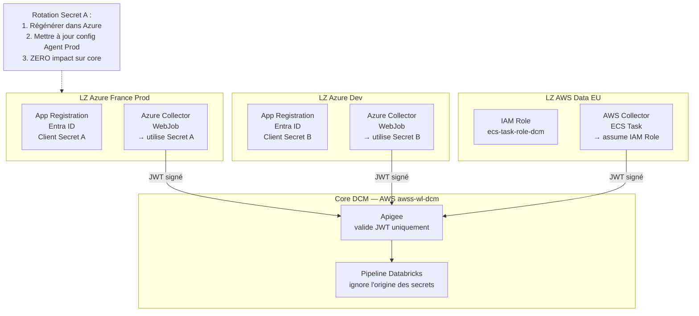

**Règle d'or :** Si une LZ tourne un secret, seul l'agent de cette LZ est affecté. Les autres LZ continuent sans interruption. Le core ne change pas.

### 2.4 Colonne `subscription_or_account_id`

Cette colonne est **nullable** dans toutes les tables sauf `cost_metrics` (où elle est obligatoire). Elle permet une isolation fine au niveau facturation :

- Pour Azure : Azure Subscription ID (UUID format)
- Pour AWS : AWS Account ID (12 chiffres)
- Pour des agents multicomptes : peut être `null` si non applicable (ex : agent collectant des métriques cross-account)

> **Décision d'implémentation :** La colonne doit être ajoutée à `MetricPayload` au niveau de l'enveloppe (pas des métriques individuelles), car c'est une propriété de la source de collecte, pas de la métrique elle-même.

---

## 3. Contrat Central : MetricPayload (l'enveloppe universelle)

`MetricPayload` est l'objet Python qui circule depuis les agents jusqu'à Apigee. C'est le **contrat d'interface** entre les agents et le core DCM.

### 3.1 Modèle Python actuel (à mettre à jour en Sprint 1)

```python
from __future__ import annotations
from dataclasses import dataclass, field
from datetime import datetime
from enum import Enum
from typing import Optional
from uuid import UUID


class CloudProvider(str, Enum):
    AZURE = "azure"
    AWS = "aws"


class MetricDomain(str, Enum):
    PIPELINE = "pipeline"
    COMPUTE = "compute"
    COST = "cost"
    DATABASE = "database"
    SECURITY = "security"
    # Nouveaux domaines — Sprint 1
    ACTIVITY_RUN = "activity_run"
    USER = "user"
    STANDARD_CHECK = "standard_check"


@dataclass
class MetricPayload:
    """Enveloppe universelle envoyée par chaque agent vers Apigee."""
    collection_run_id: UUID
    source_lz_id: str                           # ex: "azure-lz-prod-fr"
    cloud_provider: CloudProvider               # azure | aws
    domain: MetricDomain
    collected_at: datetime                      # UTC obligatoire
    metrics: list[BaseMetricModel]
    # NOUVEAU — Sprint 1 : isolation subscription/account
    subscription_or_account_id: Optional[str] = None  # ex: "fa5abbc4-..." ou "551656632516"
```

### 3.2 Exemple JSON d'un MetricPayload

```json
{
  "collection_run_id": "550e8400-e29b-41d4-a716-446655440000",
  "source_lz_id": "azure-lz-prod-fr",
  "cloud_provider": "azure",
  "domain": "pipeline",
  "subscription_or_account_id": "fa5abbc4-02eb-416f-a75f-f8f6c5cc7d8a",
  "collected_at": "2026-03-26T08:15:00Z",
  "metrics": [
    {
      "pipeline_id": "/subscriptions/fa5abbc4-.../providers/Microsoft.DataFactory/factories/adf-prod-fr/pipelines/LoadDWH",
      "pipeline_name": "LoadDWH",
      "run_id": "adf-run-abc123def456",
      "status": "failed",
      "trigger_type": "scheduled",
      "start_time": "2026-03-26T07:00:00Z",
      "end_time": "2026-03-26T08:14:52Z",
      "duration_seconds": 4492.0,
      "error_message": "Timeout on Copy Activity 'CopyCustomers': exceeded 3600s",
      "tags": {
        "environment": "prod",
        "team": "data-engineering"
      }
    }
  ]
}
```

### 3.3 Propagation des champs d'enveloppe dans les couches

Les champs de l'enveloppe (`collection_run_id`, `source_lz_id`, `cloud_provider`, `subscription_or_account_id`, `collected_at`) sont copiés **dans chaque ligne** des couches CURATED et SERVING. Cela permet de filtrer par LZ sur n'importe quelle table sans jointure.

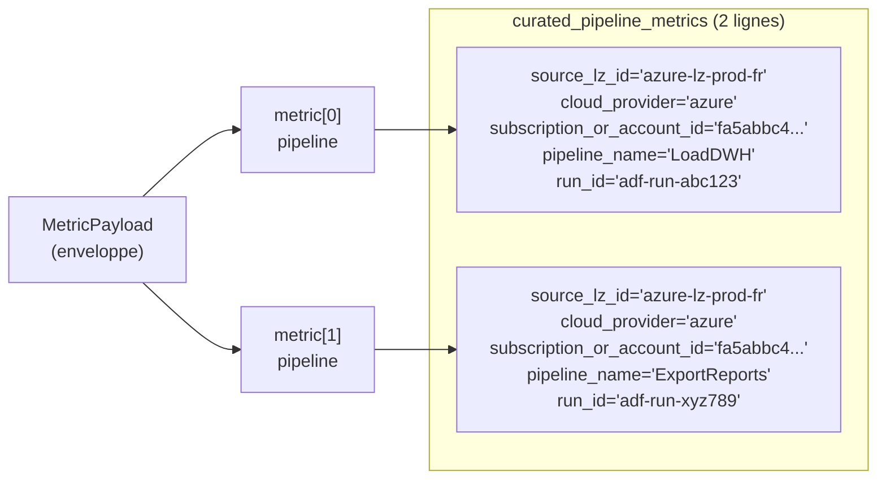

---

## 4. Couche 1 — RAW Delta Lake

> Archive immuable. Stocke le JSON brut complet de chaque `MetricPayload` tel qu'il arrive depuis SQS.
> Le `body` est intentionnellement opaque : aucune migration de cette table n'est jamais nécessaire.

### 4.1 Table `raw_metrics`

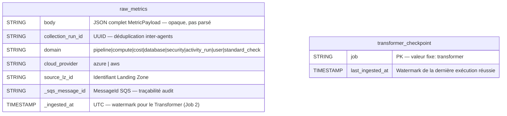

**Partitionnement Delta :** `cloud_provider` (permet de scanner uniquement Azure ou AWS)
**Format :** Delta Lake (Unity Catalog, eu-west-1)
**Mode d'écriture :** append uniquement (pas de UPDATE ni DELETE)
**Rétention :** 90 jours (VACUUM + OPTIMIZE planifiés — voir Section 11)

### 4.2 Logique du Job 1 — Ingestor

```python
# Pseudo-code du Job 1 Ingestor (Databricks Notebook ou Spark job)
def ingest_from_sqs(messages: list[SQSMessage]) -> None:
    rows = []
    for msg in messages:
        payload = json.loads(msg.body)  # ← pas de validation Pydantic ici
        rows.append({
            "body": msg.body,                          # ← JSON brut, opaque
            "collection_run_id": payload["collection_run_id"],
            "domain": payload["domain"],
            "cloud_provider": payload["cloud_provider"],
            "source_lz_id": payload["source_lz_id"],
            "_sqs_message_id": msg.message_id,
            "_ingested_at": datetime.utcnow(),
        })

    spark.createDataFrame(rows).write \
        .format("delta") \
        .mode("append") \
        .partitionBy("cloud_provider") \
        .saveAsTable("dcm.monitoring.raw_metrics")
```

> **Pourquoi pas de validation Pydantic dans le Ingestor ?**
> La Lambda a déjà validé le payload. Le Ingestor est volontairement simple pour maximiser le throughput. La validation métier est dans le Transformer (Job 2).

---

## 5. Couche 2 — CURATED Delta Lake — 8 domaines

> Données parsées et normalisées par domaine.
> Produit par le Job 2 — Transformer via `from_json` avec schéma Spark explicite.
> Format : une ligne par métrique individuelle (pas par payload).

### 5.1 Schéma commun à toutes les tables CURATED

Chaque table CURATED contient ces colonnes communes héritées de l'enveloppe :

| Colonne | Type Spark | Description |
|---|---|---|
| `collection_run_id` | STRING | Lien vers `raw_metrics` |
| `source_lz_id` | STRING | Landing Zone source |
| `cloud_provider` | STRING | azure \| aws |
| `subscription_or_account_id` | STRING | Nullable — Subscription Azure ou Account AWS |
| `collected_at` | TIMESTAMP | Timestamp de collecte côté agent |
| `_ingested_at` | TIMESTAMP | Timestamp ingestion RAW — watermark |

### 5.2 `curated_pipeline_metrics`

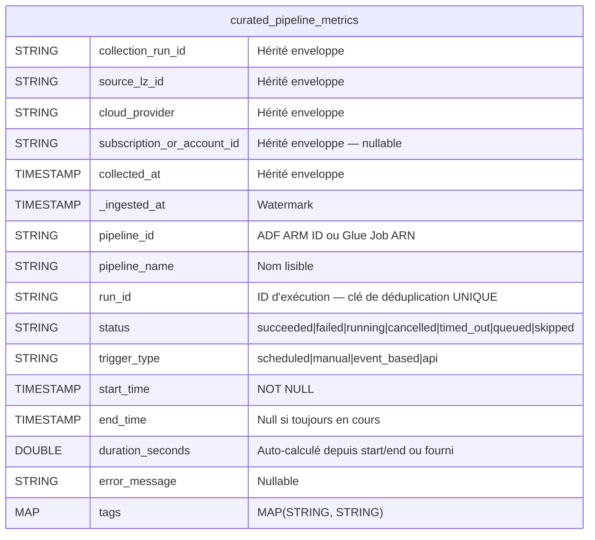

### 5.3 `curated_compute_metrics`

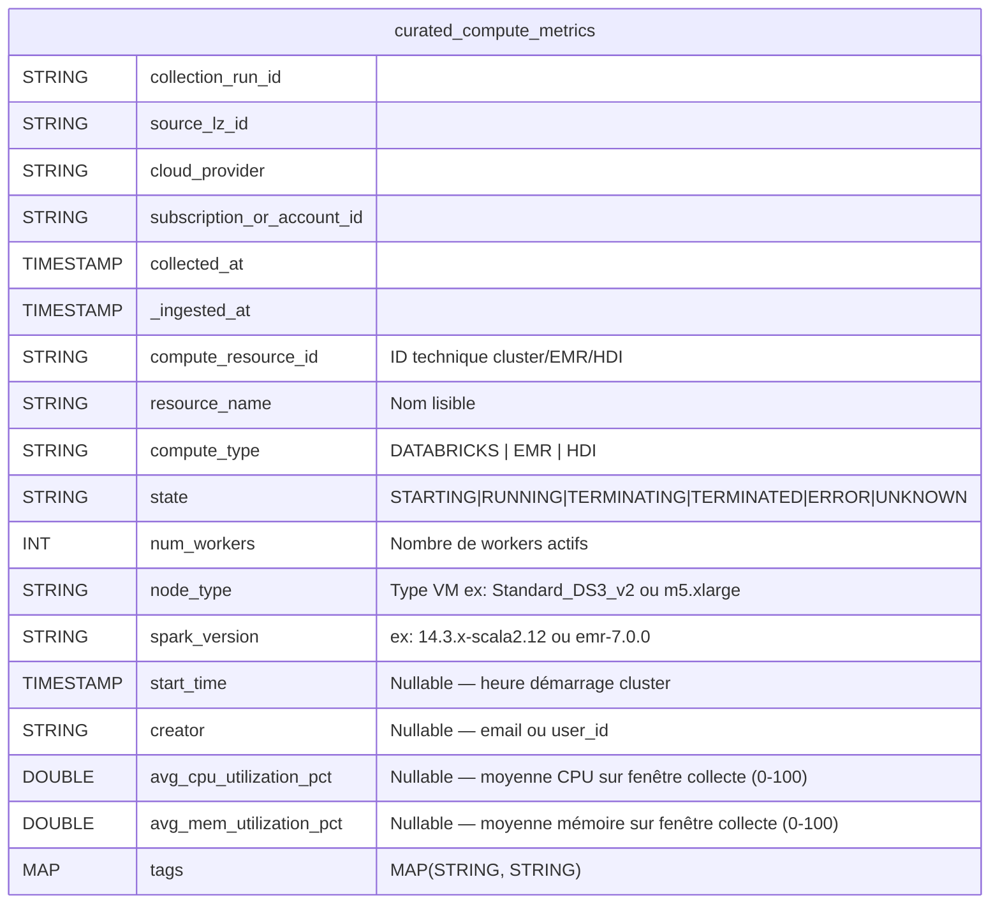

### 5.4 `curated_cost_metrics`

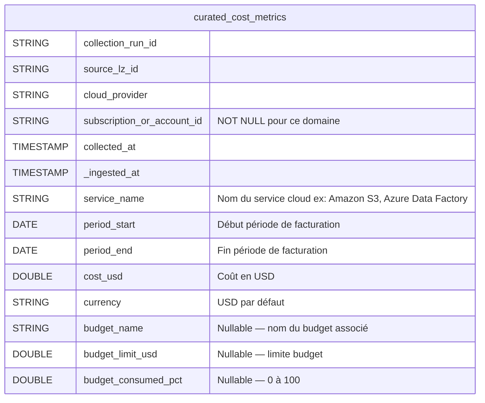

### 5.5 `curated_database_metrics`

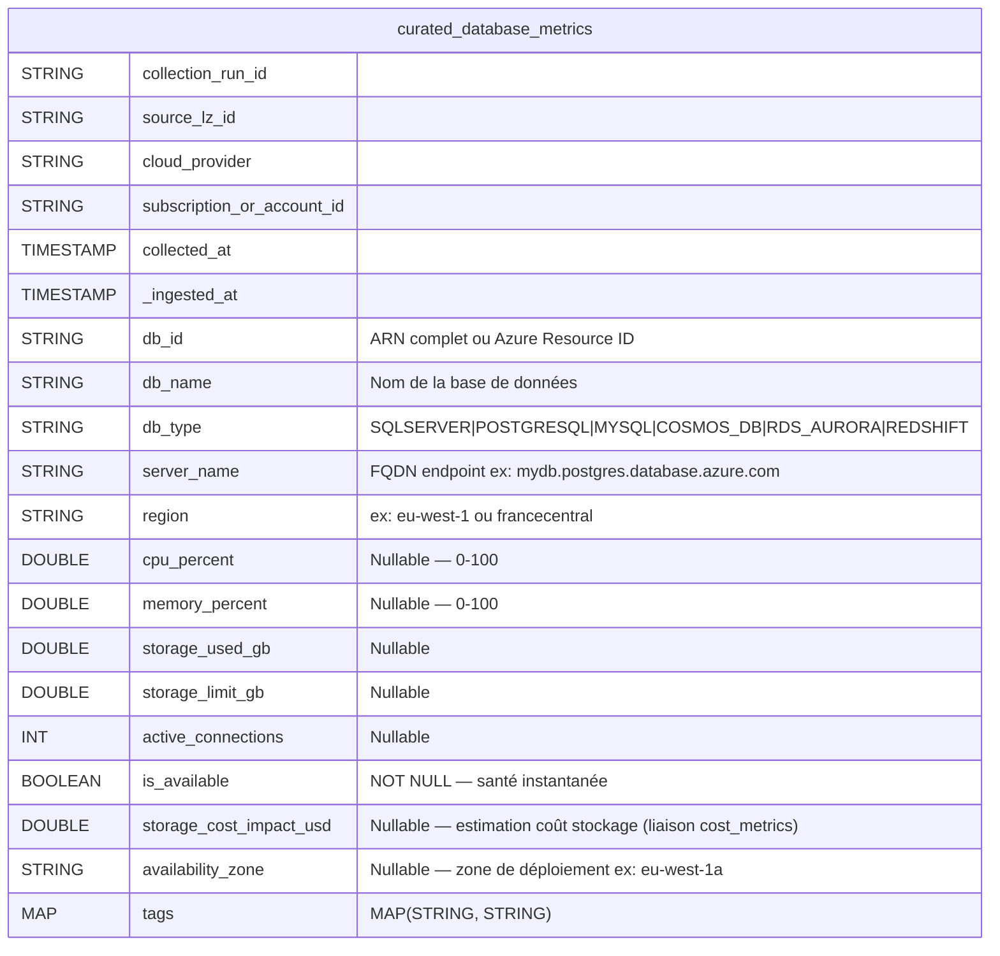

### 5.6 `curated_security_alerts`

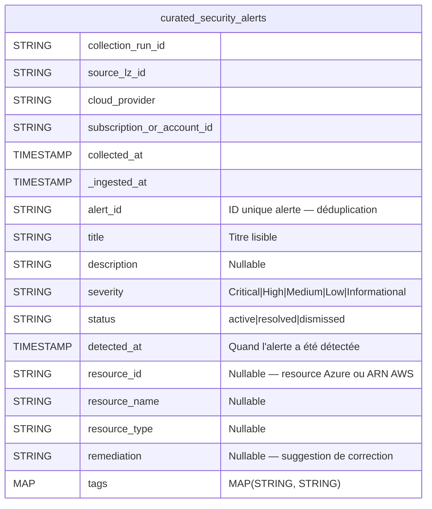

### 5.7 `curated_activity_runs` *(nouveau domaine)*

> Détail des activités d'un pipeline ADF (Copy Activity, Databricks Notebook, Lookup, ForEach, etc.) ou AWS Glue step.
> Lien logique vers `curated_pipeline_metrics` via `pipeline_run_id`.

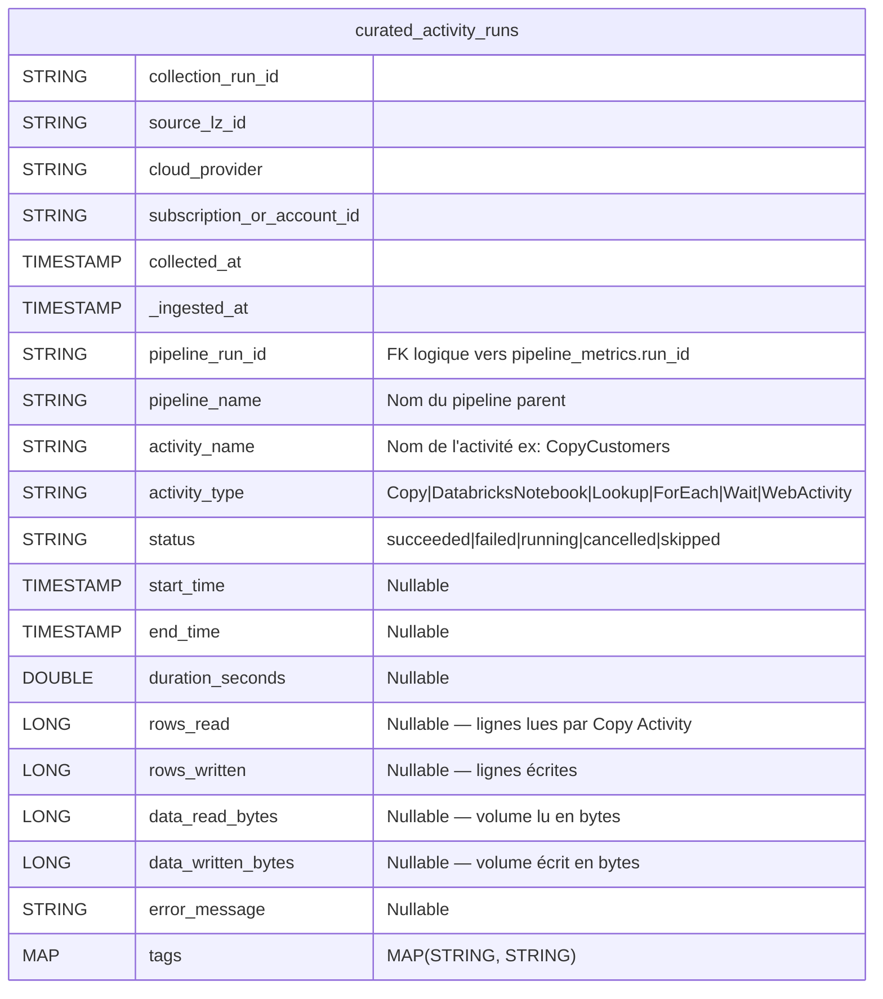

**Cas d'usage typiques :**
- Identifier quelle activité spécifique dans un pipeline a échoué
- Mesurer la volumétrie de données par activité (rows_read/written)
- Comparer les performances d'une même activité Copy sur plusieurs exécutions

### 5.8 `curated_user_metrics` *(nouveau domaine)*

> Utilisateurs Databricks collectés via SCIM (`/api/2.0/preview/scim/v2/Users`) + utilisateurs AWS IAM.
> Clé de déduplication : `(user_id, source_lz_id)` — un utilisateur par LZ.

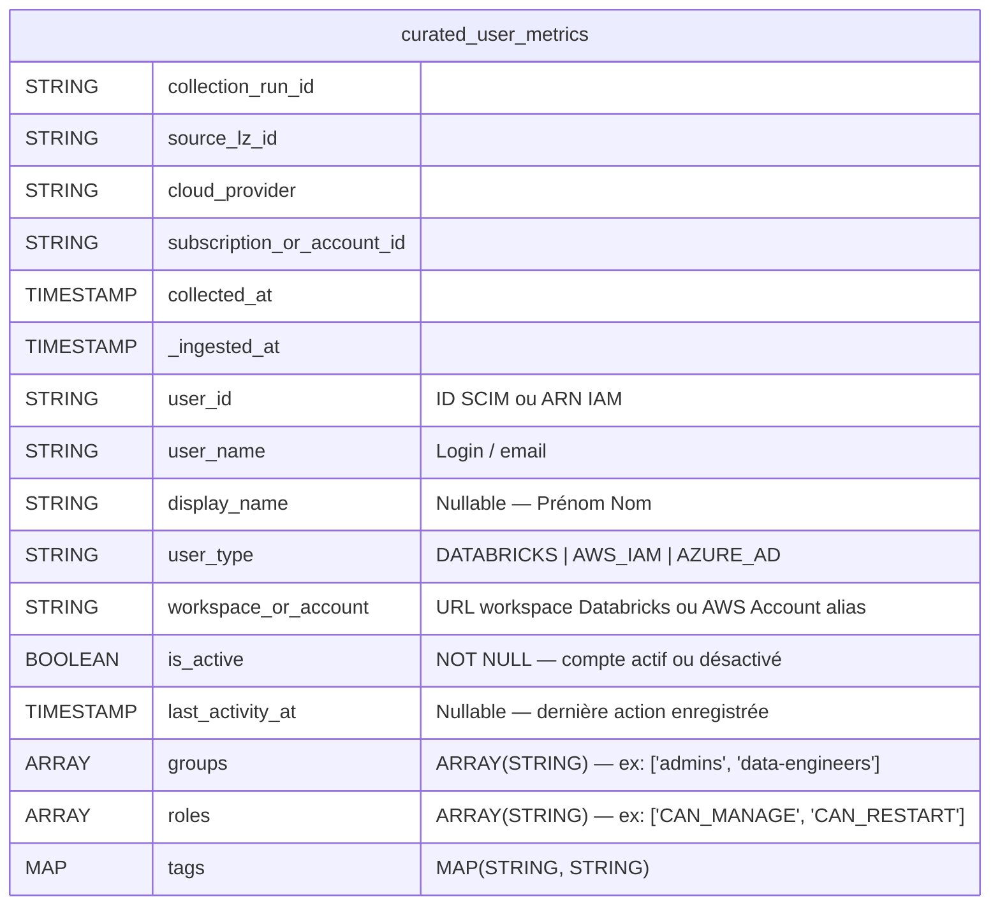

**Cas d'usage typiques :**
- Audit des comptes actifs par workspace
- Détection de comptes inactifs depuis > 90 jours
- Inventaire des groupes et rôles par LZ

### 5.9 `curated_standard_checks` *(nouveau domaine)*

> Azure Policy (état de conformité des ressources) + AWS Config Rules (évaluations).
> Clé de déduplication : `(check_id, resource_id, source_lz_id, evaluated_at)`.

> **Note architecturale (atelier 2026-04-13, actualisée 2026-05-27)** : Le domaine Standard Check est exposé dans la **couche Gold** de Databricks. La collecte brute reste inchangée (les agents collectent les états Azure Policy / AWS Config Rules via `domain: standard_check`). L'agrégation sémantique — calcul du score de conformité, dédoublonnage des règles, classification des sévérités — se fait dans un **Job Gold dédié** avant l'exposition au backend via SQL Warehouse.

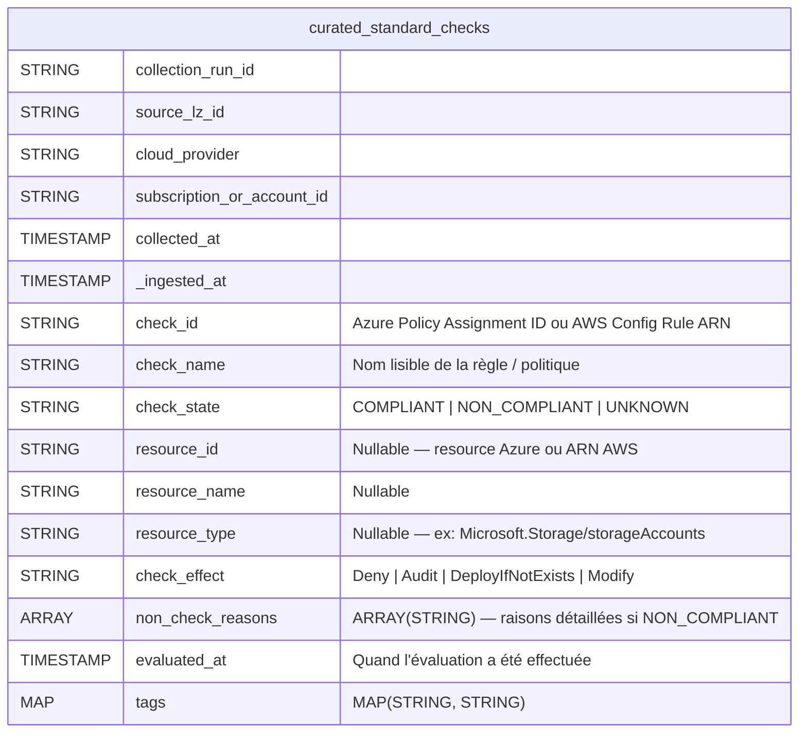

**Cas d'usage typiques :**
- Score de conformité global par LZ (`% COMPLIANT`)
- Ressources non conformes à une politique critique (effet Deny)
- Historique de conformité dans le temps

---

## 6. Couche API — Unity Catalog via SQL Warehouse

> Mise à jour 2026-05-27 : cette section décrivait historiquement une couche Lakebase/PostgreSQL.
> L'implémentation actuelle consomme directement les tables Unity Catalog via Databricks SQL Warehouse.
> Les DDL PostgreSQL ci-dessous restent utiles comme contrat logique de colonnes, mais ne sont plus la cible de déploiement backend.

### 6.1 Tables actives consommées par l'API

| Domaine API | Table Unity Catalog actuelle |
|---|---|
| Pipelines | `curated_pipeline_metrics` |
| Activity runs | `curated_activity_runs` |
| Compute / clusters | `curated_compute_metrics` |
| Costs | `curated_cost_metrics` |
| Databases | `curated_database_metrics` |
| Security | `curated_security_alerts` |
| Users | `curated_user_metrics` |
| Standard Checks | `curated_standard_checks` |
| Scores Standard Checks | `gold_standard_check_score` |
| Data Product Usage | `gold_data_product_usage` |
| Administration | `dcm_app_users`, `dcm_landing_zones`, `dcm_alert_rules`, `dcm_kpi_config`, etc. |

### 6.2 Vue historique des relations logiques

> Note : il n'y a **pas de Foreign Keys physiques** imposees au niveau backend. Les relations restent logiques et sont controlees par les jobs Databricks ou par l'API.

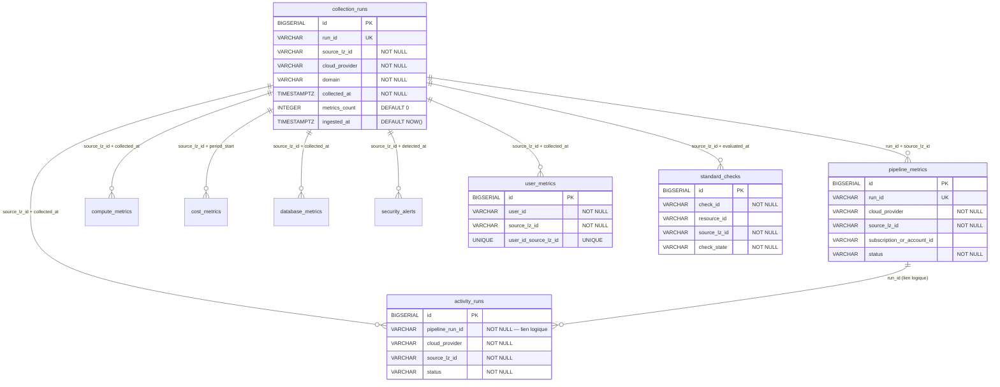

### 6.3 Contrat historique — anciennes tables SERVING PostgreSQL

#### Table `pipeline_metrics`

```sql
CREATE TABLE IF NOT EXISTS pipeline_metrics (
    id                          BIGSERIAL       PRIMARY KEY,
    pipeline_name               VARCHAR(255)    NOT NULL,
    pipeline_id                 VARCHAR(500),
    run_id                      VARCHAR(255)    UNIQUE,
    cloud_provider              VARCHAR(10)     NOT NULL,
    source_lz_id                VARCHAR(255)    NOT NULL,
    subscription_or_account_id  VARCHAR(255),                  -- Nullable pour compatibilité ascendante
    status                      VARCHAR(50)     NOT NULL,
    trigger_type                VARCHAR(50),
    start_time                  TIMESTAMPTZ     NOT NULL,
    end_time                    TIMESTAMPTZ,
    duration_seconds            FLOAT,
    error_message               TEXT,
    tags                        JSONB           NOT NULL DEFAULT '{}',
    collected_at                TIMESTAMPTZ     NOT NULL,
    ingested_at                 TIMESTAMPTZ     NOT NULL DEFAULT NOW()
);
```

#### Table `compute_metrics`

```sql
CREATE TABLE IF NOT EXISTS compute_metrics (
    id                          BIGSERIAL       PRIMARY KEY,
    compute_resource_id         VARCHAR(255)    NOT NULL,       -- ID technique (cluster ID, EMR cluster ID, HDI ID)
    resource_name               VARCHAR(255)    NOT NULL,       -- Nom lisible de la ressource compute
    compute_type                VARCHAR(50),                    -- DATABRICKS | EMR | HDI
    cloud_provider              VARCHAR(10)     NOT NULL,
    source_lz_id                VARCHAR(255)    NOT NULL,
    subscription_or_account_id  VARCHAR(255),                  -- Nullable
    state                       VARCHAR(50)     NOT NULL,
    num_workers                 INTEGER         NOT NULL DEFAULT 0,
    node_type                   VARCHAR(255),
    spark_version               VARCHAR(100),
    avg_cpu_utilization_pct     DECIMAL(5, 2),                  -- Nullable — 0-100, calculé sur fenêtre de collecte
    avg_mem_utilization_pct     DECIMAL(5, 2),                  -- Nullable — 0-100, calculé sur fenêtre de collecte
    tags                        JSONB           NOT NULL DEFAULT '{}',
    collected_at                TIMESTAMPTZ     NOT NULL,
    ingested_at                 TIMESTAMPTZ     NOT NULL DEFAULT NOW()
);
```

#### Table `cost_metrics`

```sql
CREATE TABLE IF NOT EXISTS cost_metrics (
    id                          BIGSERIAL       PRIMARY KEY,
    service_name                VARCHAR(255)    NOT NULL,
    subscription_or_account_id  VARCHAR(255)    NOT NULL,      -- NOT NULL : clé de facturation
    cloud_provider              VARCHAR(10)     NOT NULL,
    source_lz_id                VARCHAR(255)    NOT NULL,
    period_start                DATE            NOT NULL,
    period_end                  DATE            NOT NULL,
    cost_usd                    DECIMAL(15, 4)  NOT NULL,
    currency                    VARCHAR(10)     NOT NULL DEFAULT 'USD',
    budget_name                 VARCHAR(255),
    budget_limit_usd            DECIMAL(15, 4),
    budget_consumed_pct         DECIMAL(6, 2),                 -- 0.00 à 100.00
    ingested_at                 TIMESTAMPTZ     NOT NULL DEFAULT NOW(),
    UNIQUE (service_name, subscription_or_account_id, period_start, period_end)
);
```

#### Table `database_metrics`

```sql
CREATE TABLE IF NOT EXISTS database_metrics (
    id                          BIGSERIAL       PRIMARY KEY,
    db_id                       VARCHAR(500)    NOT NULL,
    db_name                     VARCHAR(255)    NOT NULL,
    db_type                     VARCHAR(50)     NOT NULL,
    server_name                 VARCHAR(500)    NOT NULL,
    region                      VARCHAR(100),
    cloud_provider              VARCHAR(10)     NOT NULL,
    source_lz_id                VARCHAR(255)    NOT NULL,
    subscription_or_account_id  VARCHAR(255),                  -- Nullable
    cpu_percent                 DECIMAL(5, 2),
    memory_percent              DECIMAL(5, 2),
    storage_used_gb             DECIMAL(12, 4),
    storage_limit_gb            DECIMAL(12, 4),
    active_connections          INTEGER,
    is_available                BOOLEAN         NOT NULL DEFAULT TRUE,
    storage_cost_impact_usd     DECIMAL(15, 4),                -- Nullable — estimation coût stockage lié
    availability_zone           VARCHAR(100),                  -- Nullable — ex: eu-west-1a, francecentral-1
    tags                        JSONB           NOT NULL DEFAULT '{}',
    collected_at                TIMESTAMPTZ     NOT NULL,
    ingested_at                 TIMESTAMPTZ     NOT NULL DEFAULT NOW()
);
```

#### Table `security_alerts`

```sql
CREATE TABLE IF NOT EXISTS security_alerts (
    id                          BIGSERIAL       PRIMARY KEY,
    alert_id                    VARCHAR(500)    UNIQUE NOT NULL,
    title                       VARCHAR(500)    NOT NULL,
    description                 TEXT,
    severity                    VARCHAR(20)     NOT NULL,
    status                      VARCHAR(50)     NOT NULL,
    cloud_provider              VARCHAR(10)     NOT NULL,
    source_lz_id                VARCHAR(255)    NOT NULL,
    subscription_or_account_id  VARCHAR(255),                  -- Nullable
    detected_at                 TIMESTAMPTZ     NOT NULL,
    resource_id                 VARCHAR(500),
    resource_name               VARCHAR(255),
    resource_type               VARCHAR(100),
    remediation                 TEXT,
    tags                        JSONB           NOT NULL DEFAULT '{}',
    ingested_at                 TIMESTAMPTZ     NOT NULL DEFAULT NOW()
);
```

#### Table `activity_runs` *(nouvelle)*

```sql
CREATE TABLE IF NOT EXISTS activity_runs (
    id                          BIGSERIAL       PRIMARY KEY,
    pipeline_run_id             VARCHAR(255)    NOT NULL,      -- Lien logique vers pipeline_metrics.run_id
    pipeline_name               VARCHAR(255)    NOT NULL,
    activity_name               VARCHAR(255)    NOT NULL,
    activity_type               VARCHAR(100),                  -- Copy|DatabricksNotebook|Lookup|ForEach|Wait|WebActivity
    cloud_provider              VARCHAR(10)     NOT NULL,
    source_lz_id                VARCHAR(255)    NOT NULL,
    subscription_or_account_id  VARCHAR(255),
    status                      VARCHAR(50)     NOT NULL,
    start_time                  TIMESTAMPTZ,
    end_time                    TIMESTAMPTZ,
    duration_seconds            FLOAT,
    rows_read                   BIGINT,
    rows_written                BIGINT,
    data_read_bytes             BIGINT,
    data_written_bytes          BIGINT,
    error_message               TEXT,
    tags                        JSONB           NOT NULL DEFAULT '{}',
    collected_at                TIMESTAMPTZ     NOT NULL,
    ingested_at                 TIMESTAMPTZ     NOT NULL DEFAULT NOW(),
    UNIQUE (pipeline_run_id, activity_name)
);
```

#### Table `user_metrics` *(nouvelle)*

```sql
CREATE TABLE IF NOT EXISTS user_metrics (
    id                          BIGSERIAL       PRIMARY KEY,
    user_id                     VARCHAR(255)    NOT NULL,
    user_name                   VARCHAR(255)    NOT NULL,
    display_name                VARCHAR(500),
    cloud_provider              VARCHAR(10)     NOT NULL,
    source_lz_id                VARCHAR(255)    NOT NULL,
    subscription_or_account_id  VARCHAR(255),
    user_type                   VARCHAR(50),                   -- DATABRICKS | AWS_IAM | AZURE_AD
    workspace_or_account        VARCHAR(255),                  -- URL workspace ou AWS Account alias
    is_active                   BOOLEAN         NOT NULL DEFAULT TRUE,
    last_activity_at            TIMESTAMPTZ,
    groups                      JSONB           NOT NULL DEFAULT '[]',  -- ["admins", "data-engineers"]
    roles                       JSONB           NOT NULL DEFAULT '[]',  -- ["CAN_MANAGE", "CAN_RESTART"]
    tags                        JSONB           NOT NULL DEFAULT '{}',
    collected_at                TIMESTAMPTZ     NOT NULL,
    -- SCD Type 2 : gestion de l'historique des droits et groupes utilisateurs
    valid_from                  TIMESTAMPTZ     NOT NULL DEFAULT NOW(),
    valid_to                    TIMESTAMPTZ,                   -- NULL = enregistrement courant
    is_current                  BOOLEAN         NOT NULL DEFAULT TRUE,
    ingested_at                 TIMESTAMPTZ     NOT NULL DEFAULT NOW(),
    UNIQUE (user_id, source_lz_id, valid_from)
);
```

#### Table `standard_checks` *(nouvelle)*

```sql
CREATE TABLE IF NOT EXISTS standard_checks (
    id                          BIGSERIAL       PRIMARY KEY,
    check_id                    VARCHAR(500)    NOT NULL,      -- Azure Policy Assignment ID ou AWS Config Rule ARN
    check_name                  VARCHAR(255)    NOT NULL,      -- Nom lisible de la règle
    cloud_provider              VARCHAR(10)     NOT NULL,
    source_lz_id                VARCHAR(255)    NOT NULL,
    subscription_or_account_id  VARCHAR(255),
    check_state                 VARCHAR(50)     NOT NULL,      -- COMPLIANT | NON_COMPLIANT | UNKNOWN
    resource_id                 VARCHAR(500),
    resource_name               VARCHAR(255),
    resource_type               VARCHAR(100),
    check_effect                VARCHAR(50),                   -- Deny | Audit | DeployIfNotExists | Modify
    non_check_reasons           TEXT[],                        -- Array PostgreSQL natif
    evaluated_at                TIMESTAMPTZ     NOT NULL,
    tags                        JSONB           NOT NULL DEFAULT '{}',
    ingested_at                 TIMESTAMPTZ     NOT NULL DEFAULT NOW(),
    UNIQUE (check_id, resource_id, source_lz_id, evaluated_at)
);
```

#### Table `dim_landing_zone` *(nouvelle — dimension SCD Type 2)*

> Référentiel des Landing Zones avec historique des métadonnées. Alimente le filtre LZ du Frontend et les rapports de facturation par `ba_name`.
>
> `ba_name` (Business Account Name) est extrait des **tags** de la Landing Zone :
> - Azure : tag `businessAccount` ou `costCenter` sur la Subscription
> - AWS : tag `BusinessAccount` sur l'Account root
>
> Le **SCD Type 2** conserve l'historique des changements (renommage de LZ, transfert de propriétaire, changement de projet). Exemple : LZ `azure-lz-prod-fr` change de `ba_name` `"Project Alpha"` → `"Project Gamma"` → ancienne ligne : `valid_to = NOW(), is_current = FALSE` ; nouvelle ligne : `valid_from = NOW(), is_current = TRUE`.

```sql
-- Dimension Landing Zone — SCD Type 2
CREATE TABLE IF NOT EXISTS dim_landing_zone (
    id                          BIGSERIAL       PRIMARY KEY,
    lz_id                       VARCHAR(255)    NOT NULL,      -- ex: "azure-lz-prod-fr"
    cloud_provider              VARCHAR(10)     NOT NULL,      -- azure | aws
    subscription_or_account_id  VARCHAR(255),                  -- Nullable
    ba_name                     VARCHAR(255),                  -- Business Account Name (tag facturation)
    description                 TEXT,                          -- Description lisible de la LZ
    environment                 VARCHAR(50),                   -- prod | dev | staging | sandbox
    team_owner                  VARCHAR(255),                  -- Équipe propriétaire (tag)
    region                      VARCHAR(100),                  -- Région principale de la LZ
    -- SCD Type 2
    valid_from                  TIMESTAMPTZ     NOT NULL DEFAULT NOW(),
    valid_to                    TIMESTAMPTZ,                   -- NULL = enregistrement courant
    is_current                  BOOLEAN         NOT NULL DEFAULT TRUE,
    ingested_at                 TIMESTAMPTZ     NOT NULL DEFAULT NOW(),
    UNIQUE (lz_id, valid_from)
);

-- Index dim_landing_zone
CREATE INDEX IF NOT EXISTS idx_lz_current
    ON dim_landing_zone (lz_id, is_current) WHERE is_current = TRUE;
CREATE INDEX IF NOT EXISTS idx_lz_cloud
    ON dim_landing_zone (cloud_provider, is_current);
CREATE INDEX IF NOT EXISTS idx_lz_ba_name
    ON dim_landing_zone (ba_name) WHERE ba_name IS NOT NULL;
```

#### Table `collection_runs` (audit)

```sql
CREATE TABLE IF NOT EXISTS collection_runs (
    id             BIGSERIAL    PRIMARY KEY,
    run_id         VARCHAR(255) UNIQUE NOT NULL,
    source_lz_id   VARCHAR(255) NOT NULL,
    cloud_provider VARCHAR(10)  NOT NULL,
    domain         VARCHAR(50)  NOT NULL,
    collected_at   TIMESTAMPTZ  NOT NULL,
    metrics_count  INTEGER      NOT NULL DEFAULT 0,
    ingested_at    TIMESTAMPTZ  NOT NULL DEFAULT NOW()
);
```

---

## 7. Stratégie d'Index PostgreSQL historique

> Section historique : ces index concernaient la cible Lakebase/PostgreSQL.
> L'implémentation actuelle doit optimiser les tables Delta/Unity Catalog côté Databricks (partitionnement, clustering/liquid clustering, ZORDER selon disponibilité, vues Gold).

### 7.1 Tables existantes (mises à jour avec subscription_or_account_id)

| Table | Nom index | Colonnes | Requête optimisée |
|---|---|---|---|
| `pipeline_metrics` | `idx_pipeline_cloud_time` | `(cloud_provider, start_time DESC)` | Filtre par cloud + tri récent |
| `pipeline_metrics` | `idx_pipeline_status_time` | `(status, start_time DESC)` | Alertes pipeline failed |
| `pipeline_metrics` | `idx_pipeline_lz_time` | `(source_lz_id, start_time DESC)` | Vue par LZ |
| `pipeline_metrics` | `idx_pipeline_name_time` | `(pipeline_name, start_time DESC)` | Historique par pipeline |
| `pipeline_metrics` | `idx_pipeline_sub_time` | `(subscription_or_account_id, start_time DESC)` | Filtre billing |
| `compute_metrics` | `idx_compute_cloud_time` | `(cloud_provider, collected_at DESC)` | Dernier état ressources compute |
| `compute_metrics` | `idx_compute_state_time` | `(state, collected_at DESC)` | Ressources RUNNING |
| `compute_metrics` | `idx_compute_resource_time` | `(compute_resource_id, collected_at DESC)` | `DISTINCT ON (compute_resource_id)` |
| `cost_metrics` | `idx_cost_cloud_period` | `(cloud_provider, period_start DESC)` | Coûts par cloud |
| `cost_metrics` | `idx_cost_service_period` | `(service_name, period_start DESC)` | Coûts par service |
| `cost_metrics` | `idx_cost_lz_period` | `(source_lz_id, period_start DESC)` | Coûts par LZ |
| `database_metrics` | `idx_db_cloud_time` | `(cloud_provider, collected_at DESC)` | État DB par cloud |
| `database_metrics` | `idx_db_type_time` | `(db_type, collected_at DESC)` | Filtre par type DB |
| `database_metrics` | `idx_db_id_time` | `(db_id, collected_at DESC)` | `DISTINCT ON (db_id)` |
| `database_metrics` | `idx_db_availability` | `(is_available, collected_at DESC)` | DB non disponibles |
| `security_alerts` | `idx_security_severity_time` | `(severity, detected_at DESC)` | Alertes critiques |
| `security_alerts` | `idx_security_status_time` | `(status, detected_at DESC)` | Alertes actives |
| `security_alerts` | `idx_security_cloud_time` | `(cloud_provider, detected_at DESC)` | Filtre cloud |
| `collection_runs` | `idx_runs_cloud_time` | `(cloud_provider, collected_at DESC)` | Audit par cloud |
| `collection_runs` | `idx_runs_lz_time` | `(source_lz_id, collected_at DESC)` | Audit par LZ |
| `collection_runs` | `idx_runs_domain_time` | `(domain, collected_at DESC)` | Audit par domaine |

### 7.2 Nouvelles tables — index à créer

```sql
-- activity_runs
CREATE INDEX IF NOT EXISTS idx_activity_pipeline_run
    ON activity_runs (pipeline_run_id, start_time DESC);        -- Drilldown depuis pipeline
CREATE INDEX IF NOT EXISTS idx_activity_lz_time
    ON activity_runs (source_lz_id, start_time DESC);
CREATE INDEX IF NOT EXISTS idx_activity_status_time
    ON activity_runs (status, start_time DESC);
CREATE INDEX IF NOT EXISTS idx_activity_type_time
    ON activity_runs (activity_type, start_time DESC);

-- user_metrics
CREATE INDEX IF NOT EXISTS idx_user_lz_active
    ON user_metrics (source_lz_id, is_active, collected_at DESC);
CREATE INDEX IF NOT EXISTS idx_user_cloud_type
    ON user_metrics (cloud_provider, user_type, collected_at DESC);
CREATE INDEX IF NOT EXISTS idx_user_last_activity
    ON user_metrics (last_activity_at DESC NULLS LAST);          -- Comptes inactifs
CREATE INDEX IF NOT EXISTS idx_user_scd_current
    ON user_metrics (user_id, source_lz_id, is_current) WHERE is_current = TRUE;  -- SCD Type 2

-- standard_checks
CREATE INDEX IF NOT EXISTS idx_check_state_time
    ON standard_checks (check_state, evaluated_at DESC);       -- % conformité / score
CREATE INDEX IF NOT EXISTS idx_check_lz_state
    ON standard_checks (source_lz_id, check_state, evaluated_at DESC);
CREATE INDEX IF NOT EXISTS idx_check_id_time
    ON standard_checks (check_id, evaluated_at DESC);
CREATE INDEX IF NOT EXISTS idx_check_cloud_state
    ON standard_checks (cloud_provider, check_state, evaluated_at DESC);
```

---

## 8. Modèles Python ↔ Tables (correspondance complète)

### 8.1 Modèles existants (rappel + mise à jour)

```python
from __future__ import annotations
from dataclasses import dataclass, field
from datetime import datetime, date
from enum import Enum
from typing import Optional


class PipelineRunStatus(str, Enum):
    SUCCEEDED  = "succeeded"
    FAILED     = "failed"
    RUNNING    = "running"
    CANCELLED  = "cancelled"
    TIMED_OUT  = "timed_out"
    QUEUED     = "queued"
    SKIPPED    = "skipped"
    UNKNOWN    = "unknown"


class TriggerType(str, Enum):
    SCHEDULED   = "scheduled"
    MANUAL      = "manual"
    EVENT_BASED = "event_based"
    API         = "api"


class ComputeType(str, Enum):
    DATABRICKS = "DATABRICKS"
    EMR        = "EMR"
    HDI        = "HDI"


class ComputeState(str, Enum):
    STARTING     = "starting"
    RUNNING      = "running"
    TERMINATING  = "terminating"
    TERMINATED   = "terminated"
    ERROR        = "error"
    UNKNOWN      = "unknown"


class DatabaseType(str, Enum):
    SQLSERVER  = "SQLSERVER"
    POSTGRESQL = "POSTGRESQL"
    MYSQL      = "MYSQL"
    COSMOS_DB  = "COSMOS_DB"
    RDS_AURORA = "RDS_AURORA"
    REDSHIFT   = "REDSHIFT"
    UNKNOWN    = "UNKNOWN"


class AlertSeverity(str, Enum):
    CRITICAL      = "Critical"
    HIGH          = "High"
    MEDIUM        = "Medium"
    LOW           = "Low"
    INFORMATIONAL = "Informational"


class AlertStatus(str, Enum):
    ACTIVE    = "active"
    RESOLVED  = "resolved"
    DISMISSED = "dismissed"


@dataclass
class PipelineMetric:
    pipeline_id:       str
    pipeline_name:     str
    run_id:            str               # UNIQUE — clé de déduplication
    status:            PipelineRunStatus
    trigger_type:      TriggerType
    start_time:        datetime          # UTC
    end_time:          Optional[datetime] = None
    duration_seconds:  Optional[float]   = None   # auto-calculé si absent
    error_message:     Optional[str]     = None
    tags:              dict              = field(default_factory=dict)


@dataclass
class ComputeMetric:
    compute_resource_id:     str                   # ID technique (cluster ID, EMR ID, HDI ID)
    resource_name:           str                   # Nom lisible de la ressource compute
    compute_type:            ComputeType
    state:                   ComputeState
    num_workers:             int
    node_type:               str
    spark_version:           str
    start_time:              Optional[datetime] = None
    creator:                 Optional[str]      = None
    avg_cpu_utilization_pct: Optional[float]   = None  # 0-100, moyenne calculée sur fenêtre collecte
    avg_mem_utilization_pct: Optional[float]   = None  # 0-100, moyenne calculée sur fenêtre collecte
    tags:                    dict              = field(default_factory=dict)


@dataclass
class CostMetric:
    service_name:               str
    subscription_or_account_id: str           # NOT NULL pour le domaine cost
    period_start:               date
    period_end:                 date
    cost_usd:                   float
    currency:                   str            = "USD"
    budget_name:                Optional[str]  = None
    budget_limit_usd:           Optional[float] = None
    budget_consumed_pct:        Optional[float] = None    # 0-100


@dataclass
class DatabaseMetric:
    db_id:              str
    db_name:            str
    db_type:            DatabaseType
    server_name:        str
    region:             str
    cpu_percent:        Optional[float] = None
    memory_percent:     Optional[float] = None
    storage_used_gb:    Optional[float] = None
    storage_limit_gb:   Optional[float] = None
    active_connections:      Optional[int]   = None
    is_available:            bool            = True
    storage_cost_impact_usd: Optional[float] = None   # Estimation coût stockage
    availability_zone:       Optional[str]   = None   # ex: eu-west-1a, francecentral-1
    tags:                    dict            = field(default_factory=dict)


@dataclass
class SecurityAlert:
    alert_id:      str             # UNIQUE
    title:         str
    severity:      AlertSeverity
    status:        AlertStatus
    detected_at:   datetime
    description:   Optional[str]  = None
    resource_id:   Optional[str]  = None
    resource_name: Optional[str]  = None
    resource_type: Optional[str]  = None
    remediation:   Optional[str]  = None
    tags:          dict           = field(default_factory=dict)
```

### 8.2 Nouveaux modèles — Sprint 1 (à créer dans `dcm_commons/models/`)

```python
# dcm_commons/models/activity_run.py

class ActivityRunStatus(str, Enum):
    SUCCEEDED = "succeeded"
    FAILED    = "failed"
    RUNNING   = "running"
    CANCELLED = "cancelled"
    SKIPPED   = "skipped"


class ActivityType(str, Enum):
    COPY                   = "Copy"
    DATABRICKS_NOTEBOOK    = "DatabricksNotebook"
    LOOKUP                 = "Lookup"
    FOR_EACH               = "ForEach"
    WAIT                   = "Wait"
    WEB_ACTIVITY           = "WebActivity"
    EXECUTE_PIPELINE       = "ExecutePipeline"
    GLUE_JOB_NODE          = "GlueJobNode"          # AWS Glue workflow step
    UNKNOWN                = "Unknown"


@dataclass
class ActivityRunMetric:
    pipeline_run_id:    str              # Lien logique vers PipelineMetric.run_id
    pipeline_name:      str
    activity_name:      str
    status:             ActivityRunStatus
    activity_type:      ActivityType     = ActivityType.UNKNOWN
    start_time:         Optional[datetime] = None
    end_time:           Optional[datetime] = None
    duration_seconds:   Optional[float]    = None
    rows_read:          Optional[int]      = None
    rows_written:       Optional[int]      = None
    data_read_bytes:    Optional[int]      = None
    data_written_bytes: Optional[int]      = None
    error_message:      Optional[str]      = None
    tags:               dict               = field(default_factory=dict)
```

```python
# dcm_commons/models/user.py

class UserType(str, Enum):
    DATABRICKS = "DATABRICKS"
    AWS_IAM    = "AWS_IAM"
    AZURE_AD   = "AZURE_AD"


@dataclass
class UserMetric:
    user_id:              str
    user_name:            str
    user_type:            UserType
    is_active:            bool            = True
    display_name:         Optional[str]   = None
    workspace_or_account: Optional[str]   = None    # URL workspace ou AWS Account alias
    last_activity_at:     Optional[datetime] = None
    groups:               list[str]       = field(default_factory=list)
    roles:                list[str]       = field(default_factory=list)
    tags:                 dict            = field(default_factory=dict)
```

```python
# dcm_commons/models/standard_check.py

class StandardCheckState(str, Enum):
    COMPLIANT     = "COMPLIANT"
    NON_COMPLIANT = "NON_COMPLIANT"
    UNKNOWN       = "UNKNOWN"


class CheckEffect(str, Enum):
    DENY                  = "Deny"
    AUDIT                 = "Audit"
    DEPLOY_IF_NOT_EXISTS  = "DeployIfNotExists"
    MODIFY                = "Modify"
    DISABLED              = "Disabled"


@dataclass
class StandardCheckMetric:
    check_id:           str                          # Azure Policy Assignment ID ou AWS Config Rule ARN
    check_name:         str                          # Nom lisible de la règle
    check_state:        StandardCheckState
    evaluated_at:       datetime
    resource_id:        Optional[str]       = None
    resource_name:      Optional[str]       = None
    resource_type:      Optional[str]       = None
    check_effect:       Optional[CheckEffect] = None
    non_check_reasons:  list[str]           = field(default_factory=list)
    tags:               dict                = field(default_factory=dict)
```

### 8.3 Tableau de correspondance complet

```mermaid
classDiagram
    class MetricPayload {
        +UUID collection_run_id
        +str source_lz_id
        +CloudProvider cloud_provider
        +str subscription_or_account_id
        +MetricDomain domain
        +datetime collected_at
        +list metrics
    }

    class PipelineMetric {
        +str pipeline_id
        +str pipeline_name
        +str run_id
        +PipelineRunStatus status
        +TriggerType trigger_type
        +datetime start_time
        +datetime end_time
        +float duration_seconds
        +str error_message
        +dict tags
    }

    class ActivityRunMetric {
        +str pipeline_run_id
        +str pipeline_name
        +str activity_name
        +ActivityRunStatus status
        +ActivityType activity_type
        +int rows_read
        +int rows_written
        +int data_read_bytes
        +int data_written_bytes
    }

    class ComputeMetric {
        +str compute_resource_id
        +str resource_name
        +ComputeType compute_type
        +ComputeState state
        +int num_workers
        +str node_type
        +str spark_version
        +float avg_cpu_utilization_pct
        +float avg_mem_utilization_pct
    }

    class CostMetric {
        +str service_name
        +str subscription_or_account_id
        +date period_start
        +date period_end
        +float cost_usd
    }

    class DatabaseMetric {
        +str db_id
        +str db_name
        +DatabaseType db_type
        +str server_name
        +float cpu_percent
        +bool is_available
    }

    class SecurityAlert {
        +str alert_id
        +str title
        +AlertSeverity severity
        +AlertStatus status
        +datetime detected_at
    }

    class UserMetric {
        +str user_id
        +str user_name
        +UserType user_type
        +bool is_active
        +datetime last_activity_at
        +list groups
        +list roles
    }

    class StandardCheckMetric {
        +str check_id
        +str check_name
        +StandardCheckState check_state
        +datetime evaluated_at
        +list non_check_reasons
    }

    MetricPayload "1" --> "0..*" PipelineMetric    : domain=pipeline
    MetricPayload "1" --> "0..*" ActivityRunMetric  : domain=activity_run
    MetricPayload "1" --> "0..*" ComputeMetric      : domain=compute
    MetricPayload "1" --> "0..*" CostMetric         : domain=cost
    MetricPayload "1" --> "0..*" DatabaseMetric     : domain=database
    MetricPayload "1" --> "0..*" SecurityAlert      : domain=security
    MetricPayload "1" --> "0..*" UserMetric         : domain=user
    MetricPayload "1" --> "0..*" StandardCheckMetric   : domain=standard_check
```

| Domaine (`domain`) | Modèle Python | Table CURATED | Table SERVING |
|---|---|---|---|
| `pipeline` | `PipelineMetric` | `curated_pipeline_metrics` | `pipeline_metrics` |
| `activity_run` | `ActivityRunMetric` | `curated_activity_runs` | `activity_runs` |
| `compute` | `ComputeMetric` | `curated_compute_metrics` | `compute_metrics` |
| `cost` | `CostMetric` | `curated_cost_metrics` | `cost_metrics` |
| `database` | `DatabaseMetric` | `curated_database_metrics` | `database_metrics` |
| `security` | `SecurityAlert` | `curated_security_alerts` | `security_alerts` |
| `user` | `UserMetric` | `curated_user_metrics` | `user_metrics` |
| `standard_check` | `StandardCheckMetric` | `curated_standard_checks` | `standard_checks` |

---

## 9. Valeurs d'Énumérations

### `domain` / `MetricDomain`

| Valeur | Modèle Python | Source Azure | Source AWS |
|---|---|---|---|
| `pipeline` | `PipelineMetric` | ADF pipeline runs | Glue job runs |
| `activity_run` | `ActivityRunMetric` | ADF activity runs | Glue workflow steps |
| `compute` | `ComputeMetric` | Databricks clusters / HDInsight | EMR clusters |
| `cost` | `CostMetric` | Azure Cost Management | AWS Cost Explorer |
| `database` | `DatabaseMetric` | Azure SQL/PostgreSQL/MySQL | RDS/Aurora/Redshift |
| `security` | `SecurityAlert` | Azure Security Center / Defender | AWS Security Hub / GuardDuty |
| `user` | `UserMetric` | Databricks SCIM / Azure AD | AWS IAM users |
| `standard_check` | `StandardCheckMetric` | Azure Policy states | AWS Config Rules |

### `cloud_provider` / `CloudProvider`

| Valeur | Agent source | Déploiement |
|---|---|---|
| `azure` | `dcm-azure-collector` | Azure App Service WebJob |
| `aws` | `dcm-aws-collector` | AWS ECS Fargate Task |

### `status` / `PipelineRunStatus` (pipeline)

| Valeur | Description | Action recommandée |
|---|---|---|
| `succeeded` | Exécution terminée avec succès | Aucune |
| `failed` | Exécution en erreur | Alerte équipe |
| `running` | En cours d'exécution | Monitoring durée |
| `cancelled` | Annulé manuellement | Log uniquement |
| `timed_out` | Timeout dépassé (SLA dépassé) | Alerte critique |
| `queued` | En attente de ressources | Monitoring si > 30min |
| `skipped` | Conditionnel non déclenché | Info uniquement |
| `unknown` | État non reconnu dans l'API | Log + investigation |

### `status` / `ActivityRunStatus` (activity_run)

| Valeur | Description |
|---|---|
| `succeeded` | Activité terminée avec succès |
| `failed` | Activité en erreur — stoppe souvent le pipeline |
| `running` | Activité en cours |
| `cancelled` | Annulé avec le pipeline parent |
| `skipped` | Condition `dependsOn` non remplie |

### `state` / `ComputeState` (compute)

| Valeur | Description | Facturation |
|---|---|---|
| `starting` | Démarrage en cours | En cours |
| `running` | Actif (WAITING inclus pour EMR) | Facturé |
| `terminating` | Arrêt en cours | En cours |
| `terminated` | Arrêté normalement | Stoppé |
| `error` | Erreur fatale | Stoppé — investigation requise |
| `unknown` | État non reconnu | Inconnu — investigation |

### `db_type` / `DatabaseType` (database)

| Valeur | Service Azure | Service AWS |
|---|---|---|
| `SQLSERVER` | Azure SQL Database | Amazon RDS SQL Server |
| `POSTGRESQL` | Azure PostgreSQL Flexible | Amazon RDS PostgreSQL |
| `MYSQL` | Azure MySQL Flexible | Amazon RDS MySQL |
| `COSMOS_DB` | Azure Cosmos DB | — |
| `RDS_AURORA` | — | Amazon Aurora (MySQL/PostgreSQL) |
| `REDSHIFT` | — | Amazon Redshift |
| `UNKNOWN` | Autres / non reconnu | Autres / non reconnu |

### `severity` / `AlertSeverity` (security)

| Valeur | Priorité | SLA réponse recommandé |
|---|---|---|
| `Critical` | P1 — alerte immédiate | < 15 minutes |
| `High` | P2 — traitement urgent | < 2 heures |
| `Medium` | P3 — traitement planifié | < 24 heures |
| `Low` | P4 — surveillance | < 1 semaine |
| `Informational` | Info — pas d'action requise | Aucun |

### `check_state` / `StandardCheckState` (standard_check)

| Valeur | Signification | Source Azure | Source AWS |
|---|---|---|---|
| `COMPLIANT` | La ressource respecte la politique | Azure Policy : Compliant | AWS Config : COMPLIANT |
| `NON_COMPLIANT` | La ressource viole la politique | Azure Policy : NonCompliant | AWS Config : NON_COMPLIANT |
| `UNKNOWN` | État indéterminé (ressource non évaluée) | Azure Policy : Unknown | AWS Config : NOT_APPLICABLE |

### `check_effect` / `CheckEffect` (standard_check)

| Valeur | Comportement |
|---|---|
| `Deny` | Bloque la création/modification de ressources non conformes |
| `Audit` | Journalise la non-conformité sans bloquer |
| `DeployIfNotExists` | Déploie une ressource corrective automatiquement |
| `Modify` | Modifie les propriétés de la ressource pour la mettre en conformité |
| `Disabled` | Politique désactivée — ne produit aucun résultat |

### `user_type` / `UserType` (user)

| Valeur | Source de données | API de collecte |
|---|---|---|
| `DATABRICKS` | Workspace Databricks | SCIM `/api/2.0/preview/scim/v2/Users` |
| `AWS_IAM` | AWS IAM | `iam list-users` + `get-credential-report` |
| `AZURE_AD` | Azure Active Directory | Microsoft Graph `/v1.0/users` |

---

## 10. Exemple de Flux Complet (end-to-end)

> Scénario : Un pipeline ADF `LoadDWH` échoue sur l'activité `CopyCustomers` le 26 mars 2026 à 08h14.
> Ce scénario montre les données exactes JSON à chaque étape du pipeline.

### Étape 1 — Agent Azure collecte et crée le MetricPayload

```python
# Exécuté dans le Azure WebJob — LZ azure-lz-prod-fr
# L'agent appelle l'API ADF : GET /subscriptions/.../providers/Microsoft.DataFactory/factories/adf-prod-fr/pipelineruns/adf-run-abc123def456

payload = MetricPayload(
    collection_run_id=UUID("550e8400-e29b-41d4-a716-446655440000"),
    source_lz_id="azure-lz-prod-fr",
    cloud_provider=CloudProvider.AZURE,
    domain=MetricDomain.PIPELINE,
    subscription_or_account_id="fa5abbc4-02eb-416f-a75f-f8f6c5cc7d8a",
    collected_at=datetime(2026, 3, 26, 8, 15, 0, tzinfo=timezone.utc),
    metrics=[
        PipelineMetric(
            pipeline_id="/subscriptions/fa5abbc4-.../factories/adf-prod-fr/pipelines/LoadDWH",
            pipeline_name="LoadDWH",
            run_id="adf-run-abc123def456",
            status=PipelineRunStatus.FAILED,
            trigger_type=TriggerType.SCHEDULED,
            start_time=datetime(2026, 3, 26, 7, 0, 0, tzinfo=timezone.utc),
            end_time=datetime(2026, 3, 26, 8, 14, 52, tzinfo=timezone.utc),
            duration_seconds=4492.0,
            error_message="Timeout on Copy Activity 'CopyCustomers': exceeded 3600s",
            tags={"environment": "prod", "team": "data-engineering"}
        )
    ]
)
```

**JSON envoyé vers Apigee (POST avec JWT) :**
```json
{
  "collection_run_id": "550e8400-e29b-41d4-a716-446655440000",
  "source_lz_id": "azure-lz-prod-fr",
  "cloud_provider": "azure",
  "domain": "pipeline",
  "subscription_or_account_id": "fa5abbc4-02eb-416f-a75f-f8f6c5cc7d8a",
  "collected_at": "2026-03-26T08:15:00Z",
  "metrics": [
    {
      "pipeline_id": "/subscriptions/fa5abbc4-.../factories/adf-prod-fr/pipelines/LoadDWH",
      "pipeline_name": "LoadDWH",
      "run_id": "adf-run-abc123def456",
      "status": "failed",
      "trigger_type": "scheduled",
      "start_time": "2026-03-26T07:00:00Z",
      "end_time": "2026-03-26T08:14:52Z",
      "duration_seconds": 4492.0,
      "error_message": "Timeout on Copy Activity 'CopyCustomers': exceeded 3600s",
      "tags": {"environment": "prod", "team": "data-engineering"}
    }
  ]
}
```

### Étape 2 — Lambda reçoit, valide Pydantic, publie dans SQS

```python
# Lambda dcm-ingestion-api
def handler(event, context):
    body = json.loads(event["body"])
    payload = MetricPayload(**body)  # Validation Pydantic — lève exception si invalide

    sqs.send_message(
        QueueUrl="https://sqs.eu-west-1.amazonaws.com/.../dcm-metrics-queue",
        MessageBody=json.dumps(body),          # ← Corps brut original (pas re-sérialisé)
        MessageGroupId=payload.source_lz_id,   # FIFO grouping par LZ
        MessageDeduplicationId=str(payload.collection_run_id)
    )
    return {"statusCode": 200}
```

### Étape 3 — Job 1 Ingestor — écrit dans `raw_metrics` Delta

**Ligne insérée dans `dcm.monitoring.raw_metrics` :**

| Colonne | Valeur |
|---|---|
| `body` | `{"collection_run_id": "550e8400...", "source_lz_id": "azure-lz-prod-fr", "domain": "pipeline", ...}` (JSON brut complet) |
| `collection_run_id` | `550e8400-e29b-41d4-a716-446655440000` |
| `domain` | `pipeline` |
| `cloud_provider` | `azure` |
| `source_lz_id` | `azure-lz-prod-fr` |
| `_sqs_message_id` | `msg-uuid-from-sqs` |
| `_ingested_at` | `2026-03-26T08:15:05Z` |

### Étape 4 — Job 2 Transformer — parse et écrit dans `curated_pipeline_metrics`

```python
# Pseudo-code Spark Transformer
raw_df = spark.table("dcm.monitoring.raw_metrics") \
    .filter(col("_ingested_at") > last_checkpoint) \
    .filter(col("domain") == "pipeline")

pipeline_schema = StructType([
    StructField("pipeline_id", StringType()),
    StructField("pipeline_name", StringType(), nullable=False),
    StructField("run_id", StringType(), nullable=False),
    StructField("status", StringType(), nullable=False),
    StructField("trigger_type", StringType()),
    StructField("start_time", TimestampType(), nullable=False),
    StructField("end_time", TimestampType()),
    StructField("duration_seconds", DoubleType()),
    StructField("error_message", StringType()),
    StructField("tags", MapType(StringType(), StringType())),
])

payload_schema = StructType([
    StructField("collection_run_id", StringType()),
    StructField("source_lz_id", StringType()),
    StructField("cloud_provider", StringType()),
    StructField("subscription_or_account_id", StringType()),
    StructField("collected_at", TimestampType()),
    StructField("metrics", ArrayType(pipeline_schema)),
])

curated_df = raw_df \
    .select(from_json(col("body"), payload_schema).alias("p")) \
    .select(
        "p.collection_run_id",
        "p.source_lz_id",
        "p.cloud_provider",
        "p.subscription_or_account_id",
        "p.collected_at",
        explode("p.metrics").alias("m"),   # ← UNE LIGNE PAR MÉTRIQUE
        col("_ingested_at"),
    ) \
    .select("collection_run_id", "source_lz_id", "cloud_provider",
            "subscription_or_account_id", "collected_at", "_ingested_at",
            "m.*")

curated_df.write.format("delta").mode("append") \
    .saveAsTable("dcm.monitoring.curated_pipeline_metrics")
```

**Ligne insérée dans `curated_pipeline_metrics` :**

| Colonne | Valeur |
|---|---|
| `collection_run_id` | `550e8400-e29b-41d4-a716-446655440000` |
| `source_lz_id` | `azure-lz-prod-fr` |
| `cloud_provider` | `azure` |
| `subscription_or_account_id` | `fa5abbc4-02eb-416f-a75f-f8f6c5cc7d8a` |
| `collected_at` | `2026-03-26T08:15:00Z` |
| `_ingested_at` | `2026-03-26T08:15:05Z` |
| `pipeline_id` | `/subscriptions/fa5abbc4-.../factories/adf-prod-fr/pipelines/LoadDWH` |
| `pipeline_name` | `LoadDWH` |
| `run_id` | `adf-run-abc123def456` |
| `status` | `failed` |
| `trigger_type` | `scheduled` |
| `start_time` | `2026-03-26T07:00:00Z` |
| `end_time` | `2026-03-26T08:14:52Z` |
| `duration_seconds` | `4492.0` |
| `error_message` | `Timeout on Copy Activity 'CopyCustomers': exceeded 3600s` |
| `tags` | `{"environment": "prod", "team": "data-engineering"}` |

### Étape 5 — Ancien flux Lakebase remplace par SQL Warehouse

> Historique : l'étape ci-dessous décrivait l'ancien Aggregator JDBC vers Lakebase.
> Dans le code actuel, le backend lit directement `curated_pipeline_metrics` via Databricks SQL Warehouse.

### Ancien exemple — Job 3 Aggregator vers `pipeline_metrics` Lakebase

```python
# Pseudo-code Spark Aggregator — JDBC vers Lakebase PostgreSQL
curated_df = spark.table("dcm.monitoring.curated_pipeline_metrics") \
    .filter(col("_ingested_at") > last_aggregator_checkpoint)

# Transformation vers format SERVING (types compatibles PostgreSQL)
serving_df = curated_df.select(
    col("pipeline_name"),
    col("pipeline_id"),
    col("run_id"),
    col("cloud_provider"),
    col("source_lz_id"),
    col("subscription_or_account_id"),
    col("status"),
    col("trigger_type"),
    col("start_time"),
    col("end_time"),
    col("duration_seconds").cast(FloatType()),
    col("error_message"),
    to_json(col("tags")).alias("tags"),   # MAP → JSON string → PostgreSQL JSONB
    col("collected_at"),
)

serving_df.write \
    .format("jdbc") \
    .option("url", "jdbc:postgresql://lakebase-endpoint:5432/dcm_monitoring?sslmode=require") \
    .option("dbtable", "pipeline_metrics") \
    .option("user", lakebase_user) \
    .option("password", lakebase_password) \
    .mode("append") \
    .save()
```

**Ligne insérée dans `pipeline_metrics` (Lakebase PostgreSQL) :**

```sql
-- Résultat visible via psql ou asyncpg :
SELECT id, pipeline_name, run_id, status, duration_seconds, error_message, source_lz_id
FROM pipeline_metrics
WHERE run_id = 'adf-run-abc123def456';

-- Résultat :
-- id | pipeline_name | run_id                  | status | duration_seconds | error_message                              | source_lz_id
-- ---+---------------+-------------------------+--------+------------------+--------------------------------------------+-----------------
-- 42 | LoadDWH       | adf-run-abc123def456    | failed | 4492.0           | Timeout on Copy Activity 'CopyCustomers'...| azure-lz-prod-fr
```

### Étape 6 — Backend API répond à une requête Frontend

```http
GET /api/v1/pipelines?status=failed&source_lz_id=azure-lz-prod-fr&limit=20
Authorization: Bearer eyJ...
```

```python
# dcm-backend FastAPI — endpoint pipelines
@router.get("/api/v1/pipelines")
async def get_pipelines(
    status: Optional[str] = None,
    source_lz_id: Optional[str] = None,
    cloud_provider: Optional[str] = None,
    limit: int = 50,
    db: asyncpg.Connection = Depends(get_db)
):
    query = """
        SELECT id, pipeline_name, run_id, status, trigger_type,
               start_time, end_time, duration_seconds, error_message,
               cloud_provider, source_lz_id, subscription_or_account_id, tags
        FROM pipeline_metrics
        WHERE ($1::text IS NULL OR status = $1)
          AND ($2::text IS NULL OR source_lz_id = $2)
          AND ($3::text IS NULL OR cloud_provider = $3)
        ORDER BY start_time DESC
        LIMIT $4
    """
    rows = await db.fetch(query, status, source_lz_id, cloud_provider, limit)
    return [dict(row) for row in rows]
```

**Réponse JSON retournée :**
```json
[
  {
    "id": 42,
    "pipeline_name": "LoadDWH",
    "run_id": "adf-run-abc123def456",
    "status": "failed",
    "trigger_type": "scheduled",
    "start_time": "2026-03-26T07:00:00+00:00",
    "end_time": "2026-03-26T08:14:52+00:00",
    "duration_seconds": 4492.0,
    "error_message": "Timeout on Copy Activity 'CopyCustomers': exceeded 3600s",
    "cloud_provider": "azure",
    "source_lz_id": "azure-lz-prod-fr",
    "subscription_or_account_id": "fa5abbc4-02eb-416f-a75f-f8f6c5cc7d8a",
    "tags": {"environment": "prod", "team": "data-engineering"}
  }
]
```

### Étape 7 — Frontend affiche la ligne avec badge rouge

```
┌──────────────────────────────────────────────────────────────────────────────┐
│  Pipelines — azure-lz-prod-fr                                                │
├────────────┬──────────────────┬──────────┬──────────┬───────────────────────┤
│  Pipeline  │  Run ID          │  Status  │ Duration │  Erreur               │
├────────────┼──────────────────┼──────────┼──────────┼───────────────────────┤
│  LoadDWH   │  adf-run-abc123  │ [FAILED] │  1h14m   │  Timeout CopyCustomers│
└────────────┴──────────────────┴──────────┴──────────┴───────────────────────┘
```

### Séquence complète en diagramme

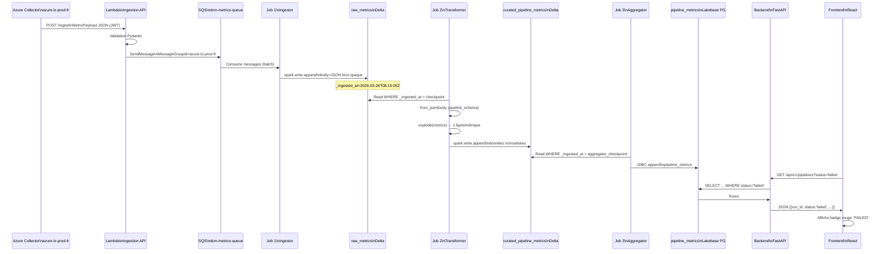

---

## 11. Cycle de Vie des Données & Rétention

### 11.1 Politique de rétention par couche

| Couche | Table / Chemin | Rétention | Mécanisme |
|---|---|---|---|
| RAW | `dcm.monitoring.raw_metrics` | 90 jours | `VACUUM RETAIN 90 DAYS` + `OPTIMIZE` hebdomadaire |
| CURATED | `dcm.monitoring.curated_*` (8 tables) | 1 an | `VACUUM RETAIN 365 DAYS` mensuel |
| SERVING | Tables Lakebase PostgreSQL | 2 ans glissants | Job de purge `DELETE WHERE ingested_at < NOW() - INTERVAL '2 years'` |
| SERVING coûts | `cost_metrics` | 3 ans | Règle spéciale — conformité comptable |
| SERVING conformité | `standard_checks` | 3 ans | Règle spéciale — audit réglementaire |

### 11.2 Planification des jobs de maintenance

```python
# Schedule Databricks — Workflows
MAINTENANCE_SCHEDULE = {
    "vacuum_raw":      "0 2 * * 0",    # Dimanche 02h00 — VACUUM raw_metrics (90j)
    "optimize_raw":    "0 3 * * 0",    # Dimanche 03h00 — OPTIMIZE raw_metrics (compaction)
    "vacuum_curated":  "0 4 1 * *",    # 1er du mois 04h00 — VACUUM curated (365j)
    "purge_serving":   "0 1 * * *",    # Quotidien 01h00 — DELETE expired serving rows
}
```

### 11.3 Stratégie de compaction Delta (OPTIMIZE)

Delta Lake accumule de nombreux petits fichiers Parquet au fil des appends. Le job `OPTIMIZE` les fusionne en fichiers plus grands (objectif : 1 GB/fichier) pour accélérer les lectures.

```sql
-- Job Databricks — exécuté après VACUUM
OPTIMIZE dcm.monitoring.raw_metrics ZORDER BY (source_lz_id, domain);
OPTIMIZE dcm.monitoring.curated_pipeline_metrics ZORDER BY (source_lz_id, status);
OPTIMIZE dcm.monitoring.curated_compute_metrics ZORDER BY (source_lz_id, state);
```

**ZORDER** est l'équivalent Delta d'un index B-Tree mais au niveau fichier. Il co-localise les données pour les filtres les plus fréquents (`source_lz_id`, `status`) et réduit les I/O Spark.

---

## 12. Ajouter une Nouvelle Landing Zone (zero-downtime)

> L'un des avantages clés de l'architecture DCM est que l'ajout d'une nouvelle LZ est entièrement **zero-downtime** et **sans migration de schéma**.

### 12.1 Pourquoi c'est zero-downtime ?

- Toutes les tables CURATED et SERVING sont **génériques** — elles ne connaissent pas les LZ à l'avance
- Le routing se fait par le champ `source_lz_id` qui est libre-texte
- Le core DCM (Lambda + Jobs Databricks + Backend FastAPI) ne nécessite aucun changement
- Seul l'**agent de la nouvelle LZ** doit être déployé et configuré

### 12.2 Procédure — 5 étapes

**Étape 1 — Provisionner l'agent dans la nouvelle LZ**

Pour une nouvelle LZ Azure (ex: client ABC) :
```bash
# L'équipe de la LZ crée une App Registration dans leur tenant
# Obtient : TenantId, ClientId, ClientSecret

# Déploie l'Azure WebJob avec les variables d'environnement :
DCM_SOURCE_LZ_ID="azure-lz-client-abc"
DCM_CLOUD_PROVIDER="azure"
DCM_SUBSCRIPTION_ID="11223344-aaaa-bbbb-cccc-ddeeff001122"
DCM_TENANT_ID="..."
DCM_CLIENT_ID="..."
DCM_CLIENT_SECRET="..."          # ← secret LOCAL à cette LZ, pas connu du core
DCM_APIGEE_ENDPOINT="https://api.dcm.internal/ingest"
DCM_APIGEE_JWT="..."             # JWT pour s'authentifier auprès d'Apigee
```

**Étape 2 — Configurer `source_lz_id` unique**

Le `source_lz_id` doit être unique dans tout le parc DCM. Convention recommandée :
- Azure : `azure-lz-{environnement}-{pays/région}` → `azure-lz-prod-de`, `azure-lz-client-abc`
- AWS : `aws-lz-{équipe}-{région}` → `aws-lz-data-eu-west`, `aws-lz-ml-us-east`

**Étape 3 — Démarrer l'agent**

L'agent démarre et commence à envoyer des payloads. Les données arrivent dans SQS automatiquement. Aucune configuration côté core.

**Étape 4 — Vérification dans Lakebase**

Après le premier cycle de collecte (généralement 5-15 minutes) :
```sql
-- Vérifier que la nouvelle LZ est bien présente
SELECT source_lz_id, cloud_provider, COUNT(*) as nb_runs
FROM collection_runs
WHERE source_lz_id = 'azure-lz-client-abc'
GROUP BY source_lz_id, cloud_provider;

-- Vérifier les premières métriques
SELECT pipeline_name, status, start_time
FROM pipeline_metrics
WHERE source_lz_id = 'azure-lz-client-abc'
ORDER BY start_time DESC
LIMIT 10;
```

**Étape 5 — Frontend : filtre LZ automatique**

Le Frontend lit la liste des `source_lz_id` distincts depuis l'API :
```http
GET /api/v1/landing-zones
→ ["azure-lz-prod-fr", "azure-lz-dev-fr", "aws-lz-data-eu", "azure-lz-client-abc"]
```

La nouvelle LZ apparaît automatiquement dans le sélecteur sans déploiement Frontend.

### 12.3 Rotation de secret — zero-downtime

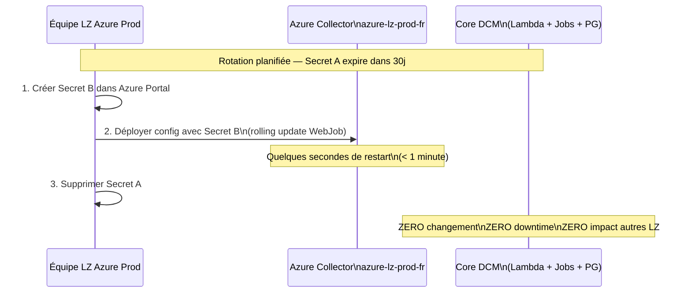

---

## 13. Roadmap Données — Phases suivantes

> Actions d'implémentation suite à ce workshop. Classées par sprint et par composant.

### Sprint 1 — Modèles (dcm-commons)

**Priorité : BLOQUANT pour tous les autres sprints**

- [ ] Ajouter `subscription_or_account_id: Optional[str] = None` à `MetricPayload`
- [ ] Ajouter `MetricDomain.ACTIVITY_RUN = "activity_run"` dans `MetricDomain`
- [ ] Ajouter `MetricDomain.USER = "user"` dans `MetricDomain`
- [ ] Ajouter `MetricDomain.STANDARD_CHECK = "standard_check"` dans `MetricDomain`
- [ ] Créer `dcm_commons/models/activity_run.py` avec `ActivityRunMetric`, `ActivityRunStatus`, `ActivityType`
- [ ] Créer `dcm_commons/models/user.py` avec `UserMetric`, `UserType`
- [ ] Créer `dcm_commons/models/standard_check.py` avec `StandardCheckMetric`, `StandardCheckState`, `CheckEffect`
- [ ] Mettre à jour `dcm_commons/models/__init__.py` avec les exports des nouveaux modèles
- [ ] Tests unitaires Pydantic pour les 3 nouveaux modèles (cas nominaux + cas limites)

### Sprint 2 — Collecteurs Azure (dcm-azure-collector)

- [ ] Ajouter collecte `activity_run` dans `collectors/datafactory.py`
  - API : `POST /subscriptions/{sub}/resourceGroups/{rg}/providers/Microsoft.DataFactory/factories/{factory}/queryActivityRuns`
  - Corps : `{"lastUpdatedAfter": "...", "lastUpdatedBefore": "..."}`
  - Lien : via `pipeline_run_id` récupéré dans les pipeline runs
- [ ] Ajouter collecte `user` dans `collectors/databricks.py`
  - API SCIM : `GET {workspace_url}/api/2.0/preview/scim/v2/Users?count=1000`
  - Gestion pagination (attribut `startIndex`)
- [ ] Ajouter collecte `compliance` dans `collectors/security_center.py` (ou nouveau fichier `collectors/policy.py`)
  - API : `POST /subscriptions/{sub}/providers/Microsoft.PolicyInsights/policyStates/latest/queryResults`
  - Filtre : `complianceState eq 'NonCompliant'` pour ne collecter que les non-conformes
- [ ] Mettre à jour `config.py` pour supporter **liste de subscriptions** (pas une seule)
  ```python
  AZURE_SUBSCRIPTION_IDS: list[str] = ["fa5abbc4...", "05ea2e78..."]
  ```
- [ ] Gérer la rotation de secret : si 401 sur un appel → `logger.critical(...)` + alerte Slack, **ne pas crasher** les autres collectes
- [ ] Mettre à jour `MetricPayload` instanciation pour inclure `subscription_or_account_id`

### Sprint 3 — Collecteurs AWS (dcm-aws-collector)

- [ ] Ajouter collecte `activity_run` depuis AWS Glue
  - API : `glue.get_job_runs(JobName=...)` + détail steps via `glue.get_workflow_run_properties()`
  - Mapping Glue steps → `ActivityRunMetric`
- [ ] Ajouter collecte `user` depuis AWS IAM
  - API : `iam.list_users()` + `iam.generate_credential_report()` pour `last_activity_at`
  - Gestion pagination IAM (marker-based)
- [ ] Ajouter collecte `compliance` depuis AWS Config Rules
  - API : `config.get_compliance_details_by_config_rule(ConfigRuleName=...)`
  - Itérer sur tous les Config Rules actifs
- [ ] Mettre à jour `MetricPayload` instanciation avec `subscription_or_account_id = aws_account_id`
- [ ] Gérer le multi-account AWS via `sts.assume_role()` si l'agent collecte plusieurs comptes

### Sprint 4 — Pipeline Databricks (dcm-databricks-pipeline)

- [ ] Mettre à jour `lakebase_ddl.sql` :
  - Ajouter colonne `subscription_or_account_id VARCHAR(255)` sur les 5 tables existantes (`pipeline_metrics`, `compute_metrics`, `database_metrics`, `security_alerts`, `collection_runs`) — migration `ALTER TABLE ... ADD COLUMN IF NOT EXISTS`
  - Ajouter les 3 nouvelles tables (`activity_runs`, `user_metrics`, `standard_checks`) avec leurs index
- [ ] Job 2 — Transformer :
  - Ajouter branche `domain == "activity_run"` → parse et écrit dans `curated_activity_runs`
  - Ajouter branche `domain == "user"` → parse et écrit dans `curated_user_metrics`
  - Ajouter branche `domain == "compliance"` → parse et écrit dans `curated_standard_checks`
  - Propager `subscription_or_account_id` dans toutes les branches existantes
- [ ] Job 3 — Aggregator :
  - Ajouter écriture JDBC vers `activity_runs` depuis `curated_activity_runs`
  - Ajouter écriture JDBC vers `user_metrics` depuis `curated_user_metrics`
  - Ajouter écriture JDBC vers `standard_checks` depuis `curated_standard_checks`
  - Ajouter `subscription_or_account_id` dans les SELECT des tables existantes
- [ ] Valider les schémas Spark pour les 3 nouvelles tables CURATED
- [ ] Tester la déduplication UNIQUE constraint sur `activity_runs (pipeline_run_id, activity_name)`
- [ ] Tester la déduplication UNIQUE constraint sur `user_metrics (user_id, source_lz_id)`

### Sprint 5 — Backend API (dcm-backend)

- [ ] Ajouter route `GET /api/v1/activities`
  - Filtres : `pipeline_run_id`, `cloud_provider`, `source_lz_id`, `status`, `activity_type`
  - Tri : `start_time DESC`
  - Objectif : drilldown depuis `/api/v1/pipelines/{run_id}/activities`
- [ ] Ajouter route `GET /api/v1/users`
  - Filtres : `cloud_provider`, `source_lz_id`, `is_active`, `user_type`
  - Tri : `last_activity_at DESC NULLS LAST`
- [ ] Ajouter route `GET /api/v1/standard-checks`
  - Filtres : `cloud_provider`, `source_lz_id`, `check_state`, `check_effect`
  - Agrégation : count par `check_state` (pour Security Score)
- [ ] Mettre à jour `GET /api/v1/dashboard` :
  - Ajouter `standard_check_summary: {compliant: int, non_compliant: int, unknown: int}`
  - Ajouter `user_summary: {total: int, active: int, inactive_90d: int}`
- [ ] Ajouter `subscription_or_account_id` comme filtre optionnel sur toutes les routes existantes
- [ ] Ajouter `GET /api/v1/landing-zones` → liste des `source_lz_id` distincts (pour filtre Frontend)
- [ ] Ajouter `GET /api/v1/subscriptions` → liste des `subscription_or_account_id` distincts

### Sprint 6 — Frontend (dcm-frontend)

- [ ] Créer page `/governance` :
  - Security Score (% COMPLIANT)
  - Tableau standard_checks avec filtres cloud/LZ/état/effet
  - Graphique tendance conformité dans le temps
  - Export CSV
- [ ] Créer page `/users` :
  - Liste `user_metrics` avec filtres is_active, user_type, cloud, LZ
  - Indicateur "Inactif depuis > 90j" (badge orange)
  - Affichage groupes et rôles (badges colorés)
- [ ] Ajouter drilldown Pipelines → ActivityRuns :
  - Cliquer sur un pipeline dans `/pipelines` → voir ses activités
  - Tableau `activity_runs` avec colonnes rows_read/written, duration, status
  - Badge rouge sur l'activité en erreur
- [ ] Dashboard : ajouter carte "Conformité" :
  - Non-compliant count (badge rouge si > 0)
  - Security Score % (jauge)
- [ ] Filtre global **LZ Selector** :
  - Dropdown dans le header avec liste de `source_lz_id` (depuis `GET /api/v1/landing-zones`)
  - Persiste dans `localStorage`
  - Propage le filtre sur toutes les pages
- [ ] Filtre global **Cloud Selector** :
  - Toggle `azure | aws | all`

### Sprint 7 — Changements atelier 2026-04-13

**Priorité : Modèle de données — impact sur tous les composants**

- [ ] **dcm-commons** : Renommer `MetricDomain.CLUSTER → COMPUTE` + valeur `"compute"`
- [ ] **dcm-commons** : Renommer `MetricDomain.COMPLIANCE → STANDARD_CHECK` + valeur `"standard_check"`
- [ ] **dcm-commons** : Renommer `ClusterMetric → ComputeMetric` + colonnes (`compute_resource_id`, `resource_name`, `compute_type`)
- [ ] **dcm-commons** : Ajouter `avg_cpu_utilization_pct` et `avg_mem_utilization_pct` dans `ComputeMetric`
- [ ] **dcm-commons** : Renommer `ComplianceMetric → StandardCheckMetric` + colonnes (`check_id`, `check_name`, `check_state`, `check_effect`, `non_check_reasons`)
- [ ] **dcm-commons** : Renommer fichier `models/compliance.py` → `models/standard_check.py`
- [ ] **dcm-databricks-pipeline** : Créer table `dim_landing_zone` dans `lakebase_ddl.sql` (SCD Type 2, avec `ba_name`)
- [ ] **dcm-databricks-pipeline** : Ajouter colonnes SCD Type 2 à `user_metrics` (`valid_from`, `valid_to`, `is_current`) — migration `ALTER TABLE`
- [ ] **dcm-databricks-pipeline** : Ajouter `storage_cost_impact_usd` et `availability_zone` dans `database_metrics` — migration `ALTER TABLE`
- [ ] **dcm-databricks-pipeline** : Ajouter `avg_cpu_utilization_pct` et `avg_mem_utilization_pct` dans `compute_metrics` — migration `ALTER TABLE`
- [ ] **dcm-databricks-pipeline** : Renommer colonnes `compute_metrics` DDL : `cluster_id → compute_resource_id`, `cluster_name → resource_name`, `cluster_type → compute_type` — migration `ALTER TABLE RENAME COLUMN`
- [ ] **dcm-databricks-pipeline** : Créer Job Gold dédié Standard Check (calcul score, dédoublonnage règles)
- [ ] **dcm-azure-collector** : Mettre à jour `MetricDomain.COMPUTE` dans la création des payloads cluster
- [ ] **dcm-aws-collector** : Mettre à jour `MetricDomain.COMPUTE` dans la création des payloads EMR
- [ ] **dcm-backend** : Renommer route `/api/v1/governance` → `/api/v1/standard-checks`
- [ ] **dcm-backend** : Mettre à jour les filtres SQL : `compliance_state → check_state`, `policy_id → check_id`
- [ ] **dcm-backend** : Ajouter route `GET /api/v1/landing-zones/details` → données `dim_landing_zone` avec `ba_name`
- [ ] **dcm-frontend** : Renommer page "Gouvernance" → "Standard Checks"
- [ ] **dcm-frontend** : Afficher `ba_name` dans le sélecteur LZ (via `dim_landing_zone`)

---

## Annexe — Mapping Delta Types ↔ PostgreSQL Types

| Type Delta / PySpark | Type PostgreSQL | Notes |
|---|---|---|
| `StringType` | `VARCHAR(N)` / `TEXT` | N selon longueur max attendue |
| `TimestampType` | `TIMESTAMPTZ` | UTC obligatoire — toujours `WITH TIME ZONE` |
| `DateType` | `DATE` | Pour `period_start` / `period_end` uniquement |
| `DoubleType` | `DECIMAL(P,S)` / `FLOAT` | `FLOAT` pour métriques, `DECIMAL` pour coûts |
| `IntegerType` | `INTEGER` | Compteurs, num_workers |
| `LongType` | `BIGINT` | rows_read, rows_written, data_bytes |
| `BooleanType` | `BOOLEAN` | is_available, is_active |
| `MapType(String, String)` | `JSONB` | Sérialisé par Spark en JSON string → converti JSONB par PG |
| `ArrayType(StringType)` | `JSONB` ou `TEXT[]` | `JSONB` pour groups/roles (User), `TEXT[]` pour non_check_reasons |
| `BIGSERIAL` | — | Généré côté PostgreSQL uniquement — pas dans les modèles Python ni Spark |
