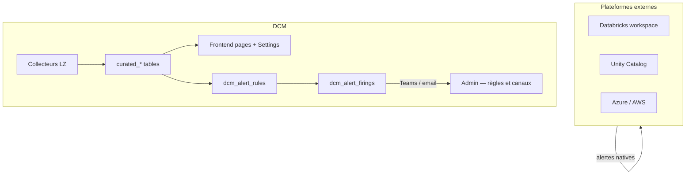
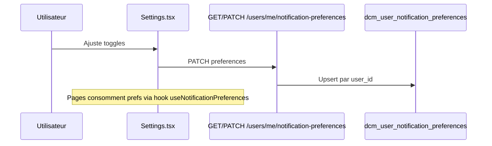

# Notifications et alertes — État actuel et évolution frontend

**Version:** 0.1 (proposition)  
**Date:** 3 juin 2026  
**Périmètre:** UI DCM (`packages/dcm-frontend`) + contrat API backend associé

---

## Objectif du document

Clarifier comment les **alertes** et **notifications** fonctionnent aujourd’hui dans DCM, ce que l’utilisateur peut (ou non) personnaliser, et proposer un bloc **Settings → Notifications** pour réduire le bruit tout en gardant les alertes critiques visibles.

---

## Résumé exécutif

| Question | Réponse aujourd’hui |
|----------|---------------------|
| L’utilisateur peut-il personnaliser ses notifications dans Settings ? | **Non** — Settings = thème + healthcheck backend |
| DCM agrège-t-il des alertes multi-plateformes ? | **Oui** — via tables `curated_*` (sécurité, pipelines, coûts, etc.) |
| Un admin peut-il définir des règles et envoyer Teams/email ? | **Oui** — page Admin, `dcm_alert_rules` + canaux |
| Les alertes natives Databricks / Unity Catalog / Azure sont-elles pilotées par DCM Settings ? | **Non** — hors périmètre sauf ingestion + filtrage côté DCM |

**Recommandation :** implémenter d’abord la **personnalisation in-app** (ce que l’utilisateur voit), puis les **abonnements sortants** (Teams/email par utilisateur).

---

## Deux mondes d’alertes



### 1. Alertes « plateforme » (hors DCM)

Exemples : alertes Unity Catalog, jobs Databricks, Defender, budgets Azure.

- Configurées dans chaque outil.
- DCM peut **afficher** des signaux dérivés si les collecteurs les ingèrent (`curated_security_alerts`, métriques pipeline/cluster, etc.).
- Un futur bloc Settings **ne désactivera pas** ces alertes à la source — il filtre uniquement la **présentation DCM** (et éventuellement les envois DCM).

### 2. Alertes « DCM »

| Mécanisme | Rôle | Stockage / API |
|-----------|------|----------------|
| **Données curated** | Alertes et KPI affichés dans Security, Dashboard, Talk-to-Data | `curated_security_alerts`, loaders chat, routes `/api/v1/security/alerts` |
| **Règles admin** | Seuils métier (pipeline, cluster, cost, security, governance) | `dcm_alert_rules`, `dcm_alert_firings`, `/api/v1/admin/alert-rules` |
| **Canaux notification** | Teams, email (global admin) | `dcm_notification_channels`, `/api/v1/admin/notification-channels` |
| **Demandes d’accès** | Webhook Teams système | `DCM_TEAMS_WEBHOOK_URL` (env backend) |

Domaines supportés par l’évaluateur de règles (`alert_evaluator.py`) :

- `pipeline` — failure rate, durée, volume de runs  
- `cluster` — erreurs, CPU/RAM  
- `cost` — coût, budget consommé  
- `security` — nombre d’alertes ouvertes  
- `governance` — score de conformité  

---

## État actuel du frontend

### Page Settings (`/settings`)

Fichier : `packages/dcm-frontend/src/pages/Settings.tsx`

Contenu actuel :

- **Theme** — mode clair/sombre (localStorage navigateur)
- **Backend DCM** — healthcheck `/api/v1/health`

**Aucun** bloc notification, abonnement ou filtre d’alerte.

### Où l’utilisateur « voit » des alertes aujourd’hui

| Page / zone | Type d’alerte |
|-------------|----------------|
| `/security` | Alertes sécurité actives (`SecurityAlert`) |
| `/dashboard` | Compteurs KPI dont `activeAlerts` / `open_alerts` |
| `/costs` | `BudgetAlert` (legacy types API) |
| `/talk-to-data` | Intent sécurité → alertes curated via Genie ou loaders |
| `/admin` | Règles d’alerte + canaux Teams/email (rôle admin) |

Le périmètre **Landing Zone** (RBAC) filtre déjà les données par LZ ; il n’y a pas de préférence **par utilisateur** au-delà du rôle et des LZ autorisées.

### Page Admin (hors Settings utilisateur)

Réservée aux rôles admin : création de règles, association de canaux, test d’envoi Teams.

→ Modèle **global organisation**, pas **personnalisé par utilisateur final**.

---

## Besoin produit : Settings → Notifications

### Problème

Les utilisateurs voient des alertes **partout** (dashboard, sécurité, coûts, IA, et en parallèle sur Databricks/UC). Sans réglages personnels, le signal utile se noie dans le bruit.

### Proposition UX (bloc Settings)

```
┌─────────────────────────────────────────────────────────┐
│  Notifications                                          │
├─────────────────────────────────────────────────────────┤
│  Affichage dans DCM                                     │
│  ☑ Pipelines    ☑ Clusters    ☑ Coûts                  │
│  ☑ Sécurité     ☑ Gouvernance ☑ Collecteurs             │
│                                                         │
│  Sévérité minimale affichée                             │
│  ○ Tout  ● Warning+  ○ Critical uniquement              │
│                                                         │
│  ☐ Masquer les alertes info                             │
│                                                         │
│  Notifications sortantes (phase 2)                      │
│  ☐ Me notifier par email                                │
│  ☑ Résumé Teams quotidien                               │
│  Canaux : [ sélection LZ / data products ]              │
└─────────────────────────────────────────────────────────┘
```

Principes :

1. **Séparation admin / user** — les règles admin restent la politique ops ; les prefs user = confort.
2. **Critical non masquable** (recommandé) — un utilisateur ne peut pas masquer toutes les alertes `critical` sur son périmètre LZ.
3. **Alignement RBAC** — les prefs ne donnent jamais accès à une LZ non autorisée.
4. **Persistance** — préférences stockées côté backend (pas seulement localStorage), liées à `dcm_app_users.id`.

---

## Architecture cible

### Phase 1 — Filtrage in-app (MVP)

**Objectif :** l’utilisateur choisit quels **domaines** et **sévérités** apparaissent dans l’UI (badges, listes, widgets, Talk-to-Data optionnel).



**Impact frontend :**

| Composant | Changement |
|-----------|------------|
| `Settings.tsx` | Nouvelle carte « Notifications » |
| `hooks/useNotificationPreferences.ts` | Chargement + cache des prefs |
| Pages Security, Dashboard, Costs | Filtre client ou query param `?domains=...` |
| `dcmApiClient.ts` | Types + `getNotificationPreferences` / `updateNotificationPreferences` |

### Phase 2 — Abonnements sortants

**Objectif :** après évaluation d’une règle (`dcm_alert_firings`), n’envoyer Teams/email qu’aux users ayant souscrit au domaine + sévérité + LZ.

Nécessite un worker ou étape post-firing côté backend (hors scope frontend seul).

### Phase 3 — Filtres avancés (optionnel)

- Abonnement par **data product** ou **workspace Databricks**
- Digest vs temps réel
- Snooze temporaire sur une alerte

---

## Modèle de données proposé

Table Unity Catalog (à créer) :

```sql
CREATE TABLE IF NOT EXISTS {catalog}.{schema}.dcm_user_notification_preferences (
    user_id STRING NOT NULL,           -- FK logique vers dcm_app_users.id
    -- Affichage in-app (phase 1)
    show_pipeline BOOLEAN NOT NULL,
    show_cluster BOOLEAN NOT NULL,
    show_cost BOOLEAN NOT NULL,
    show_security BOOLEAN NOT NULL,
    show_governance BOOLEAN NOT NULL,
    show_collector_status BOOLEAN NOT NULL,
    min_severity STRING NOT NULL,      -- info | warning | critical
    hide_info BOOLEAN NOT NULL,
    -- Sortant (phase 2)
    email_enabled BOOLEAN NOT NULL,
    teams_digest_enabled BOOLEAN NOT NULL,
    teams_digest_cron STRING,          -- ex. "0 8 * * 1-5"
    updated_at TIMESTAMP NOT NULL
)
USING DELTA;
```

Valeurs par défaut à la **première connexion** : tout activé, `min_severity = warning`, `hide_info = false`.

---

## Contrat API proposé

| Méthode | Route | Description |
|---------|-------|-------------|
| `GET` | `/api/v1/users/me/notification-preferences` | Lire prefs (404 → défauts) |
| `PUT` ou `PATCH` | `/api/v1/users/me/notification-preferences` | Mettre à jour |
| — | — | Auth : JWT + user enregistré dans `dcm_app_users` |

Exemple payload :

```json
{
  "show_pipeline": true,
  "show_cluster": true,
  "show_cost": true,
  "show_security": true,
  "show_governance": false,
  "show_collector_status": true,
  "min_severity": "warning",
  "hide_info": true,
  "email_enabled": false,
  "teams_digest_enabled": false
}
```

Types TypeScript à ajouter dans `packages/dcm-frontend/src/types/api.ts` :

```typescript
export type NotificationMinSeverity = 'info' | 'warning' | 'critical';

export interface UserNotificationPreferences {
  show_pipeline: boolean;
  show_cluster: boolean;
  show_cost: boolean;
  show_security: boolean;
  show_governance: boolean;
  show_collector_status: boolean;
  min_severity: NotificationMinSeverity;
  hide_info: boolean;
  email_enabled: boolean;
  teams_digest_enabled: boolean;
  updated_at?: string;
}
```

---

## Règles métier recommandées

| Règle | Détail |
|-------|--------|
| RBAC | Les prefs ne étendent pas le périmètre LZ |
| Critical | Toujours visible en UI pour les rôles `admin` / `super_admin` ; pour les autres, au minimum badge + entrée Security |
| Admin rules | `dcm_alert_rules.is_active` reste maître pour le **déclenchement** ; les prefs user filtrent affichage / destinataires |
| Défauts | Nouveau user = prefs par défaut générées au premier `GET /auth/me` ou lazy au premier accès Settings |
| Audit | Optionnel : log dans table audit admin des changements de prefs sensibles (phase 2+) |

---

## Cartographie domaine UI ↔ technique

| Toggle Settings | Source données | Route API existante (lecture) |
|-----------------|----------------|-------------------------------|
| Pipelines | `curated_pipeline_metrics` | `/api/v1/pipelines` |
| Clusters | `curated_compute_metrics` | `/api/v1/clusters` |
| Coûts | curated cost / budget | `/api/v1/costs` |
| Sécurité | `curated_security_alerts` | `/api/v1/security/alerts` |
| Gouvernance | compliance curated | `/api/v1/governance` |
| Collecteurs | `dcm_collector_status` | `/api/v1/collectors/status` |

L’évaluateur admin utilise les mêmes domaines (`metric_domain`) — garder **les mêmes libellés** dans l’UI Settings pour cohérence.

---

## Hors périmètre (explicitement)

- Désactivation des alertes **Databricks Account / UC** depuis DCM Settings
- Remplacement des outils de alerting Azure Monitor / Databricks Jobs
- Gestion des canaux Teams globaux (reste dans **Admin**)
- Notifications push navigateur (Web Push) — possible en phase ultérieure

---

## Plan d’implémentation suggéré

| Étape | Livrable | Effort estimé | Statut branche `feature/user-notification-preferences` |
|-------|----------|---------------|------------------------------------------------------|
| 1 | DDL `dcm_user_notification_preferences` + seed défauts | Backend / data | Fait (`our_catalogs_spn.py`) |
| 2 | Routes `GET/PUT` + tests | Backend | Fait (`notification_preferences.py`) |
| 3 | Carte Settings + hook frontend | Frontend | Fait (`NotificationPreferencesCard`) |
| 4 | Filtres sur Security + Dashboard | Frontend |
| 5 | Extension Talk-to-Data (optionnel) | Backend chat loaders |
| 6 | Moteur abonnement sortant post-firing | Backend async |

---

## Références code

| Élément | Chemin |
|---------|--------|
| Settings actuel | `packages/dcm-frontend/src/pages/Settings.tsx` |
| Admin alertes / canaux | `packages/dcm-frontend/src/pages/Admin.tsx` |
| Règles alerte API | `packages/dcm-backend/app/api/routes/admin_alert_rules.py` |
| Canaux API | `packages/dcm-backend/app/api/routes/admin_channels.py` |
| Domaines métriques | `packages/dcm-backend/app/auth/alert_evaluator.py` |
| DDL tables DCM | `our_catalogs_spn.py` (`dcm_alert_rules`, `dcm_notification_channels`) |
| Auth utilisateur | `docs/06-auth/README.md` |

---

## Liens documentation

- [`GUIDE-UTILISATION-DCM.md`](./GUIDE-UTILISATION-DCM.md) — parcours pages et alertes visibles  
- [`PAGES-CONTENU-DETAILLE.md`](./PAGES-CONTENU-DETAILLE.md) — contenu détaillé par page  
- [`../02-data-model/data-models.md`](../02-data-model/data-models.md) — modèle de données  
- [`../06-auth/permissions-management.md`](../06-auth/permissions-management.md) — RBAC et LZ  
