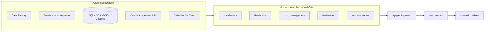
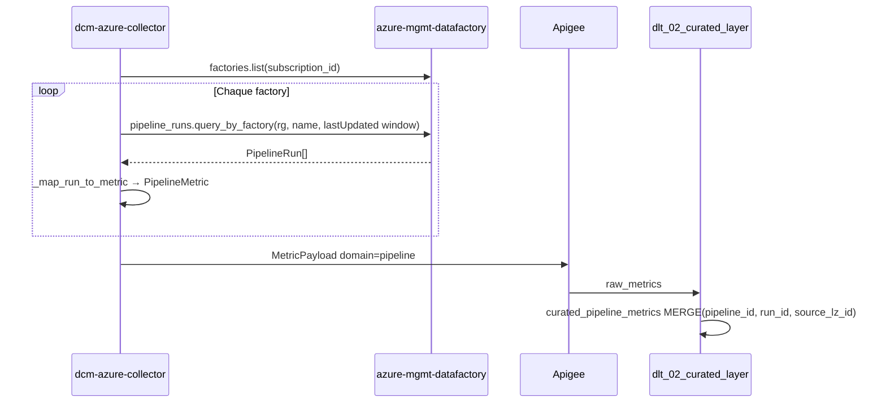

# Spécification — `dcm-azure-collector`

Document de référence pour vérifier l’alignement entre le collecteur Azure, les modèles `dcm-commons`, et les tables Unity Catalog (`it.ba_data_connect_monitoring__a.*`).

Sources :
- Code : `packages/dcm-azure-collector/`
- Schéma UC : `SCHEMA_DDL.sql` (généré par `list_tables_schema.py`)
- Curated DLT : `packages/dcm-databricks-pipeline/pipelines/dlt_02_curated_layer.py`

---

## 1. Vue d’ensemble du runtime



| Paramètre env | Rôle |
|---------------|------|
| `AZURE_SUBSCRIPTION_ID` | Subscription monitorée (une LZ = une sub en prod typique) |
| `DCM_SOURCE_LZ_ID` | Identifiant LZ dans chaque `MetricPayload` (ex. `sub-iasp-lz-DataSquad`) |
| `DCM_ENABLED_COLLECTORS` | Liste CSV ; défaut : 8 collecteurs (tous) |
| `DCM_PIPELINE_LOOKBACK_HOURS` | Fenêtre ADF pipeline + activity (défaut `168` = 7 jours) |
| `DCM_COLLECTION_INTERVAL` | Cycle en secondes (défaut `300`) |

Chaque collecteur produit un `MetricPayload` avec `domain` = `MetricDomain` (`pipeline`, `compute`, `cost`, `database`, `security`, `activity_run`, …).

Enveloppe commune (ajoutée par `BaseCollector`, mappée en DLT par `_ENVELOPE`) :
`collection_run_id`, `source_lz_id`, `cloud_provider`, `subscription_or_account_id`, `collected_at`, `_ingested_at`, `row_id`.

---

## 2. Modèle d’identification des ressources Azure

### 2.1 Hiérarchie ARM (général)

Toute ressource Azure est identifiée par un **ARM resource ID** :

```text
/subscriptions/{subscriptionId}/resourceGroups/{resourceGroup}/providers/{namespace}/{type}/{name}/...
```

Le collecteur extrait le **resource group** via `_extract_resource_group()` :

```python
parts = resource_id.lower().split("/")
idx = parts.index("resourcegroups")
return resource_id.split("/")[idx + 1]  # casse originale conservée
```

### 2.2 Data Factory — comment une ressource est identifiée

| Niveau | Identifiant utilisé par DCM | Source API | Notes |
|--------|----------------------------|------------|-------|
| **Factory (instance ADF)** | `factory_name` + `resource_group` | `factories.list()` → `factory.name`, `factory.id` | Une factory = une ressource ARM `Microsoft.DataFactory/factories/{name}` |
| **Pipeline (définition)** | `pipeline_id` (ARM-like synthétique) | Construit à partir du run | Voir ci-dessous |
| **Exécution (run)** | `run_id` | `PipelineRun.run_id` (GUID ADF) | Clé de dédup avec `pipeline_id` + `source_lz_id` |

**Construction de `pipeline_id`** (`datafactory.py`) :

```text
/subscriptions/{run_group_id}/providers/Microsoft.DataFactory/factories/{factory_name}/pipelines/{pipeline_name}
```

> Attention : le segment `subscriptions/{run_group_id}` reprend `run.run_group_id` tel que renvoyé par ADF, pas forcément `AZURE_SUBSCRIPTION_ID`. En pratique cela reste stable pour une factory donnée.

**Filtrage des runs** : `pipeline_runs.query_by_factory(rg, factory_name, RunFilterParameters)` avec :
- `last_updated_after` = now − `lookback_hours`
- `last_updated_before` = now
- Pagination via `continuation_token` (100 runs / page)

**Runs ignorés** (pas de métrique) : absence de `run_id`, `pipeline_name` ou `run_start`.

**Champs Azure-only** dans `curated_pipeline_metrics` : `factory_name`, `resource_group` ; `glue_job_name` reste `NULL`.

### 2.3 Databricks — identification

| Niveau | Identifiant | Source |
|--------|-------------|--------|
| Workspace | `workspace_id` (propriété ARM), `workspace_url` | `GET .../Microsoft.Databricks/workspaces` |
| Cluster | `compute_resource_id` = `cluster_id` | `GET https://{workspace_url}/api/2.0/clusters/list` |

Token : management plane pour lister les workspaces ; token scope Databricks (`2ff814a6-…`) pour `clusters/list`.

### 2.4 Bases de données — identification

| Moteur | `db_id` | `db_name` | `server_name` |
|--------|---------|-----------|---------------|
| Azure SQL | ARM ID de la database | nom DB | `{server}.database.windows.net` |
| PostgreSQL Flexible | ARM ID du serveur | nom serveur | `{name}.postgres.database.azure.com` |
| MySQL Flexible | ARM ID du serveur | nom serveur | `{name}.mysql.database.azure.com` |
| Cosmos DB | ARM ID du compte | nom compte | `document_endpoint` ou `{name}.documents.azure.com` |

Métriques Monitor : fenêtre 15 min, agrégation `Average`, noms de métriques par famille (`cpu_percent`, `storage_used`, …).

### 2.5 FinOps (cost) — identification

Granularité **subscription × service Azure** (dimension `ServiceName`), pas par resource group dans la requête actuelle :

- `POST .../Microsoft.CostManagement/query` — `ActualCost`, grouping `ServiceName`, période custom 30 jours
- `GET .../Microsoft.Consumption/budgets` — budgets subscription

Clé de dédup UC : `(period_start, service_name, source_lz_id)`.

---

## 3. Collecteurs : registry `main.py` (tous actifs par défaut)

| Clé `DCM_ENABLED_COLLECTORS` | Classe | `domain` JSON | Cible UC |
|------------------------------|--------|---------------|----------|
| `datafactory` | `DataFactoryCollector` | `pipeline` | `curated_pipeline_metrics` |
| `activity_runs` | `ActivityRunCollector` | `activity_run` | `curated_activity_runs` |
| `databricks` | `DatabricksCollector` | `compute` | `curated_compute_metrics` |
| `users` | `DatabricksUserCollector` | `user` | `curated_user_metrics` |
| `cost_management` | `CostManagementCollector` | `cost` | `curated_cost_metrics` |
| `databases` | `DatabaseCollector` | `database` | `curated_database_metrics` |
| `security_center` | `SecurityCenterCollector` | `security` | `curated_security_alerts` |
| `standard_checks` | `StandardCheckCollector` | `standard_check` | `curated_standard_checks` |

---

## 4. Matrice d’alignement Unity Catalog ↔ collecteur

Légende : ✅ champ alimenté quand données existent · ⚠️ partiel / souvent NULL · ❌ non collecté · 🔧 code existe mais collecteur off

### 4.1 `curated_pipeline_metrics` ← `DataFactoryCollector`

| Colonne UC | Champ JSON (`PipelineMetric`) | Statut |
|------------|------------------------------|--------|
| `pipeline_id` | `pipeline_id` | ✅ |
| `pipeline_name` | `pipeline_name` | ✅ |
| `run_id` | `run_id` | ✅ |
| `status` | `status` (lowercase via `map_adf_status`) | ✅ |
| `trigger_type` | `trigger_type` | ✅ |
| `start_time` | `start_time` | ✅ |
| `end_time` | `end_time` | ✅ |
| `duration_seconds` | `duration_seconds` ou dérivé start/end | ✅ |
| `error_message` | `message` si échec | ✅ |
| `factory_name` | `factory_name` | ✅ |
| `resource_group` | `resource_group` | ✅ |
| `glue_job_name` | — | ✅ NULL (Azure) |
| `tags` | `{}` (vide aujourd’hui) | ⚠️ |

**Besoin métier** : tableau rempli seulement s’il y a des **pipeline runs** dans la fenêtre `DCM_PIPELINE_LOOKBACK_HOURS` (défaut 168 h).

### 4.2 `curated_activity_runs` ← `ActivityRunCollector` 🔧

| Colonne UC | Champ JSON | Statut |
|------------|------------|--------|
| `activity_run_id` | synthèse DLT : `pipeline_run_id \| activity_name` | ✅ (côté DLT) |
| `pipeline_run_id` | `pipeline_run_id` (= ADF `run_id`) | ✅ si collecteur activé |
| `pipeline_name` | `pipeline_name` | ✅ |
| `activity_name` | `activity_name` | ✅ |
| `activity_type` | `activity_type` (enum lowercase) | ✅ |
| `status` | `status` | ✅ |
| `start_time` / `end_time` | `activity_run_start` / `activity_run_end` | ✅ |
| `duration_seconds` | auto validator | ✅ |
| `rows_read` / `rows_written` | `output.rowsRead` / `rowsCopied` | ⚠️ surtout activités **Copy** |
| `data_read_bytes` / `data_written_bytes` | `output.dataRead` / `dataWritten` | ⚠️ idem |
| `error_message` | `error.message` | ✅ |
| `tags` | `factory`, `resource_group` | ✅ |

**Gold dépendant** : `gold_activity_performance`, `gold_data_product_usage` (lignage volumétrie).

**Runtime** : `activity_runs` est dans le registry ; données seulement si des pipeline runs existent dans la fenêtre lookback.

### 4.3 `curated_cost_metrics` ← `CostManagementCollector` (FinOps)

| Colonne UC | Champ JSON (`CostMetric`) | Statut |
|------------|---------------------------|--------|
| `service_name` | `service_name` | ✅ |
| `resource_group` | `resource_group` | ⚠️ souvent NULL (grouping ServiceName only) |
| `period_start` / `period_end` | dates période requête (30 j) | ✅ |
| `cost_usd` | `cost_usd` | ✅ |
| `currency` | `currency` (défaut USD) | ✅ |
| `budget_name` | `budget_name` | ✅ si budgets ARM |
| `budget_limit_usd` | `budget_limit_usd` | ✅ |
| `budget_consumed_pct` | `budget_consumed_pct` | ✅ |
| `tags` | `tags` | ⚠️ souvent `{}` |

**Gold** : `gold_cost_summary` ← agrégation `curated_cost_metrics`.

**Risque opérationnel** : HTTP **429** Cost Management → cycles sans domaine `cost` (vu en logs locaux).

### 4.4 `curated_compute_metrics` ← `DatabricksCollector`

| Colonne UC | Champ JSON | Statut |
|------------|------------|--------|
| `compute_resource_id` | `cluster_id` | ✅ |
| `resource_name` | `cluster_name` | ✅ |
| `compute_type` | `databricks` | ✅ |
| `state` | `state` mappé | ✅ |
| `node_type` | `node_type_id` | ✅ |
| `num_workers` | `num_workers` | ✅ |
| `autoscale_min` / `autoscale_max` | autoscale | ✅ |
| `spark_version` | `spark_version` | ✅ |
| `start_time` | `start_time` (epoch ms) | ✅ |
| `creator` | `creator_user_name` | ✅ |
| `workspace_id` | workspace ARM | ✅ |
| `avg_cpu_utilization_pct` | — | ❌ |
| `avg_mem_utilization_pct` | — | ❌ |
| `estimated_hourly_cost_usd` | — | ❌ |
| `tags` | `custom_tags` | ✅ |

**Gold** : `gold_compute_utilization` attend CPU/mem/estimated cost → **écarts** tant que Monitor / pricing non branchés.

### 4.5 `curated_database_metrics` ← `DatabaseCollector`

Alignement modèle ↔ UC : ✅ pour tous les champs métier. Qualité des valeurs Monitor : ⚠️ (souvent NULL si pas de données 15 min).

### 4.6 Tables UC sans collecteur Azure actif

| Table | Collecteur attendu | Statut |
|-------|-------------------|--------|
| `curated_user_metrics` | `DatabricksUserCollector` | 🔧 off |
| `curated_standard_checks` | `StandardCheckCollector` | 🔧 off |
| `curated_security_alerts` | `SecurityCenterCollector` | ✅ branché ; données si alertes actives |

---

## 5. Chaîne Data Factory (détail technique)



**Activity runs** (non activé par défaut) :

```text
pipeline_runs.query_by_factory  →  pour chaque run_id
  activity_runs.query_by_pipeline_run(rg, factory, run_id, filter)
    → ActivityRunMetric (cap 500 activités / run par défaut)
```

---

## 6. Vérification avec `list_tables_schema.py`

1. Exporter le schéma UC : `python list_tables_schema.py` → `SCHEMA_DDL.sql`
2. Comparer les colonnes **métier** (hors enveloppe) avec les tableaux §4
3. Valider en runtime :
   - `DCM_LOG_LEVEL=DEBUG` pour `sql_servers_found`, `datafactory_instances_found`, etc.
   - Vérifier Apigee `domain` + `metric_count` dans les logs (`payloads_summary`)

Checklist pipeline + FinOps :

| Question | Réponse attendue |
|----------|------------------|
| Les pipelines ADF tournent-ils au moins 1× / `lookback_hours` ? | Sinon `curated_pipeline_metrics` reste vide malgré un collecteur OK |
| `DCM_ENABLED_COLLECTORS` vide ou `all` ? | Les 8 collecteurs tournent (défaut `config.py`) |
| FinOps alimente-t-il `curated_cost_metrics` ? | Oui si pas de 429 ; sinon trou dans l’historique |
| `gold_cost_summary` / dashboards FinOps | Dépendent de `curated_cost_metrics` + `dim_landing_zone` |

---

## 7. Écarts prioritaires (backlog)

| Priorité | Écart | Impact | Piste |
|----------|-------|--------|-------|
| P0 | Fenêtre ADF 1 h, peu de runs | `curated_pipeline_metrics` et `curated_activity_runs` vides | Augmenter `DCM_PIPELINE_LOOKBACK_HOURS` |
| P0 | Fenêtre ADF 1 h → 0 run en dev | Pas de pipeline metrics | Augmenter `DCM_PIPELINE_LOOKBACK_HOURS` ou déclencher runs test |
| P1 | Cost Management 429 | Trous FinOps | Intervalle cost dédié, cache, moins de retries parallèles |
| P1 | `resource_group` NULL sur cost | Gold moins granulaire | Ajouter grouping `ResourceGroup` dans la query Cost |
| P2 | Compute sans CPU/mem/cost estimé | `gold_compute_utilization` incomplet | Azure Monitor clusters ou table pricing |
| P2 | `tags` pipeline toujours `{}` | Pas de tags en analytics | Tags factory ARM si besoin |
| P3 | `pipeline_id` utilise `run_group_id` | Cohérence ARM | Aligner sur `subscription_id` config si besoin reporting |

---

## 8. Références code

| Sujet | Fichier |
|-------|---------|
| Orchestration cycle | `packages/dcm-azure-collector/azure_collector/main.py` |
| Config / collecteurs activés | `packages/dcm-azure-collector/azure_collector/config.py` |
| ADF pipelines | `packages/dcm-azure-collector/azure_collector/collectors/datafactory.py` |
| ADF activities | `packages/dcm-azure-collector/azure_collector/collectors/activity_runs.py` |
| FinOps | `packages/dcm-azure-collector/azure_collector/collectors/cost_management.py` |
| Modèles payload | `packages/dcm-commons/dcm_commons/models/*.py` |
| Mapping curated | `packages/dcm-databricks-pipeline/pipelines/dlt_02_curated_layer.py` |
| Export schéma UC | `list_tables_schema.py`, `SCHEMA_DDL.sql` |
