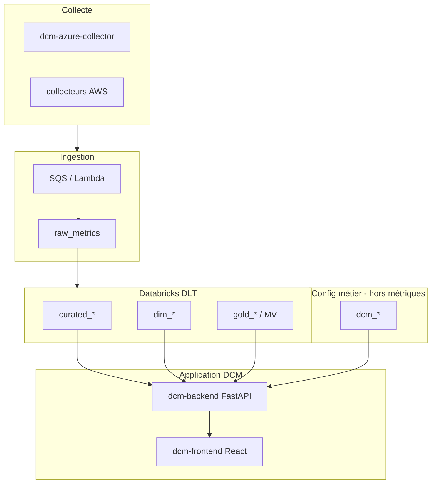

# Spécification technique — Interfaces UI, API et tables Unity Catalog

**Version:** 1.0  
**Date:** 4 juin 2026  
**Catalogue:** `it.ba_data_connect_monitoring__a`  
**Sources:** `SCHEMA_DDL.sql`, `packages/dcm-backend`, `packages/dcm-frontend`

---

## 1. Objectif

Documenter **ce que l’interface DCM affiche**, **d’où viennent les données** (tables Unity Catalog + API), et **ce qui n’est pas exposé** dans les dashboards — pour distinguer « pas de data » vs « bug UI ».

---

## 2. Architecture données (résumé)



| Couche | Rôle | Consommée par l’UI opérationnelle ? |
|--------|------|-------------------------------------|
| **curated_*** | Faits temps réel (pipelines, coûts, alertes…) | **Oui — source principale** |
| **gold_*** / MV | Agrégats, scores, usage data products | **Partiellement** (voir §4) |
| **dim_*** | Référentiels LZ / users | **Partiellement** |
| **dcm_*** | Users, règles alertes, KPI seuils, préférences | **Admin + auth + Settings** |
| **raw_metrics** | Bronze ingestion | **Non** (pipeline interne) |
| ***_rejects** | Lignes DQ rejetées | **Non** |

---

## 3. Inventaire Unity Catalog — statut d’exposition UI

Légende : **UI** = lu par une route API consommée par le frontend · **Admin** = page `/admin` uniquement · **Chat** = Talk-to-Data · **Aucun** = pas de route backend UI actuelle

### 3.1 Couche CURATED (streaming)

| Table | Domaine | UI / API | Remarque |
|-------|---------|----------|----------|
| `curated_pipeline_metrics` | Pipelines ADF/Glue | **UI** | Dashboard, Pipelines, Data Factory, Databricks, Monitoring Reports |
| `curated_compute_metrics` | Clusters Databricks/EMR | **UI** | Dashboard, Clusters, Databricks, Monitoring Reports |
| `curated_cost_metrics` | FinOps | **UI** | Dashboard, Costs, FinOps pages, Monitoring Reports |
| `curated_security_alerts` | Sécurité | **UI** | Dashboard, Security, Alerts, cloche notifications |
| `curated_standard_checks` | Gouvernance | **UI** | Governance, scores (fallback), Monitoring Reports |
| `curated_database_metrics` | Bases SQL/Cosmos | **UI** | Databases, Database * pages |
| `curated_activity_runs` | Activités pipeline | **UI** | Pipelines (drilldown), Databricks ; défaut Unity Explorer preview |
| `curated_user_metrics` | Utilisateurs cloud | **UI** | `/users` |
| `curated_*_rejects` (×8) | DQ rejetées | **Aucun** | Audit data quality uniquement |

### 3.2 Couche GOLD / dimensions

| Table / vue | UI / API | Remarque |
|-------------|----------|----------|
| `gold_standard_check_score` (MV) | **UI** | `GET /standard-checks/score` — carte Governance dashboard |
| `gold_data_product_usage` | **UI** | Data Product Usage, Monitoring Reports |
| `dim_landing_zone` (streaming) | **UI** | `GET /landing-zones/details` ; fallback → `dcm_landing_zones` |
| `dim_landing_zone_sync` | **Aucun** | Sync Lakebase / réplication |
| `dim_users` / `dim_users_sync` | **Aucun** | Dimension SCD ; pas branchée aux routes UI |
| `gold_pipeline_summary_sync` | **Aucun** | Agrégat batch ; UI lit `curated_pipeline_metrics` |
| `gold_compute_summary_sync` | **Aucun** | Idem |
| `gold_compute_utilization_sync` | **Aucun** | Idem |
| `gold_cost_summary_sync` | **Aucun** | Idem |
| `gold_security_summary_sync` | **Aucun** | Idem |
| `gold_database_capacity_alerts_sync` | **Aucun** | Idem |
| `gold_activity_performance_sync` | **Aucun** | Idem |
| `gold_standard_check_score_sync` | **Aucun** | Copie sync ; API utilise la **MV** `gold_standard_check_score` |

### 3.3 Couche RAW

| Table | UI / API |
|-------|----------|
| `raw_metrics` | **Aucun** — alimentation DLT uniquement |

### 3.4 Tables applicatives `dcm_*`

| Table | UI / API | Écran |
|-------|----------|-------|
| `dcm_app_users` | **Auth** | Toutes pages (JWT → `/auth/me`) |
| `dcm_user_lz_access` | **Auth** | Filtre RBAC LZ sur toutes les routes métriques |
| `dcm_landing_zones` | **Admin** + fallback LZ | Admin registry ; si `dim_landing_zone` indisponible |
| `dcm_user_notification_preferences` | **Settings** | `/settings` — Notifications |
| `dcm_kpi_config` | **UI** (seuils) | Couleurs cartes KPI (`GET /kpi-config`) |
| `dcm_collector_status` | **Admin** | `/admin` — Collectors |
| `dcm_alert_rules` | **Admin** | `/admin` — Alert rules |
| `dcm_alert_firings` | **Admin** | Historique firings par règle |
| `dcm_notification_channels` | **Admin** | Canaux Teams/email |
| `dcm_maintenance_windows` | **Admin** | Fenêtres maintenance |
| `dcm_retention_policies` | **Admin** | Rétention + stats `DESCRIBE` curated |
| `dcm_audit_log` | **Admin** | Journal audit |
| `dcm_access_requests` | **POST public** | Modal demande d’accès (pas de lecture UI) |

---

## 4. Interfaces API (`/api/v1`)

Base : `packages/dcm-backend/app/api/routes/`. Auth : Bearer Entra + enregistrement `dcm_app_users`. Filtre LZ : `get_allowed_lz_ids` (sauf `super_admin` / admin sans scope = tout).

### 4.1 Routes consommées par le frontend

| Route | Méthode | Tables principales | Pages UI |
|-------|---------|-------------------|----------|
| `/health` | GET | Test connexion warehouse | Settings, Collection Status |
| `/auth/me` | GET | `dcm_app_users`, `dcm_user_lz_access` | Toute l’app (RBAC) |
| `/dashboard/overview` | GET | `curated_pipeline_metrics`, `curated_compute_metrics`, `curated_cost_metrics`, `curated_security_alerts` | **Dashboard** (6 KPI header) |
| `/pipelines` | GET | `curated_pipeline_metrics` | Pipelines, Data Factory, Databricks, Monitoring Reports |
| `/pipelines/{name}/runs` | GET | `curated_pipeline_metrics` | Pipelines |
| `/activities` | GET | `curated_activity_runs` | Pipelines, Databricks |
| `/clusters` | GET | `curated_compute_metrics` | Clusters, Dashboard, Databricks, Monitoring Reports |
| `/costs/summary` | GET | `curated_cost_metrics` | Costs, Dashboard, FinOps * |
| `/costs/by-service` | GET | `curated_cost_metrics` | Costs, Databricks FinOps, Monitoring Reports |
| `/databases` | GET | `curated_database_metrics` | Databases, Dashboard |
| `/security/alerts` | GET | `curated_security_alerts` | Security, Alerts, DataFactory/DB/Databricks Alerts, cloche |
| `/standard-checks` | GET | `curated_standard_checks` | Governance, *Governance pages, Monitoring Reports |
| `/standard-checks/score` | GET | `gold_standard_check_score` (+ fallback curated) | Dashboard, Governance, Databricks |
| `/landing-zones/details` | GET | `dim_landing_zone` → fallback `dcm_landing_zones` | Header scope, Settings LZ, Monitoring Reports |
| `/users` | GET | `curated_user_metrics` | Users |
| `/data-product-usage/*` | GET | `gold_data_product_usage` | Data Product Usage, Monitoring Reports |
| `/unity-catalog/*` | GET/POST | `information_schema` + **preview任意 table** | Unity Catalog Explorer |
| `/users/me/notification-preferences` | GET/PUT | `dcm_user_notification_preferences` | Settings |
| `/kpi-config` | GET | `dcm_kpi_config` | Seuils couleur KPI (toutes pages avec MetricCard) |
| `/chat` | POST | Agrégats via `chat/loaders` (curated + gold DP usage) | Talk-to-Data |
| `/admin/*` | * | Tables `dcm_*` | Admin (`super_admin`) |

### 4.2 Routes backend non exposées dans le menu principal

| Route | Usage |
|-------|--------|
| `/access-requests` POST | Demande d’accès Teams |
| `/admin/alert-rules/{id}/test` | Test règle |
| `/maintenance-windows/active` | Évaluation alertes (backend interne) |
| `/push-to-raw-in`, `/sqs-to-raw-in` | Ingestion ops |
| `/health/live` | K8s liveness |

---

## 5. Matrice pages UI → données affichées

Filtres globaux sur presque toutes les pages : **période** (header), **cloud / LZ / env** (MonitoringScope), **RBAC** (`dcm_user_lz_access`).

| Route frontend | Titre menu | APIs appelées | Tables UC | Affiché | Non affiché (même page) |
|----------------|------------|---------------|-----------|---------|-------------------------|
| `/dashboard` | Home | `dashboard/overview`, `standard-checks/score`, `costs/summary`, `pipelines`, `clusters`, `databases`, `security/alerts` | curated ×4, gold score, curated lists | 6 KPI, verdict, cartes modules, aperçus listes | Tables gold_sync, raw, rejects, dcm_* métier |
| `/pipelines` | Pipelines | `pipelines`, `pipelines/.../runs`, `activities` | `curated_pipeline_metrics`, `curated_activity_runs` | Runs, statuts, drilldown activités | Coût par run, gold_pipeline_summary |
| `/datafactory` | Data Factory | `pipelines` (azure) | `curated_pipeline_metrics` | KPI pipelines Azure | AWS Glue (autre filtre cloud) |
| `/datafactoryalerts` | DF Alerts | `security/alerts` | `curated_security_alerts` | Alertes filtrées ressource ADF | Firings admin `dcm_alert_firings` |
| `/datafactoryfinops` | DF FinOps | `costs/*` | `curated_cost_metrics` | Coûts Azure | `gold_cost_summary_sync` |
| `/datafactorygovernance` | DF Governance | `standard-checks`, `score` | curated + gold score | Checks compliance | dim_users |
| `/databricks` | Databricks | pipelines, clusters, activities, costs, alerts, checks, score | curated + gold score | Vue consolidée DBX | gold_compute_*_sync |
| `/databricksalerts` | DBX Alerts | `security/alerts` | `curated_security_alerts` | Alertes | — |
| `/databricksfinops` | DBX FinOps | `costs/*` | `curated_cost_metrics` | Coûts | — |
| `/databricksgovernance` | DBX Governance | checks + score | curated + gold | Compliance | — |
| `/unitycatalogexplorer` | Unity Catalog | `unity-catalog/*` | **Toute table** du catalogue (lecture) | Arborescence + preview SQL | Écriture, tables hors UC |
| `/data-product-usage` | Data Product Usage | `data-product-usage/*` | `gold_data_product_usage` | Overview, trends, consumers | curated_* direct |
| `/monitoringreports` | Monitoring Reports | 10+ routes agrégées | curated + gold DP + LZ + score | Rapport santé multi-domaine | gold_*_sync |
| `/clusters` | Clusters | `clusters` | `curated_compute_metrics` | État clusters, CPU/RAM | Historique long terme gold |
| `/costs` | Global FinOps | `costs/summary`, `by-service` | `curated_cost_metrics` | Total, par service | Budget rules `dcm_alert_rules` |
| `/alerts` | Global Alerts | `security/alerts` | `curated_security_alerts` | Liste alertes | Canaux notification |
| `/security` | Cloud security | `security/alerts` | `curated_security_alerts` | Multi-cloud | — |
| `/governance` | Standard Checks | `standard-checks` | `curated_standard_checks` | Détail checks | MV score (carte agrégée ailleurs) |
| `/databases` | Databases | `databases` | `curated_database_metrics` | Inventaire DB, dispo | `gold_database_capacity_alerts_sync` |
| `/database*` | DB sous-pages | alerts / costs / governance | curated | Même pattern que DF/DBX | — |
| `/users` | Users | `users` | `curated_user_metrics` | Utilisateurs cloud | `dim_users` |
| `/talk-to-data` | Talk to Data | `POST /chat` | curated + gold (loaders) | Réponses NL agrégées | Donnée brute ligne à ligne |
| `/status` | Collection status | `health` | — (pas de table métrique) | Statut API/DB + doc pipeline | Métriques collecteur (`dcm_collector_status` → Admin) |
| `/settings` | Settings | `health`, `notification-preferences`, `landing-zones`, `auth/me` | dcm_prefs + dim LZ | Thème local, prefs notif, health | Toutes curated |
| `/admin` | Administration | `/admin/*` | `dcm_*` | Users, LZ, rules, channels, collectors, KPI, retention, audit | curated_* |

---

## 6. Dashboard Home (`/dashboard`) — mapping utilisateur (ce que l’utilisateur voit)

Filtres appliqués à **toutes** les requêtes ci-dessous (header) :

| Filtre UI | Paramètre API | Colonnes SQL impactées |
|-----------|---------------|------------------------|
| Dates « From / to » | `start_date`, `end_date` | `start_time` (pipelines), `period_start` / `period_end` (coûts), `since` (gouvernance) |
| Scope cloud / LZ | `cloud_provider`, `source_lz_id` (selon page) | `cloud_provider`, `source_lz_id` |
| RBAC | (header backend) | `source_lz_id IN (...)` via `dcm_user_lz_access` |

---

### 6.1 Les 6 cartes KPI (bandeau du haut)

Chaque ligne = **texte à l’écran** → **champ JSON** → **SQL** → **colonnes Unity Catalog lues** (pas une ligne détaillée par ressource).

#### Carte 1 — **Pipelines**

| Ce que l’utilisateur voit | Valeur technique |
|---------------------------|----------------|
| **Titre** | `Pipelines` |
| **Nombre principal** | Nombre compact (ex. `1.2K`) = `overview.total_pipelines` |
| **Sous-texte** | `Runs over the period` |

| Champ API | Table | Requête / colonnes utilisées |
|-----------|-------|------------------------------|
| `total_pipelines` | `curated_pipeline_metrics` | `COUNT(*)` — **1 ligne table = 1 run** (`pipeline_id` + `run_id` + `source_lz_id`) |
| Filtre période | | `CAST(start_time AS DATE) BETWEEN start_date AND end_date` |
| Filtre LZ / cloud | | `source_lz_id`, `cloud_provider` |

**Colonnes curated lues implicitement :** `start_time`, `status`, `source_lz_id`, `cloud_provider` (+ clés `pipeline_id`, `run_id` pour compter les lignes).

**Ce que l’utilisateur ne voit pas sur cette carte :** `pipeline_name`, `factory_name`, `duration_seconds`, `error_message` (affichés plus bas dans « Latest pipeline runs »).

---

#### Carte 2 — **Failures 24h**

| Ce que l’utilisateur voit | Valeur technique |
|---------------------------|----------------|
| **Titre** | `Failures 24h` |
| **Nombre principal** | Entier = `overview.failed_pipelines_24h` |
| **Sous-texte** | `X.X% of period runs` = `failed_24h / total_pipelines × 100` (calcul **frontend**) |
| **Couleur** | Seuils `dcm_kpi_config` : `pipeline_failure_rate_warning_pct`, `pipeline_failure_rate_critical_pct` |

| Champ API | Table | Requête / colonnes utilisées |
|-----------|-------|------------------------------|
| `failed_pipelines_24h` | `curated_pipeline_metrics` | `COUNT(*)` WHERE `status = 'failed'` AND `start_time >= now() - 24h` |
| (dénominateur %) | même table | `total_pipelines` (période header, pas 24h) |

**Colonnes curated :** `status`, `start_time`, `source_lz_id`, `cloud_provider`.

**Important :** ce n’est **pas** le nombre de pipelines uniques en échec, c’est le **nombre de runs** en échec sur 24h.

---

#### Carte 3 — **Active clusters**

| Ce que l’utilisateur voit | Valeur technique |
|---------------------------|----------------|
| **Titre** | `Active clusters` |
| **Nombre principal** | `overview.active_clusters` |
| **Sous-texte** | `{N} resources collected` où **N = `computes.length`** (2ᵉ appel API, peut ≠ KPI) |

| Champ API | Route | Table | Requête / colonnes |
|-----------|-------|-------|-------------------|
| `active_clusters` | `GET /dashboard/overview` | `curated_compute_metrics` | Par `compute_resource_id` : dernière ligne (`ORDER BY collected_at DESC`), puis `COUNT` où `state = 'running'` |
| `computes.length` | `GET /clusters` | `curated_compute_metrics` | Dernier snapshot **par ressource** (tous états), liste complète |

**Colonnes curated :** `compute_resource_id`, `state`, `collected_at`, `source_lz_id`, `cloud_provider`.

**Écart possible :** KPI = clusters **running** uniquement ; sous-texte = **toutes** ressources avec au moins une métrique (running, terminated, etc.).

**Non affiché sur la carte :** `resource_name`, `avg_cpu_utilization_pct`, `workspace_id` (page Clusters / Databricks).

---

#### Carte 4 — **Cost total**

| Ce que l’utilisateur voit | Valeur technique |
|---------------------------|----------------|
| **Titre** | `Cost total` |
| **Nombre principal** | Montant formaté devise (`formatCurrency`) |
| **Sous-texte** | `Consolidated costs` |
| **Source affichage** | `costs.total_usd` **si présent**, sinon `overview.total_cost_usd` |

| Champ API | Route | Table | Requête / colonnes |
|-----------|-------|-------|-------------------|
| `total_cost_usd` | `/dashboard/overview` | `curated_cost_metrics` | `SUM(cost_usd)` |
| `costs.total_usd` | `GET /costs/summary` | `curated_cost_metrics` | Même `SUM(cost_usd)` + détail `by_cloud`, `by_service` |

**Filtre période :** `period_start >= start_date` AND `period_end <= end_date`.

**Colonnes curated :** `cost_usd`, `period_start`, `period_end`, `service_name`, `source_lz_id`, `cloud_provider`.

**Non affiché sur la carte :** `budget_name`, `budget_limit_usd`, `budget_consumed_pct` (disponibles en table, pas sur Home).

---

#### Carte 5 — **Open alerts**

| Ce que l’utilisateur voit | Valeur technique |
|---------------------------|----------------|
| **Titre** | `Open alerts` |
| **Nombre principal** | `overview.open_alerts` |
| **Sous-texte** | `Active alerts` |
| **Couleur** | Seuils KPI : `open_alerts_warning_count`, `open_alerts_critical_count` |

| Champ API | Table | Requête / colonnes |
|-----------|-------|-------------------|
| `open_alerts` | `curated_security_alerts` | `COUNT(*)` WHERE `status = 'active'` |

**Colonnes curated :** `status`, `alert_id`, `source_lz_id`, `cloud_provider` (+ pour la liste plus bas : `title`, `description`, `severity`, `detected_at`).

**Non filtré par période header** sur le KPI (toutes alertes actives, quelle que soit `detected_at`).

**Liste « Active alerts » (max 8) :** même table, champs affichés = `title`, `severity`, `description` / `resource_id`.

---

#### Carte 6 — **Governance**

| Ce que l’utilisateur voit | Valeur technique |
|---------------------------|----------------|
| **Titre** | `Governance` |
| **Nombre principal** | `XX%` ou `—` si pas de data |
| **Sous-texte** | `{total_evaluated} checks` |
| **Couleur** | Seuils KPI : `compliance_score_warning_pct`, `compliance_score_critical_pct` (inversés : bas = mauvais) |

| Champ API | Route | Table / vue | Calcul |
|-----------|-------|-------------|--------|
| `global_score_pct` | `GET /standard-checks/score` | `gold_standard_check_score` (MV) | `ROUND(SUM(compliant_count) / SUM(total_checks) × 100, 1)` |
| `total_evaluated` | idem | colonnes MV `total_checks` | `SUM(total_checks)` |
| `compliant_count` / `non_compliant_count` | idem | MV | Agrégés mais **pas affichés** sur la carte |
| `by_landing_zone[]` | idem | MV par LZ | Utilisé dans bloc « Evaluated landing zones » (count de lignes breakdown) |

**Colonnes MV lues :** `compliant_count`, `non_compliant_count`, `total_checks`, `cloud_provider`, `source_lz_id`, `evaluation_date`.

**Source amont :** `curated_standard_checks` (`check_state`, `evaluated_at`, …) — alimente la MV, pas lue directement par cette carte.

**Filtre dashboard :** `since = start_date` (pas `end_date` sur le score).

---

### 6.2 Synthèse visuelle — 6 KPI

```
Utilisateur voit          API JSON                    SQL (agrégat)                    Table UC
─────────────────────────────────────────────────────────────────────────────────────────────
"Pipelines" + nombre   →  total_pipelines         →  COUNT(*) runs [dates]          →  curated_pipeline_metrics.start_time, ...
"Failures 24h"         →  failed_pipelines_24h    →  COUNT(*) status='failed' 24h   →  curated_pipeline_metrics.status, start_time
"Active clusters"      →  active_clusters         →  COUNT DISTINCT running       →  curated_compute_metrics.state, collected_at
"Cost total" $         →  costs.total_usd         →  SUM(cost_usd)                →  curated_cost_metrics.cost_usd, period_*
"Open alerts"          →  open_alerts             →  COUNT(*) status='active'       →  curated_security_alerts.status
"Governance" XX%       →  global_score_pct      →  SUM(compliant)/SUM(total)      →  gold_standard_check_score (MV)
                       →  sous-texte total_evaluated
```

---

### 6.3 Autres blocs visibles sur `/dashboard` (hors 6 KPI)

| Bloc UI | Données affichées | API | Champs table / JSON |
|---------|-------------------|-----|---------------------|
| **PageVerdict** | Texte action / santé | dérivé overview + governance | `failed_pipelines_24h`, `open_alerts`, `global_score_pct` |
| **Data Factory** card | Runs, Failures 24h | overview | idem KPI 1–2 |
| **Databricks** card | Clusters, Active | `listComputes` | `state`, `compute_resource_id` — **Active** = filtre frontend `state === 'running'` |
| **Databases** card | Instances, Available | `listDatabases` | `curated_database_metrics` : lignes = instances ; **Available** = `is_available === true` |
| **FinOps** card | Total, Services | `costs/summary` | `total_usd`, longueur `by_service[]` |
| **Latest pipeline runs** | Nom, date, badge statut | `pipelines` limit 8 | `pipeline_name`, `start_time`, `status` |
| **Active alerts** | Titre, severity, description | `security/alerts` limit 8 | `title`, `severity`, `description`, `alert_id` |
| **Covered clouds** | AZURE / AWS | `overview.cloud_coverage` | `DISTINCT cloud_provider` depuis `curated_pipeline_metrics` |
| **Evaluated landing zones** | Nombre | `governance.by_landing_zone.length` | MV `gold_standard_check_score` groupée |
| **Billed services** | Nombre | `costs.by_service.length` | `curated_cost_metrics` GROUP BY `service_name` |

---

### 6.4 Cartes KPI header — référence rapide (ancien tableau)

| Carte UI | Champ API | Table | Affiché si… |
|----------|-----------|-------|-------------|
| Pipelines | `total_pipelines` | `curated_pipeline_metrics` | Runs avec `start_time` dans la période |
| Failures 24h | `failed_pipelines_24h` | `curated_pipeline_metrics` | `status='failed'` dernières 24h |
| Active clusters | `active_clusters` | `curated_compute_metrics` | Dernier snapshot `state='running'` |
| Cost total | `total_cost_usd` / `costs.total_usd` | `curated_cost_metrics` | Lignes coût dans la période |
| Open alerts | `open_alerts` | `curated_security_alerts` | `status='active'` |
| Governance | `global_score_pct` | `gold_standard_check_score` | MV avec `total_checks > 0` |

### 6.2 Ce que le Dashboard **n’affiche pas** (malgré présence dans `SCHEMA_DDL.sql`)

- Toutes les tables **`gold_*_sync`** (agrégats batch non branchés sur `/dashboard/overview`)
- **`raw_metrics`**, tables **`*_rejects`**
- **`curated_activity_runs`** (sauf via lien Pipelines — pas dans les 6 KPI)
- **`curated_user_metrics`** (page Users dédiée)
- **`gold_data_product_usage`** (page Data Product Usage)
- **`dim_users`**, **`dim_landing_zone_sync`**
- Toute la config **`dcm_alert_rules`**, **`dcm_notification_channels`**, **`dcm_alert_firings`** (Admin)
- **`dcm_collector_status`** (Admin / Status doc seulement)
- Données **Unity Catalog métier** hors schéma monitoring (autres catalogues — Explorer seulement)

### 6.3 Cartes modules (sous les KPI)

| Module | Métriques affichées | Source |
|--------|---------------------|--------|
| Data Factory | Runs, failures 24h | `overview` |
| Databricks | `#` computes, `#` running | `listComputes` → `curated_compute_metrics` |
| Databases | Instances, available | `listDatabases` → `curated_database_metrics` |
| FinOps | Cost total | `costs/summary` |

---

## 7. Filtres et comportement « zéro »

| Filtre | Impact |
|--------|--------|
| Période header (défaut ~30j) | Réduit pipelines, coûts ; pas les alertes `active` ni clusters (snapshot) |
| Scope cloud / LZ | Ajoute `WHERE cloud_provider` / `source_lz_id` |
| RBAC `dcm_user_lz_access` | Restreint aux LZ autorisées (admin sans liste = tout) |
| Préférences notif Settings | **Cloche uniquement** — pas les KPI Dashboard |

**Interprétation :** API **200** + JSON avec `0` → requête OK, **données absentes ou filtrées**. Erreur rouge → backend/warehouse.

**Requête diagnostic :**

```sql
SELECT 'pipeline' src, COUNT(*) n FROM it.ba_data_connect_monitoring__a.curated_pipeline_metrics
UNION ALL SELECT 'compute', COUNT(*) FROM it.ba_data_connect_monitoring__a.curated_compute_metrics
UNION ALL SELECT 'cost', COUNT(*) FROM it.ba_data_connect_monitoring__a.curated_cost_metrics
UNION ALL SELECT 'security', COUNT(*) FROM it.ba_data_connect_monitoring__a.curated_security_alerts
UNION ALL SELECT 'checks', COUNT(*) FROM it.ba_data_connect_monitoring__a.curated_standard_checks;
```

---

## 8. Unity Catalog Explorer — périmètre spécial

- Liste **tous les catalogues** (`SHOW CATALOGS`), pas seulement `it`.
- Preview / query : table choisie par l’utilisateur (défaut `curated_activity_runs`).
- **N’alimente pas** automatiquement les dashboards : outil d’exploration ad hoc.
- Requêtes en **lecture seule** (pas de DDL/DML).

---

## 9. Chaîne collecte → curated (rappel)

Sans données dans **`curated_*`**, les dashboards affichent **0** même si :

- les tables **`gold_*_sync`** sont remplies (non lues par l’UI actuelle) ;
- **`dcm_landing_zones`** est renseigné (référentiel seulement).

Collecteur Azure : `packages/dcm-azure-collector` → ingestion → `raw_metrics` → DLT → `curated_*`. Voir `docs/03-implementation/azure-collector-spec.md`.

---

## 10. Fichiers de référence

| Sujet | Chemin |
|-------|--------|
| DDL complet | `SCHEMA_DDL.sql`, `SCHEMA_MANIFEST.txt` |
| Overview API | `packages/dcm-backend/app/api/routes/dashboard.py` |
| Dashboard UI | `packages/dcm-frontend/src/pages/Dashboard.tsx`, `hooks/useDashboardQueries.ts` |
| Routes pages | `packages/dcm-frontend/src/app-routes.ts` |
| Menu | `packages/dcm-frontend/src/config/navigation.ts` |
| Notifications | `docs/03-frontend/notification.md` |
| Modèle données | `docs/02-data-model/data-models.md` |

---

## 11. Synthèse une phrase

**Le frontend n’affiche pas « tout le catalogue Unity » : il agrège surtout les `curated_*`, complété par `gold_standard_check_score`, `gold_data_product_usage` et `dim_landing_zone` ; le reste du DDL (gold_sync, rejects, raw, dim_users) sert au pipeline data ou à l’admin, pas aux KPI dashboards.**
