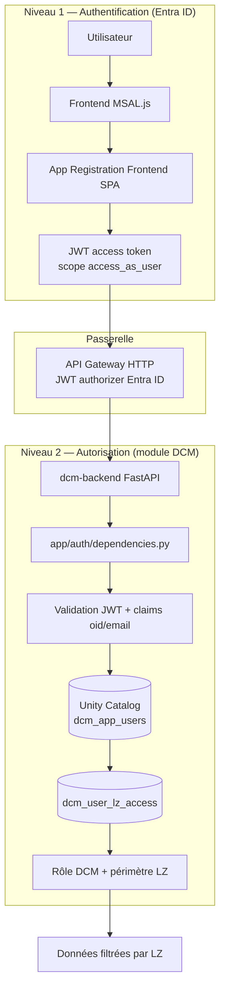

# DCM — Authentification et autorisation

> Documentation de référence pour la sécurité DCM : **Microsoft Entra ID authentifie**, **DCM autorise**.

---

## 1. Contexte — architecture actuelle du projet

DCM est un **monorepo** (`packages/`) déployé sur AWS (compte `awss-wl-dcm`) avec Databricks SQL Warehouse comme source de données.

| Package | Rôle |
|---------|------|
| `dcm-frontend` | SPA React (Vite) — login MSAL, dashboard |
| `dcm-backend` | API FastAPI sur ECS Fargate — lecture Unity Catalog + RBAC |
| `dcm-azure-collector` / `dcm-aws-collector` | Collecteurs métriques par Landing Zone |
| `dcm-lambda-ingestion` | Ingestion SQS → raw |
| `dcm-databricks-pipeline` | Transformations Databricks |
| `dcm-commons` | Bibliothèque partagée |

Flux utilisateur en production :

```
Navigateur (MSAL.js)
    → Microsoft Entra ID (App Registration Frontend)
    → JWT access token (scope API Backend)
    → API Gateway HTTP (JWT authorizer natif Entra ID)
    → WAF + ALB → ECS dcm-backend
    → Unity Catalog (dcm_app_users, dcm_user_lz_access, curated_*, gold_*)
```

Voir aussi : [`01-architecture/`](../01-architecture/), [`02-data-model/`](../02-data-model/), [`MIGRATION-LAKEBASE-TO-WAREHOUSE.md`](../MIGRATION-LAKEBASE-TO-WAREHOUSE.md).

---

## 2. Principe clé : deux niveaux de sécurité

DCM sépare **authentification** (qui es-tu ?) et **autorisation** (que peux-tu voir ?).



| Niveau | Responsable | Ce qui est vérifié |
|--------|-------------|-------------------|
| **1 — Authentification** | Microsoft Entra ID + API Gateway | Token JWT valide, émis pour la bonne App Registration API, audience et issuer corrects |
| **2 — Autorisation** | Module `app/auth/` du backend | Utilisateur inscrit dans `dcm_app_users`, compte actif, rôle DCM, Landing Zones autorisées |

Le token Entra ID **n'est pas** la source des permissions métier DCM. Il sert uniquement à identifier l'utilisateur (`oid`, `preferred_username` / `upn` / `email`).

→ Détail des rôles, bootstrap admin et gestion LZ : [`permissions-management.md`](./permissions-management.md)

---

## 3. App Registrations Entra ID

Deux App Registrations distinctes collaborent :

```
┌─────────────────────────────────────────────────────────────────────────────┐
│                     Microsoft Entra ID (TotalEnergies)                       │
│                     Tenant: 329e91b0-e21f-48fb-a071-456717ecc28e             │
└─────────────────────────────────────────────────────────────────────────────┘
                                    │
                    ┌───────────────┴───────────────┐
                    │                               │
                    ▼                               ▼
┌───────────────────────────────┐   ┌───────────────────────────────┐
│  App Registration: Frontend   │   │  App Registration: Backend    │
│  AZR-IASP-LZ-DataSquad-       │   │  AWS-ALZP-WL-dcm-api-d        │
│  dcm-frontend-dev             │   │                               │
│                               │   │                               │
│  Client ID:                   │   │  Client ID:                   │
│  ef49b2f7-6dea-4181-ac06-     │   │  15817864-589d-4a33-ada4-     │
│  788033b361db                 │   │  ec40fa309a7b                 │
│                               │   │                               │
│  Type: SPA (PKCE)             │   │  Expose scope: access_as_user │
└───────────────────────────────┘   └───────────────────────────────┘
            │                                   │
            │  Demande token pour               │  Valide audience
            │  api://…/access_as_user           │  api://… ou client_id
            └───────────────────────────────────┘
```

### 3.1 Frontend — `AZR-IASP-LZ-DataSquad-dcm-frontend-dev`

| Propriété | Valeur |
|-----------|--------|
| **Client ID** | `ef49b2f7-6dea-4181-ac06-788033b361db` |
| **Tenant ID** | `329e91b0-e21f-48fb-a071-456717ecc28e` |
| **Type** | Single Page Application (SPA) |
| **Redirect URIs** | `http://localhost:4000/` (local), `https://dcmd.alzp.tgscloud.net/` (dev remote), `https://dcm.alzp.tgscloud.net/` (prod) |

Permissions déléguées principales : `User.Read`, `openid`, `profile`, `offline_access`, et le scope API **`access_as_user`** sur `AWS-ALZP-WL-dcm-api-d`.

### 3.2 Backend API — `AWS-ALZP-WL-dcm-api-d`

| Propriété | Valeur |
|-----------|--------|
| **Client ID** | `15817864-589d-4a33-ada4-ec40fa309a7b` |
| **Application ID URI** | `api://15817864-589d-4a33-ada4-ec40fa309a7b` |
| **Scope exposé** | `api://15817864-589d-4a33-ada4-ec40fa309a7b/access_as_user` |

Le frontend SPA est **pre-authorized** sur cette API pour obtenir le scope sans consentement utilisateur répété.

---

## 4. Flux complet — de la connexion à l'accès aux données

### 4.1 Login (Authorization Code + PKCE)

1. L'utilisateur clique **Se connecter** sur la landing page.
2. MSAL redirige vers Entra ID (`loginRedirect`, scope `User.Read`).
3. Après authentification, Entra ID renvoie un code d'autorisation.
4. MSAL échange le code contre des tokens (ID token + refresh token).
5. La session MSAL est établie (`sessionStorage`).

### 4.2 Vérification d'inscription DCM

Pour chaque route protégée, le frontend enchaîne deux contrôles :

1. **MSAL** : l'utilisateur est-il connecté à Entra ID ?
2. **`GET /api/v1/auth/me`** : l'utilisateur existe-t-il dans `dcm_app_users` ?

Composants concernés :

| Fichier | Rôle |
|---------|------|
| `packages/dcm-frontend/src/components/ProtectedRoute.tsx` | Garde de route (MSAL + inscription) |
| `packages/dcm-frontend/src/hooks/useUserRegistration.ts` | Appel `/auth/me`, gestion des statuts |
| `packages/dcm-frontend/src/components/NotRegisteredMessage.tsx` | UI si non inscrit / compte inactif / erreur auth |

Statuts possibles après `/auth/me` :

| Code HTTP | `detail` | Signification |
|-----------|----------|---------------|
| 200 | — | Utilisateur inscrit et actif |
| 401 | — | Token rejeté (API Gateway ou backend) — problème de config JWT, pas d'inscription |
| 403 | `not_registered` | Authentifié Entra ID mais absent de `dcm_app_users` |
| 403 | `account_inactive` | Compte DCM désactivé |

Les utilisateurs non inscrits peuvent soumettre une demande d'accès via **`POST /api/v1/access-requests`** (route publique, sans JWT).

### 4.3 Appels API métier

```
Frontend                    Entra ID              API Gateway           Backend
   │                           │                       │                    │
   │ acquireTokenSilent()      │                       │                    │
   │ (scope access_as_user) ──►│                       │                    │
   │◄── access token ──────────│                       │                    │
   │                           │                       │                    │
   │ GET /api/v1/dashboard/... │                       │                    │
   │ Authorization: Bearer ────┼──────────────────────►│ JWT authorizer     │
   │                           │                       │ (aud + iss)        │
   │                           │                       │ ──────────────────►│
   │                           │                       │                    │ get_current_user()
   │                           │                       │                    │ → dcm_app_users
   │                           │                       │                    │ → filtrage LZ
   │◄──────────────────────────┼───────────────────────┼────────────────────│
```

Le token est injecté automatiquement par `MsalTokenProvider` → `dcmApiClient.ts` via `acquireAccessToken()`.

---

## 5. API Gateway — première barrière JWT

En production, l'**API Gateway HTTP** (Building Block `API_GW_2`) valide le JWT **avant** d'atteindre le backend.

Configuration (infra `BA-Data-Connect-Monitoring-infra`) :

- **Authorizer** : JWT natif Entra ID (pas de Lambda Authorizer)
- **Issuer** : `https://login.microsoftonline.com/{tenant_id}/v2.0`
- **Audience** : `api://{client_id}` et `{client_id}` (les deux formes sont acceptées)
- **Header** : `Authorization: Bearer <token>`

Routes typiques :

| Route | JWT requis |
|-------|------------|
| `GET /api/v1/health` | Non |
| `POST /api/v1/access-requests` | Non |
| `GET /api/v1/auth/me` | Oui |
| `ANY /api/v1/dashboard/*`, `/pipelines/*`, … | Oui |
| `ANY /api/v1/admin/*` | Oui (+ rôle `super_admin` côté backend) |

Domaine public : `https://api.dcm.alzp.tgscloud.net`

---

## 6. Module backend `app/auth/` — autorisation DCM

Le module Python `packages/dcm-backend/app/auth/` centralise l'autorisation applicative.

```
app/auth/
├── __init__.py          # Exports publics
├── dependencies.py      # JWT decode, lookup Unity Catalog, RBAC
├── audit.py             # Écritures dcm_audit_log
├── notifier.py          # Notifications (Teams, etc.)
└── alert_evaluator.py   # Évaluation règles d'alerte admin
```

### 6.1 Dépendances FastAPI principales

| Fonction | Usage |
|----------|-------|
| `get_current_user` | Décode le JWT, charge l'utilisateur depuis `dcm_app_users`, résout les LZ |
| `get_allowed_lz_ids` | Retourne `None` (accès complet) pour `admin`/`super_admin`, sinon la liste des LZ |
| `require_role(...)` | Restreint une route à certains rôles (ex. `super_admin` pour `/admin/*`) |

Modèle retourné : `CurrentUser` (`id`, `entra_oid`, `email`, `role`, `lz_ids`, …).

### 6.2 Lookup Unity Catalog

Après validation JWT, le backend interroge :

```sql
-- Identification utilisateur
SELECT id, entra_oid, email, display_name, role, is_active
FROM {catalog}.{schema}.dcm_app_users
WHERE entra_oid = ? OR LOWER(email) = LOWER(?)

-- Périmètre Landing Zone (rôles non admin)
SELECT lz_id FROM {catalog}.{schema}.dcm_user_lz_access
WHERE user_id = ?
```

Si `entra_oid` en base est un placeholder `email:<adresse>`, il est remplacé automatiquement par l'`oid` réel au premier login.

### 6.3 Rôles DCM

| Rôle | Données | Interface `/admin` |
|------|---------|-------------------|
| `viewer`, `data_architect`, `manager` | Filtrées par `dcm_user_lz_access` | Non |
| `admin` | Accès complet (toutes LZ) | Non |
| `super_admin` | Accès complet | Oui — gestion utilisateurs, LZ, alertes, audit, … |

Routes admin protégées par `require_role("super_admin")` :

- `/api/v1/admin/users/*`
- `/api/v1/admin/landing-zones/*`
- `/api/v1/admin/alert-rules/*`, `/admin/channels/*`, `/admin/collectors/*`
- `/api/v1/admin/audit/*`, `/admin/maintenance/*`, `/admin/retention/*`
- `/api/v1/admin/entra/search` (recherche utilisateurs Entra ID)

### 6.4 Mode développement local

Avec `DCM_AUTH_DISABLED=true`, le backend accepte des en-têtes de simulation :

- `X-DCM-Role`, `X-DCM-Email`, `X-DCM-Lz-Ids`, etc.

Permet de tester sans token Entra ID. **Ne jamais activer en production.**

---

## 7. Configuration

### 7.1 Frontend (`.env`)

```env
VITE_AZURE_CLIENT_ID=ef49b2f7-6dea-4181-ac06-788033b361db
VITE_AZURE_TENANT_ID=329e91b0-e21f-48fb-a071-456717ecc28e
VITE_AZURE_SCOPE=api://15817864-589d-4a33-ada4-ec40fa309a7b/access_as_user
VITE_REDIRECT_URI=http://localhost:4000/
VITE_API_BASE_URL=https://api.dcm.alzp.tgscloud.net
VITE_ENABLE_AUTH=true
```

MSAL : login avec `User.Read`, scope API demandé silencieusement lors des appels backend (`src/lib/auth.ts`).

### 7.2 Backend (`.env` / ECS)

| Variable | Description |
|----------|-------------|
| `DCM_ENTRA_TENANT_ID` | Tenant Entra ID |
| `DCM_ENTRA_CLIENT_ID` | Client ID de l'App Registration **API** (audience JWT) |
| `DCM_AUTH_DISABLED` | `true` en dev local sans JWT |
| `DCM_DATABRICKS_CATALOG` / `DCM_DATABRICKS_SCHEMA` | Emplacement des tables `dcm_*` |

---

## 8. Gestion des permissions — suite

Pour le modèle RBAC complet, le bootstrap des super admins, l'interface `/admin` et les demandes d'accès :

→ **[`permissions-management.md`](./permissions-management.md)**

Pour l'historique de la réflexion sur les claims token vs tables DCM :

→ [`permissions-yahia-plan.md`](./permissions-yahia-plan.md) (document de travail, décision retenue : **tables DCM**, pas claims Entra)

---

## 9. Dépannage

### 9.1 `401` sur `/auth/me` avec token qui semble valide

Cause probable : **audience JWT** mal alignée entre MSAL, API Gateway et backend.

Vérifier :

1. `VITE_AZURE_SCOPE` = `api://{backend-client-id}/access_as_user`
2. `DCM_ENTRA_CLIENT_ID` = client ID backend (ou `api://…`)
3. Audience dans API Gateway : les deux formes `api://uuid` et `uuid`

Console navigateur : logs `[AUTH] Token for /auth/me` dans `useUserRegistration.ts`.

### 9.2 `403 not_registered`

L'utilisateur est authentifié Entra ID mais absent de `dcm_app_users`. Solutions :

- Demande d'accès via l'UI (`NotRegisteredMessage`)
- Création manuelle par un `super_admin` dans `/admin`
- Bootstrap via `our_catalogs_spn.py` (voir permissions-management.md)

### 9.3 Erreur `AADSTS65001` — Consent required

Le scope `access_as_user` n'a pas le consentement admin. Azure Portal → App Registration Frontend → API permissions → **Grant admin consent**.

### 9.4 Vider le cache MSAL

```javascript
Object.keys(sessionStorage).filter(k => k.startsWith('msal')).forEach(k => sessionStorage.removeItem(k));
location.reload();
```

---

## 10. Sécurité — récapitulatif

- **PKCE** sur le flux SPA
- **Double validation JWT** : API Gateway + backend (défense en profondeur)
- **Autorisation applicative** dans Unity Catalog, pas dans le token
- **Audit** des actions admin dans `dcm_audit_log`
- **Scopes minimaux** : `User.Read` au login, scope API uniquement pour le backend

---

## 11. Environnements

| Environnement | Frontend | API | Auth |
|---------------|----------|-----|------|
| **Local dev** | `localhost:4000` | `localhost:8080` (proxy Vite) | `VITE_ENABLE_AUTH=false` ou JWT |
| **Dev remote** | `https://dcmd.alzp.tgscloud.net` | `https://api.dcmd.alzp.tgscloud.net` | JWT Entra ID + RBAC DCM (App Reg dev) |
| **Prod** | `https://dcm.alzp.tgscloud.net` | `https://api.dcm.alzp.tgscloud.net` | JWT Entra ID + RBAC DCM (App Reg prod) |

> **DNS** : `dcmd.alzp.tgscloud.net` et `api.dcmd.alzp.tgscloud.net` sont à provisionner dans `BA-Data-Connect-Monitoring-infra` (compte dev `551656632516`). Ne pas confondre avec le compte AWS mgmt `551656632516` (nom interne `dcmd`).

Configuration GitHub : voir `docs/04-cicd/GITHUB-ENV-DEV-PROD.md` et `scripts/github-env-setup.sh`.

---

## 12. Références code

| Composant | Chemin |
|-----------|--------|
| MSAL config | `packages/dcm-frontend/src/config/msal.ts` |
| Acquisition token | `packages/dcm-frontend/src/lib/auth.ts` |
| Garde de routes | `packages/dcm-frontend/src/components/ProtectedRoute.tsx` |
| Vérification inscription | `packages/dcm-frontend/src/hooks/useUserRegistration.ts` |
| Endpoint `/auth/me` | `packages/dcm-backend/app/api/routes/auth.py` |
| Module autorisation | `packages/dcm-backend/app/auth/dependencies.py` |
| Demandes d'accès | `packages/dcm-backend/app/api/routes/access_requests.py` |
| API Gateway JWT | `BA-Data-Connect-Monitoring-infra/Project/IaC/API_GW_2.tf` |

---

*Dernière mise à jour : 3 juin 2026*
