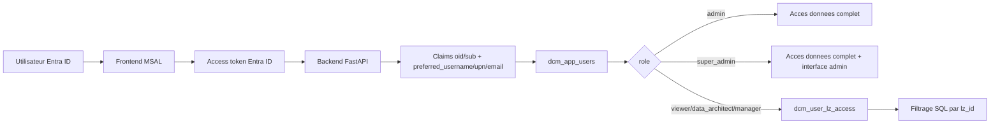
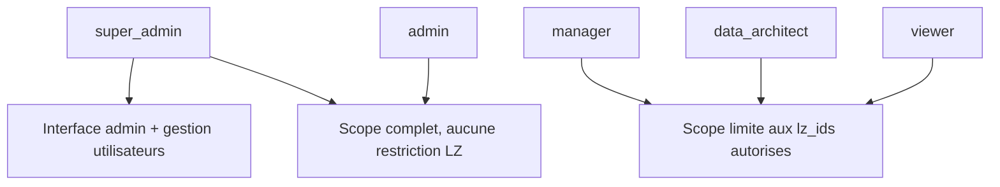
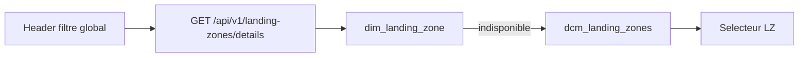

# DCM - Gestion des permissions et super admin

> Suite de [`README.md`](./README.md) — focus sur le **niveau 2** (autorisation DCM après authentification Entra ID).

Ce document explique le modèle d'autorisation DCM actuel : Entra ID authentifie l'utilisateur, puis les tables DCM dans Unity Catalog décident du rôle applicatif et du périmètre Landing Zone.

## Principe



Le token n'est pas la source finale des permissions DCM. Il sert à identifier la personne avec :

- `oid` ou `sub` pour l'identifiant Entra.
- `preferred_username`, `upn` ou `email` pour l'adresse email.

Ensuite le backend cherche l'utilisateur dans `dcm_app_users` par `entra_oid` ou par `email`.

## Rôles DCM



`admin` et `super_admin` ont tous les deux un accès données complet, sans restriction Landing Zone. Seul `super_admin` peut ouvrir l'interface `/admin` et utiliser les endpoints de gestion `/api/v1/admin/*`.

## Comptes admin bootstrappes

`our_catalogs_spn.py` cree ou met a jour les premiers comptes DCM dans `dcm_app_users`.

Super admins par defaut :

- `zahra.maaziz@totalenergies.com`
- `al1036565@admin.hubtotal.net`
- `aj0411581@admin.hubtotal.net`
- `aj1087147@tdf.hubtotal.net`

Admins full-scope par defaut, sans acces a l'interface admin :

- `al0533237@admin.hubtotal.net`
- `al1010544@admin.hubtotal.net`
- `al1057721@admin.hubtotal.net`
- `al1143744@admin.hubtotal.net`
- `al1146908@admin.hubtotal.net`
- `al1152754@admin.hubtotal.net`
- `caj0209162@admin.hubtotal.net`

Bootstrap initial via `our_catalogs_spn.py` :

```bash
export DCM_BOOTSTRAP_SUPER_ADMIN_EMAILS="prenom.nom@totalenergies.com"
export DCM_BOOTSTRAP_SUPER_ADMIN_DISPLAY_NAMES="Prenom Nom"
export DCM_BOOTSTRAP_ADMIN_EMAILS="admin1@example.com,admin2@example.com"
export DCM_BOOTSTRAP_ADMIN_DISPLAY_NAMES="Admin 1,Admin 2"
python our_catalogs_spn.py
```

Si les Object IDs Entra sont connus, ajouter aussi :

```bash
export DCM_BOOTSTRAP_SUPER_ADMIN_ENTRA_OIDS="<oid-super-admin>"
export DCM_BOOTSTRAP_ADMIN_ENTRA_OIDS="<oid-admin-1>,<oid-admin-2>"
```

Si les Object IDs ne sont pas connus, le système crée un placeholder `email:<adresse>`. Au premier login, si le token contient `oid`, le backend remplace ce placeholder par l'Object ID réel.

## Ajout depuis l'interface

Depuis `/admin`, onglet `Utilisateurs` :

1. Renseigner l'email Entra ID.
2. Choisir le rôle (`admin` pour accès données complet, `super_admin` pour gestion DCM).
3. Renseigner l'Object ID Entra si connu, sinon laisser vide.
4. Renseigner les Landing Zones uniquement pour les rôles non admin.
5. Cliquer `Create user`.

Chaque création écrit une entrée `user.create` dans `dcm_audit_log`.

## Landing Zones



Le message `Landing Zone metadata unavailable; full scope view remains enabled` apparaît quand l'endpoint de metadata LZ échoue. L'API doit maintenant utiliser `dcm_landing_zones` en fallback si `dim_landing_zone` n'est pas disponible.

## Résumé sécurité

- Entra ID authentifie, DCM autorise.
- Les routes `/api/v1/admin/*` exigent `role = "super_admin"`.
- Les admins et super admins ont un scope données complet.
- Les autres rôles sont filtrés par `dcm_user_lz_access`.
- Les écritures admin sont auditées dans `dcm_audit_log`.
