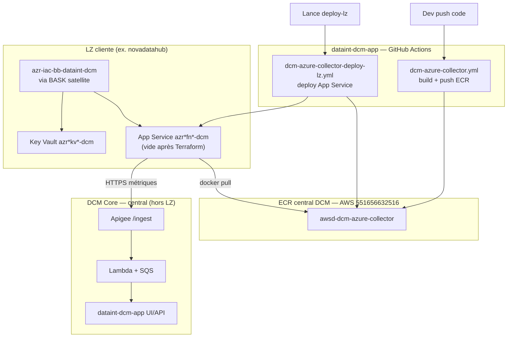
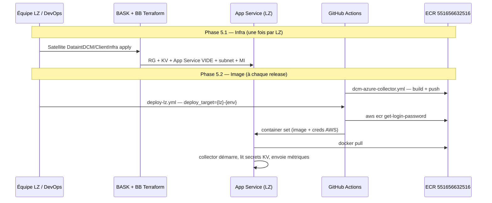
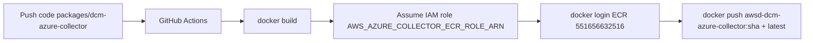
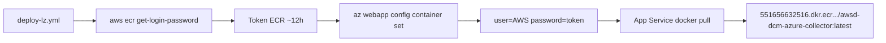

# Onboarding LZ — Collector Azure (architecture & opérations)

Guide équipe : **comment ajouter une nouvelle Landing Zone (LZ) cliente** dans DCM, **comment l'image Docker est publiée (push ECR)** et **comment l'App Service la récupère (pull ECR)**.

> Décision archi validée (J. GIBART) : **toutes les LZ clientes** (DataSquad, novadatahub, futures LZ) suivent **le même modèle**. Pas d'ACR dans la LZ. Pas d'ACI. Registry central sur **AWS ECR DCM**.

---

## 1. Vue d'ensemble



### Trois zones distinctes

| Zone | Rôle | Exemple |
|------|------|---------|
| **DCM Core** | Ingestion partagée (Apigee, Lambda, backend, UI) | `BA-Data-Connect-Monitoring-infra` |
| **ECR central** | Images Docker collectors (AWS + Azure) | **dev** `551656632516` · **prod** `884068385310` |
| **LZ cliente** | Collector runtime dans la subscription client | DataSquad, novadatahub, … |

### Ce qui est faux (ancien modèle)

| ❌ Incorrect | ✅ Modèle actuel |
|-------------|------------------|
| ACI `dcm-azure-collector-dev` | **App Service** créé par le BB |
| Pull image depuis ACR DataSquad `azrmcrdsde04` | Pull depuis **ECR AWS** `551656632516` |
| Registry créée dans la LZ cliente | **Pas de registry** dans la LZ |
| Terraform déploie le collector | Terraform crée la **coquille vide** ; la CI pose l'image |

---

## 2. Séparation des responsabilités



| Couche | Qui | Quoi |
|--------|-----|------|
| **BB** `azr-iac-bb-dataint-dcm` | Cloud Ops LZ | App Service **vide**, KV, subnet intégration, Managed Identity |
| **CI push** `dcm-azure-collector.yml` | Équipe DCM | Build image + push vers ECR central |
| **CI deploy** `deploy-lz.yml` | Équipe DCM + Builder SP LZ | Configure container + token ECR sur App Service |
| **Secrets** | Équipe LZ | 4× `dcm-*` dans KV `…-dcm` |
| **Firewall** | Réseau LZ | Egress HTTPS (Entra, Apigee, ECR) |
| **Entra** | Agent `@dp-dcm-lz-client` | Collector SP par LZ |

---

## 3. Registry central — push & pull

### Identifiants ECR

| Élément | Valeur |
|---------|--------|
| Compte AWS | **dev** `551656632516` (awss-wl-dcm) · **prod** `884068385310` (awsp-dcm) |
| Région | `eu-central-1` |
| Registry dev | `551656632516.dkr.ecr.eu-central-1.amazonaws.com` |
| Registry prod | `884068385310.dkr.ecr.eu-central-1.amazonaws.com` |
| Repo Azure collector | dev: `awsd-dcm-azure-collector` · prod: `awsp-dcm-azure-collector` (override via `AZURE_COLLECTOR_ECR_REPOSITORY`) |
| Repo AWS collector | `dcm-aws-collector` |
| Tags | `<git-sha>` + `latest` |

### Push image (CI → ECR)

**Workflow :** `.github/workflows/dcm-azure-collector.yml`



**Déclenchement :**
- Push sur `main` / `develop` (paths collector)
- Ou manuel : Actions → `dcm-azure-collector - CI & push to ECR` → `deploy=true`

**Prérequis GitHub (environment `dev`) :**
- `AWS_AZURE_COLLECTOR_ECR_ROLE_ARN` — rôle IAM dans le compte **551656632516** (pas le compte DCM backend 551656632516)

**Commande équivalente (debug local) :**

```bash
aws ecr get-login-password --region eu-central-1 \
  | docker login --username AWS --password-stdin 551656632516.dkr.ecr.eu-central-1.amazonaws.com

docker build -t 551656632516.dkr.ecr.eu-central-1.amazonaws.com/awsd-dcm-azure-collector:test \
  -f packages/dcm-azure-collector/Dockerfile packages/dcm-azure-collector

docker push 551656632516.dkr.ecr.eu-central-1.amazonaws.com/awsd-dcm-azure-collector:test
```

### Pull image (App Service ← ECR)

**Workflow :** `.github/workflows/dcm-azure-collector-deploy-lz.yml`

L'App Service Azure **ne peut pas** utiliser `AcrPull` Managed Identity — le registry est sur **AWS**, pas Azure.



**Mécanisme :**
1. CI assume le rôle IAM ECR (`AWS_AZURE_COLLECTOR_ECR_ROLE_ARN`)
2. `aws ecr get-login-password` → token temporaire
3. `az webapp config container set` avec registry `551656632516.dkr.ecr.eu-central-1.amazonaws.com`, user `AWS`, password = token
4. App Service pull l'image via chemin **public** (`WEBSITE_PULL_IMAGE_OVER_VNET=false`, `imagePullTraffic=false`)
5. Trafic applicatif (Entra, Apigee, Azure APIs) passe par le **VNet** (`WEBSITE_VNET_ROUTE_ALL=1`)

> Le token ECR expire après ~12h. Si l'App Service ne redémarre pas, re-lancer `deploy-lz.yml` pour rafraîchir les creds.

**Vérification post-deploy :**

```bash
az webapp show -g <rg> -n <webapp> \
  --query "{state:state, image:siteConfig.linuxFxVersion}" -o table
# Attendu : DOCKER|551656632516.dkr.ecr.eu-central-1.amazonaws.com/awsd-dcm-azure-collector:...
```

---

## 4. Ajouter une nouvelle LZ cliente — checklist

### Phase 1 — Scoping

| Paramètre | Exemple novadatahub | Comment le dériver |
|-----------|---------------------|-------------------|
| Subscription | `sub-iasp-lz-novadatahub` | Nom Azure |
| `lzName` | `novadatahub` | Retirer le préfixe `sub-iasp-lz-` |
| `environment` | `m` (mutualized) | Convention LZ |
| `source_lz_id` | `azr-lz-novadatahub-dev` | Identifiant métier DCM |
| Collectors | `datafactory,databricks,...` | Choix équipe |

**Démarrer l'agent :**

```
@dp-dcm-lz-client Azure : sub-iasp-lz-<LZ>, env=<d|m|p>, subscription_id=<UUID>, prenom.nom@totalenergies.com
```

### Phase 2 — Entra ID

- Créer SP : `AZR-IASP-LZ-{lzName}-dcm-collector`
- Assigner rôle `Collector` sur back ingestion SP : `AZR-IASP-LZ-DataSquad-inj-{env}`

### Phase 5.1 — Infra BASK (coquille Azure)

Dans `BA-{LZ}-Infrastructure` :

```
Project/DataintDCM/ClientInfra/
  FOUNDATION.tf          ← module azr-iac-bb-dataint-dcm
  VARIABLES.tf / OUTPUTS.tf / BACKEND.tf / ...

Project/Environments/DataintDCM/ClientInfra/
  {env}.tfvars           ← tags, subnet, groupes Entra, builder SP
```

**Ressources créées (exemple) :**

| Ressource | Pattern | Exemple novadatahub |
|-----------|---------|---------------------|
| Resource Group | `azr{env}rg{appcode}04-dcm` | `azrmrgndth04` |
| Key Vault | `azr{env}kv{appcode}-dcm` | `azrmkvndth-dcm` |
| App Service | `azr{env}fn{appcode}-dcm` | `azrmfnndth-dcm` |

Modèle IaC à copier : [DataSquad-infra DataintDCM/ClientInfra](https://github.com/TotalEnergiesCode/DataSquad-infra/tree/main/Project/DataintDCM/ClientInfra)

### Phase 3b — Secrets dans KV BB

4 secrets dans le **nouveau** KV `…-dcm` (pas le KV core IaC) :

| Secret | Contenu |
|--------|---------|
| `dcm-entra-tenant-id` | Tenant Entra |
| `dcm-entra-client-id` | App ID collector SP |
| `dcm-entra-client-secret` | Secret collector SP |
| `dcm-apigee-api-key` | Clé Apigee partagée par env DCM |

### Phase 5.2 — Enregistrer la cible + deploy image

**1. Ajouter l'entrée** dans `.github/azure-collector-deploy-targets.json` :

```json
"monlz-m": {
  "description": "LZ cliente monlz (M)",
  "azure_subscription_id": "<UUID>",
  "resource_group": "azrmrg<appcode>04",
  "webapp_name": "azrmfn<appcode>-dcm",
  "key_vault_url": "https://azrmkv<appcode>-dcm.vault.azure.net/",
  "source_lz_id": "azr-lz-monlz-dev",
  "subscription_id_monitored": "<UUID>",
  "apigee_base_url": "https://dev.apixnp.alzp.tgscloud.net/ingestion/v0.0.1",
  "enabled_collectors": "datafactory,databricks,databricks_pipelines,cost_management,databases"
}
```

**2. Ajouter la clé** dans les options `deploy_target` de `dcm-azure-collector-deploy-lz.yml`.

**3. RBAC Builder SP** (propre à chaque LZ) :

| LZ | Builder SP (`builder_sp_display_name` dans tfvars) |
|----|-----------------------------------------------------|
| DataSquad | `AZR-IASP-LZ-DataSquad-Builder` |
| novadatahub | `AZR-IASP-LZ-novadatahub-Builder` |
| nouvelle LZ | `AZR-IASP-LZ-{lzName}-Builder` |

Le Builder SP doit avoir **Contributor** sur la subscription de **sa** LZ.

**4. Lancer les workflows :**

```
1. dcm-azure-collector.yml          → push image ECR (si pas déjà fait)
2. dcm-azure-collector-deploy-lz.yml → deploy_target=monlz-m
```

### Réseau — egress obligatoire

Depuis le subnet intégration App Service, ouvrir HTTPS (443) vers :

| # | FQDN | Usage |
|---|------|-------|
| 1 | `login.microsoftonline.com` | Auth Entra — **bloquant** |
| 2 | `management.azure.com` | APIs Azure collectors |
| 3 | `dev.apixnp.alzp.tgscloud.net` | Apigee ingestion (dev/m) |
| 4 | `551656632516.dkr.ecr.eu-central-1.amazonaws.com` | **Pull image Docker** |
| 5 | `api.ecr.eu-central-1.amazonaws.com` | Token ECR |
| 6 | `prod-eu-central-1-starport-layer-bucket.s3.eu-central-1.amazonaws.com` | Layers Docker ECR |

Template firewall : [`docs/firewall/novadatahub-dcm-firewall.yml`](../firewall/novadatahub-dcm-firewall.yml)

### Phase 4 + 6 — RBAC MI + validation ingest

- RBAC Managed Identity selon collectors sélectionnés
- Test OAuth + POST `/ingest` via agent (header `x-apif-apikey`)

---

## 5. LZ clientes déjà enregistrées

| Clé deploy | LZ | App Service | Subscription |
|------------|-----|-------------|--------------|
| `datasquad-d` | DataSquad | `azrmfndsde-dcm` | `sub-iasp-lz-DataSquad` |
| `novadatahub-m` | novadatahub | `azrmfnndth-dcm` | `sub-iasp-lz-novadatahub` |

DataSquad et novadatahub ont **le même statut** : LZ clientes. Même ECR, mêmes workflows.

---

## 6. Pièges fréquents

| Symptôme | Cause | Action |
|----------|-------|--------|
| Apigee OK, rien dans DCM | Image pas déployée (Phase 5.2) | Lancer `deploy-lz.yml` |
| `ImagePullFailure` / `ContainerTimeout` | Token ECR expiré ou egress bloqué | Re-run deploy + ouvrir FQDN ECR |
| `subscription doesn't exist` (CI) | Builder SP sans Contributor sur sub LZ | RBAC sur `AZR-IASP-LZ-{lzName}-Builder` |
| Auth errors au démarrage | `login.microsoftonline.com` bloqué | Ouvrir egress Entra |
| App Service vide après Terraform | **Normal** — BB ne déploie pas l'image | Phase 5.2 obligatoire |
| Pull depuis ACR DataSquad | Ancien modèle | Corriger → ECR `551656632516` uniquement |

---

## 7. Références

| Document | Contenu |
|----------|---------|
| [packages/dcm-agent/docs/onboarding-guide/](../packages/dcm-agent/docs/onboarding-guide/) | Guide agent pas-à-pas |
| [packages/dcm-agent/docs/onboarding-guide/03-phase-5-2-deploy.md](../packages/dcm-agent/docs/onboarding-guide/03-phase-5-2-deploy.md) | Prérequis deploy détaillés |
| [packages/dcm-agent/docs/onboarding-guide/04-network-egress.md](../packages/dcm-agent/docs/onboarding-guide/04-network-egress.md) | Firewall + mail infra |
| [docs/04-cicd/README.md](../04-cicd/README.md) | Tous les workflows CI/CD |
| [azr-iac-bb-dataint-dcm/installation.md](https://github.com/TotalEnergiesCode/azr-iac-bb-dataint-dcm/blob/main/installation.md) | Guide BB Terraform |
| Agent Copilot | `@dp-dcm-lz-client` |

---

## 8. Résumé une page

```
NOUVELLE LZ
  1. @dp-dcm-lz-client → Entra SP + secrets
  2. BASK apply satellite DataintDCM/ClientInfra → App Service VIDE
  3. 4 secrets dcm-* dans KV …-dcm
  4. Firewall : 6 FQDN (Entra + Apigee + ECR)
  5. azure-collector-deploy-targets.json → nouvelle clé
  6. dcm-azure-collector.yml → PUSH image ECR 551656632516
  7. deploy-lz.yml → PULL image sur App Service (token AWS)
  8. Validation ingest + métriques DCM UI

PUSH (équipe DCM, à chaque release code)
  code → dcm-azure-collector.yml → ECR awsd-dcm-azure-collector:sha

PULL (par LZ, deploy container)
  deploy-lz.yml → token ECR → az webapp config container set → App Service pull
```
