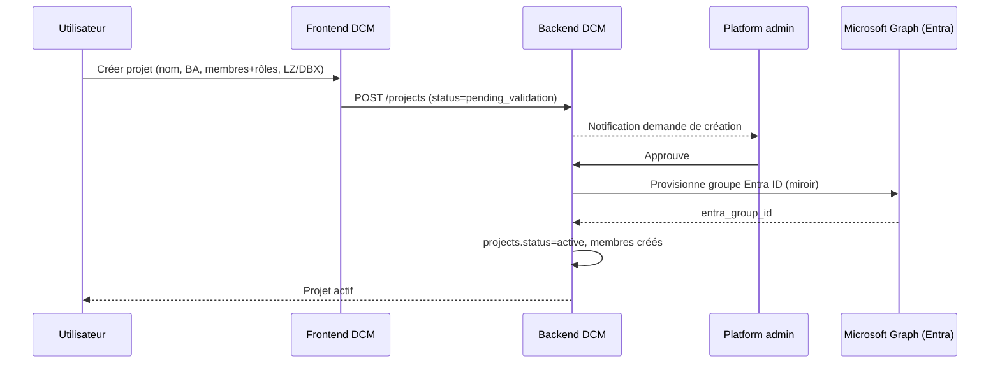
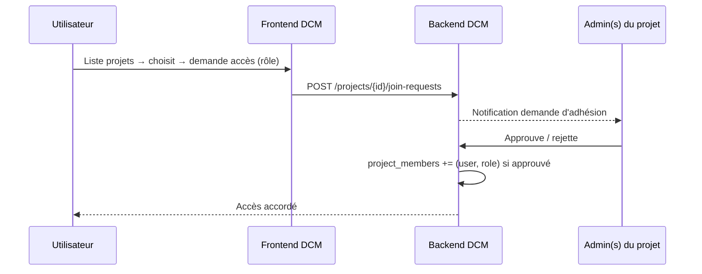
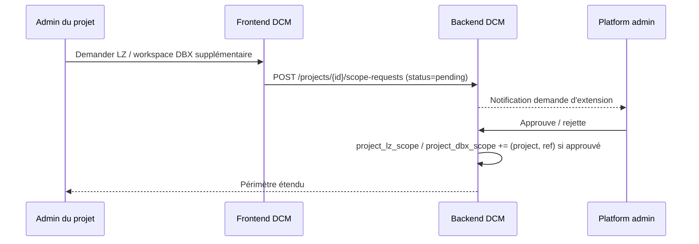

# Spike — Gouvernance des groupes d'accès DCM (modèle « projet »)

> **Statut :** spike / design — non implémenté.
> **Branche :** `spike/access_groupe_strategy`
> **Objectif :** faire évoluer l'autorisation DCM d'un modèle **plat / global** vers un modèle **multi-tenant scopé par projet**, avec self-service d'enregistrement.

> **📑 Deux variantes documentées — lire d'abord la comparaison :**
> - **[ADR-0001-access-governance.md](./ADR-0001-access-governance.md)** — décision + analyse comparée des 2 approches (à lire en premier).
> - **Ce fichier = V1** — un **groupe Entra ID par projet** (miroir provisionné via Graph).
> - **[README-v2-single-entra-group.md](./README-v2-single-entra-group.md)** — V2 : **un seul groupe Entra** (gate d'auth), autorisation 100 % interne DCM.

---

## 1. Problème

Aujourd'hui l'autorisation DCM est **plate et globale** :

- Un **rôle unique global** par utilisateur (`viewer` / `data_architect` / `manager` / `admin` / `super_admin`) — voir `packages/dcm-backend/app/auth/role_permissions.py`.
- L'accès aux Landing Zones = **liste plate** `dcm_user_lz_access`, filtrée en SQL sur `source_lz_id`.
- `admin` / `super_admin` = **toutes les LZ**, sans restriction.
- **Aucune** notion de projet / équipe, **aucun** scope au niveau workspace Databricks, l'administration est **globale** (super_admin unique).

Ce modèle ne passe pas à l'échelle quand plusieurs équipes/projets veulent auto-gérer leur périmètre.

## 2. Cible — modèle « projet »

Un **projet** = une unité de gouvernance regroupant :

- un ou plusieurs **utilisateurs** avec un rôle **scopé au projet** (`viewer` ou `admin`),
- un ou plusieurs périmètres **Landing Zone** et/ou **workspace Databricks** à monitorer,
- un **groupe Entra ID miroir** provisionné en aval.

Rôles **dans** un projet :

| Rôle projet | Droits |
|-------------|--------|
| `viewer` | Accès lecture aux pages DCM sur les LZ / workspaces DBX du projet |
| `admin` | `viewer` + gestion des membres et de leurs rôles + demande d'extension de périmètre (LZ / workspace DBX) |

Un utilisateur peut appartenir à **plusieurs projets** (rôle potentiellement différent par projet).

### Deux parcours d'enregistrement

1. **Créer un nouveau projet** — inputs : nom du projet, Business Application de rattachement, membres + rôles, LZ et/ou workspaces DBX à monitorer.
   → après **validation par un platform_admin**, un **groupe Entra ID** est provisionné (miroir).
2. **Rejoindre un projet existant** — l'utilisateur choisit un projet dans la liste et demande l'accès (rôle demandé).
   → la demande est routée vers les **admins du projet** pour approbation.

## 3. Décisions verrouillées (spike)

| # | Sujet | Décision |
|---|-------|----------|
| 1 | Granularité du scope | **LZ entière ET workspace DBX** (les deux dimensions coexistent) |
| 2 | Rôle du groupe Entra ID | **Miroir** — la table DCM est la **source de vérité**, Entra est provisionné en aval |
| 3 | Chevauchement de périmètre | **Autorisé** — une même LZ peut être partagée par plusieurs projets |
| 4 | Rôle plateforme | **Conservé** — `super_admin` (platform_admin) reste au-dessus des projets |
| 5 | Validation de création | **Par platform_admin** (`super_admin`) |
| 6 | Rôles projet | **2 niveaux** : `viewer` / `admin` |

## 4. Modèle de données proposé

```text
projects
  id              (pk)
  name
  business_app_id           -- rattachement à une Business Application (référentiel groupe)
  status                    -- pending_validation | active | archived
  entra_group_id            -- miroir (nullable tant que non provisionné)
  created_by                -- user_id demandeur
  created_at / updated_at

project_lz_scope
  project_id (fk) , lz_id           -- périmètre Landing Zone

project_dbx_scope
  project_id (fk) , workspace_id    -- périmètre workspace Databricks

project_members
  project_id (fk) , user_id
  role                      -- viewer | admin (scopé projet)
  added_by , added_at

project_join_request
  id (pk)
  project_id (fk) , user_id
  requested_role            -- viewer | admin
  status                    -- pending | approved | rejected
  decided_by , decided_at
```

Impacts sur l'existant :

- Le **rôle global** de l'utilisateur est réduit à un `platform_role` : `user` | `super_admin` (platform_admin).
  Tout le reste devient **scopé projet** via `project_members`.
- `get_allowed_lz_ids()` (dans `app/auth/dependencies.py`) devient `get_allowed_scope(user)` =
  **union** des LZ **et** workspaces DBX sur tous les projets où l'utilisateur est **membre actif**.
- Le filtrage SQL métier ajoute une dimension **workspace DBX** en plus de `source_lz_id`.
- Les routes d'administration passent d'un modèle « super_admin global » à un modèle **à deux étages** :
  - **platform_admin** : valider les créations de projet, gérer le référentiel des LZ/workspaces enregistrables, tout voir.
  - **project admin** : gérer membres/rôles et demander l'extension de périmètre **de son projet uniquement**.

## 5. Flux — création de projet



## 6. Flux — rejoindre un projet



## 6bis. Flux — étendre le périmètre d'un projet

Un **admin du projet** demande une nouvelle LZ ou un nouveau workspace DBX ;
la demande est **validée par un platform_admin** (même contrôle que la création).



## 7. Points sécurité à valider

- **Privilège Graph `Group.Create` / membership** : l'identité DCM qui provisionne les groupes Entra doit disposer d'un privilège sensible → à faire valider par la sécurité groupe. Périmètre minimal, provisioning en aval uniquement.
- **Source de vérité unique** : la table DCM fait foi ; le groupe Entra est un miroir. Réconciliation et règles de conflit détaillées en §8 (DCM gagne toujours).
- **Business Application** : rattacher le projet à une **BA existante** du référentiel groupe (pas de texte libre) → dédup + gouvernance.
- **Isolation des project admins** : un admin de projet ne doit **jamais** pouvoir agir sur un autre projet ni élargir seul son périmètre. Toute **extension de périmètre** (nouvelle LZ / workspace DBX) passe par une demande `dcm_project_scope_requests` **validée par un platform_admin** (même contrôle que la création de projet).
- **Chevauchement de LZ** : documenter que deux projets partageant une LZ voient les **mêmes** données de cette LZ.

## 8. Réconciliation Entra ↔ DCM (job de drift) — recommandations

> Rappel décision 2 : **table DCM = source de vérité**, groupe Entra = **miroir**.
> Corollaire : en cas de divergence, **DCM gagne toujours** ; la réconciliation
> pousse l'état DCM → Entra, jamais l'inverse (sauf suppression, cf. règles).

### 8.1 Modèle de propagation (2 niveaux)

1. **Event-driven (chemin nominal, quasi temps réel)** — à chaque écriture DCM
   qui modifie l'appartenance (`project_members` ajout/retrait, activation/
   archivage projet, changement de rôle sans impact Entra), publier une tâche
   idempotente qui synchronise le groupe Entra correspondant via Graph.
   → couvre 99 % des cas immédiatement, sans attendre le batch.
2. **Batch de réconciliation (filet de sécurité)** — balayage périodique qui
   compare l'état désiré (DCM) à l'état réel (Entra) et corrige les écarts que
   l'event-driven aurait manqués (échec Graph transitoire, modif hors DCM).

### 8.2 Périodicité recommandée

| Déclencheur | Fréquence | Rôle |
|-------------|-----------|------|
| Event-driven (sur écriture) | immédiat | propagation nominale |
| Batch incrémental | **toutes les 15 min** | rattrape les events échoués |
| Batch complet (full sweep) | **1×/jour** (heure creuse) | détecte le drift silencieux (modif Entra hors DCM) |
| Audit-only (rapport, sans correction) | **1×/semaine** | revue gouvernance / preuve conformité |

### 8.3 Règles de résolution de conflit

| Écart détecté | Résolution |
|---------------|-----------|
| Membre dans DCM, absent d'Entra | **Ajouter** au groupe Entra |
| Membre dans Entra, absent de DCM | **Retirer** d'Entra (DCM fait foi) — sauf comptes de service listés en allow-list |
| Groupe Entra manquant pour projet `active` | **Recréer** le groupe, re-mapper `entra_group_id` |
| Groupe Entra orphelin (projet `archived`/supprimé) | **Marquer**, ne pas supprimer automatiquement → validation platform_admin (soft-delete) |
| `entra_group_id` DCM pointe vers un groupe inexistant | Reprovisionner + logguer une anomalie |

**Garde-fous obligatoires :**

- **Idempotence** : toute opération de sync rejouable sans effet de bord.
- **Circuit-breaker de suppression en masse** : si un run veut retirer plus de
  N membres ou supprimer un groupe entier (> seuil, ex. 20 % du groupe), **ne pas
  exécuter** — mettre en quarantaine et alerter un platform_admin. Empêche qu'un
  bug/DDL corrompu ne vide des groupes réels.
- **Allow-list de comptes de service** : identités techniques présentes dans Entra
  mais pas gérées par DCM → jamais retirées.
- **Audit systématique** : chaque correction écrit dans `dcm_audit_log`
  (acteur = `system:entra-reconciler`, before/after) — traçabilité conformité.
- **Réconciliation en lecture seule d'abord** : livrer le mode *audit-only*
  (détecte + rapporte sans corriger) avant d'activer les corrections auto.

### 8.4 Implémentation suggérée

Job Databricks planifié (cohérent avec le reste de la plateforme) ou tâche
asynchrone backend. Clé de corrélation = `dcm_projects.entra_group_id`.
Stocker le dernier run + écarts détectés pour observabilité (table
`dcm_entra_reconciliation_runs` à prévoir).

## 9. Questions restantes / hors spike

- Migration des utilisateurs existants (modèle plat) vers des projets par défaut.
- Rétrocompat de `role_permissions` / matrice frontend (`role-access.ts`) avec le nouveau `platform_role` + rôle projet.

## 10. Prototype (spike)

Artefacts non câblés, pour arbitrage :

- [`ddl.sql`](./ddl.sql) — DDL Delta des 5 tables projet (conventions `our_catalogs_spn.py`).
- [`project_scope_prototype.py`](./project_scope_prototype.py) — `AllowedScope`,
  `get_allowed_scope()` (union LZ + workspace DBX sur projets actifs) et
  `is_project_admin()` (garde projet-scopé remplaçant `require_role` global).

Application au filtrage métier (esquisse) : là où le code fait aujourd'hui
`WHERE source_lz_id IN (:lz_ids)`, il faudra combiner les deux dimensions, ex.

```sql
WHERE (:unrestricted OR source_lz_id IN (:lz_ids) OR workspace_id IN (:workspace_ids))
```

et gérer le cas `scope.is_empty` (0 projet actif → 403 / vue vide) explicitement.

## 11. Prochaine étape

Si le design est validé → formaliser en spec-kit DCM (`/speckit.dcm.specify`) sur cette branche spike, puis découper en tasks par domaine (Backend / Frontend / DataEng).
