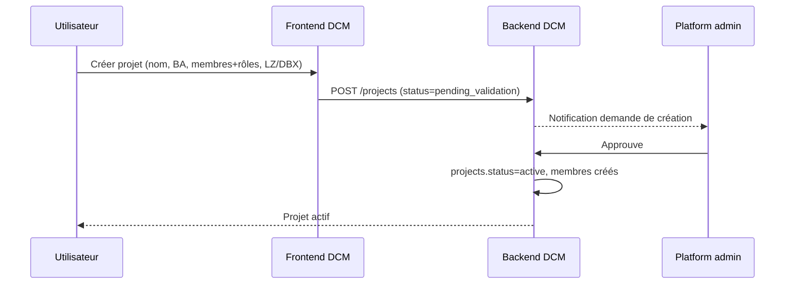
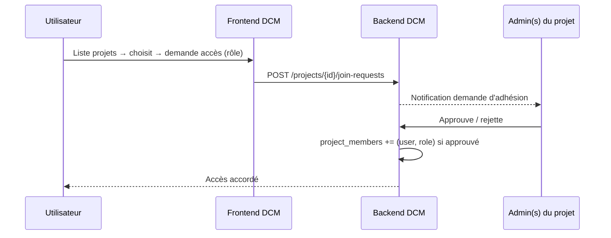
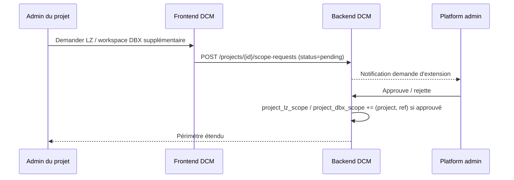

# Spike V2 — Gouvernance des accès DCM (groupe Entra **unique**)

> **Statut :** **Validé (Design Authority, 2026-08-21)** — go V2. Non implémenté : reste à formaliser en spec-kit (§11).
> **Branche :** `spike/access_groupe_strategy`
> **Objectif :** faire évoluer l'autorisation DCM d'un modèle **plat / global** vers un modèle **multi-tenant scopé par projet**, avec self-service d'enregistrement.

> **📑 Deux variantes documentées — voir la comparaison dédiée :**
> - **[ADR-0001-access-governance.md](./ADR-0001-access-governance.md)** — décision + analyse comparée des 2 approches.
> - **[README.md](./README.md)** — V1 : un **groupe Entra ID par projet** (miroir provisionné via Graph).
> - **Ce fichier = V2** — **un seul groupe Entra** (`DCM-Users`) sert de gate d'authentification ; l'autorisation vit 100 % dans les tables DCM.

---

## 1. Problème

Aujourd'hui l'autorisation DCM est **plate et globale** :

- Un **rôle unique global** par utilisateur (`viewer` / `data_architect` / `manager` / `admin` / `super_admin`) — voir `packages/dcm-backend/app/auth/role_permissions.py`.
- L'accès aux Landing Zones = **liste plate** `dcm_user_lz_access`, filtrée en SQL sur `source_lz_id`.
- `admin` / `super_admin` = **toutes les LZ**, sans restriction.
- **Aucune** notion de projet / équipe, **aucun** scope au niveau workspace Databricks, l'administration est **globale** (super_admin unique).

Ce modèle ne passe pas à l'échelle quand plusieurs équipes/projets veulent auto-gérer leur périmètre.

## 2. Cible — modèle « projet »

Un **projet** = une unité de gouvernance regroupant :

- un ou plusieurs **utilisateurs** avec un rôle **scopé au projet** (`viewer` ou `admin`),
- un ou plusieurs périmètres **Landing Zone** et/ou **workspace Databricks** à monitorer.

L'appartenance à un projet est portée **exclusivement par les tables DCM** (« groupes internes »).
Microsoft Entra ID n'intervient que via **un groupe unique `DCM-Users`** qui sert de **gate
d'authentification** : y appartenir = avoir le droit d'ouvrir DCM. Toute l'autorisation
applicative (pages, LZ, workspace DBX, gestion) est décidée par DCM.

```text
Entra ID : 1 groupe "DCM-Users"   →  peut-on ENTRER dans DCM ? (auth, app assignment)
      │ JWT
      ▼
Tables DCM (source de vérité)     →  QUOI voir / gérer ? (projets, rôles, périmètres)
```

Rôles **dans** un projet :

| Rôle projet | Droits |
|-------------|--------|
| `viewer` | Accès lecture aux pages DCM sur les LZ / workspaces DBX du projet |
| `admin` | `viewer` + gestion des membres et de leurs rôles + demande d'extension de périmètre (LZ / workspace DBX) |

Un utilisateur peut appartenir à **plusieurs projets** (rôle potentiellement différent par projet).

### Deux parcours d'enregistrement

1. **Créer un nouveau projet** — inputs : nom du projet, Business Application de rattachement, membres + rôles, LZ et/ou workspaces DBX à monitorer.
   → après **validation par un platform_admin**, le projet passe `active` (aucun provisioning Entra).
2. **Rejoindre un projet existant** — l'utilisateur choisit un projet dans la liste et demande l'accès (rôle demandé).
   → la demande est routée vers les **admins du projet** pour approbation.

## 3. Décisions verrouillées (spike)

| # | Sujet | Décision |
|---|-------|----------|
| 1 | Granularité du scope | **LZ entière ET workspace DBX** (les deux dimensions coexistent) |
| 2 | Rôle du groupe Entra ID | **Groupe unique `DCM-Users`** = gate d'authentification ; autorisation 100 % interne DCM |
| 3 | Chevauchement de périmètre | **Autorisé** — une même LZ peut être partagée par plusieurs projets |
| 4 | Rôle plateforme | **Conservé** — `super_admin` (platform_admin) reste au-dessus des projets |
| 5 | Validation de création | **Par platform_admin** (`super_admin`) |
| 6 | Rôles projet | **2 niveaux** : `viewer` / `admin` |

## 4. Modèle de données proposé

```text
projects
  id              (pk)                    -- = business_app_id (projet ≡ Business Application, 1:1)
  name                                    -- par défaut = ba_name
  business_app_id           -- référence Business Application (référentiel groupe) ; = id
  status                    -- pending_validation | active | archived
  entra_group_id            -- toujours NULL en V2 ; réservé à une option future (provisioning par projet)
  created_by                -- user_id demandeur
  created_at / updated_at

project_lz_scope
  project_id (fk) , lz_id           -- périmètre Landing Zone

project_dbx_scope
  project_id (fk) , workspace_id    -- périmètre workspace Databricks

project_members
  project_id (fk) , user_id
  role                      -- viewer | admin (scopé projet)
  added_by , added_at

project_join_request
  id (pk)
  project_id (fk) , user_id
  requested_role            -- viewer | admin
  status                    -- pending | approved | rejected
  decided_by , decided_at
```

Impacts sur l'existant :

- Le **rôle global** de l'utilisateur est réduit à un `platform_role` : `user` | `super_admin` (platform_admin).
  Tout le reste devient **scopé projet** via `project_members`.
- `get_allowed_lz_ids()` (dans `app/auth/dependencies.py`) devient `get_allowed_scope(user)` =
  **union** des LZ **et** workspaces DBX sur tous les projets où l'utilisateur est **membre actif**.
- Le filtrage SQL métier ajoute une dimension **workspace DBX** en plus de `source_lz_id`.
- Les routes d'administration passent d'un modèle « super_admin global » à un modèle **à deux étages** :
  - **platform_admin** : valider les créations de projet, gérer le référentiel des LZ/workspaces enregistrables, tout voir.
  - **project admin** : gérer membres/rôles et demander l'extension de périmètre **de son projet uniquement**.

## 5. Flux — création de projet



## 6. Flux — rejoindre un projet



## 6bis. Flux — étendre le périmètre d'un projet

Un **admin du projet** demande une nouvelle LZ ou un nouveau workspace DBX ;
la demande est **validée par un platform_admin** (même contrôle que la création).



## 7. Points sécurité à valider

- **Gate d'authentification** : l'appartenance au groupe unique `DCM-Users` (claim JWT) est **obligatoire** avant toute autorisation applicative. Un compte retiré du groupe perd l'accès dès le login suivant.
- **Source de vérité unique** : les tables DCM font foi pour toute l'autorisation ; aucun miroir Entra à maintenir → **pas de divergence possible** par construction.
- **Aucun privilège Graph élevé** : l'identité DCM n'a besoin d'aucun droit `Group.Create` / gestion de membership → surface d'attaque réduite.
- **Business Application** : rattacher le projet à une **BA existante** du référentiel groupe (pas de texte libre) → dédup + gouvernance.
- **Isolation des project admins** : un admin de projet ne doit **jamais** pouvoir agir sur un autre projet ni élargir seul son périmètre. Toute **extension de périmètre** (nouvelle LZ / workspace DBX) passe par une demande `dcm_project_scope_requests` **validée par un platform_admin** (même contrôle que la création de projet).
- **Chevauchement de LZ** : documenter que deux projets partageant une LZ voient les **mêmes** données de cette LZ.

## 7bis. Dernier admin d'un projet

**Risque** : le dernier `admin` d'un projet quitte l'entreprise (retiré de `DCM-Users`) ou perd son
rôle — plus personne ne peut alors approuver les demandes d'adhésion, gérer les membres ou
étendre le périmètre de **ce projet précis**.

Aucun blocage technique : un **platform_admin** peut déjà reprendre la main sur n'importe quel
projet (décision #4, §3) — création de membres, changement de rôle, extension de périmètre.
Le sujet est donc uniquement **préventif** (éviter l'orphelinat, pas le débloquer après coup).

**Garde-fou proposé** : interdire, au niveau applicatif, toute action qui laisserait un projet
`active` sans **aucun** `admin` dans `project_members` — que ce soit un **auto-retrait**
(l'admin se retire lui-même du projet) ou une **rétrogradation/suppression** d'un autre membre
admin par un pair. Concrètement, l'API rejette (409) la dernière suppression/rétrogradation
`admin → viewer` ou `admin → retiré` tant qu'aucun autre `admin` actif n'existe sur le projet ;
il faut d'abord promouvoir un autre membre en `admin`, ou passer par un platform_admin (qui, lui,
reste toujours habilité à agir malgré ce garde-fou).

## 8. Onboarding & gestion du groupe `DCM-Users`

Le groupe unique est géré **hors du chemin critique DCM** — aucune écriture Graph par l'application.

- **Provisioning en amont (IAM)** : l'ajout d'un utilisateur au groupe `DCM-Users` suit la
  gouvernance Entra standard du groupe (revue d'accès, Conditional Access global, break-glass).
- **Auto-provisioning `pending`** : le mécanisme existant (`_load_dcm_user` dans
  `app/auth/dependencies.py`) crée déjà un utilisateur `pending` au premier login, en attente
  d'approbation. V2 réutilise ce chemin — aucun code de provisioning de groupe à écrire.
- **Révocation** : retirer un compte de `DCM-Users` coupe l'accès applicatif ; la désactivation
  fine (par projet) reste gérée dans DCM (`project_members`, `platform_role`).

## 9. Questions restantes / hors spike

- Migration des utilisateurs existants (modèle plat) vers des projets par défaut.
- Rétrocompat de `role_permissions` / matrice frontend (`role-access.ts`) avec le nouveau `platform_role` + rôle projet.

## 10. Prototype (spike)

Artefacts non câblés, pour arbitrage :

- [`ddl.sql`](./ddl.sql) — DDL Delta des 5 tables projet (conventions `our_catalogs_spn.py`).
- [`project_scope_prototype.py`](./project_scope_prototype.py) — `AllowedScope`,
  `get_allowed_scope()` (union LZ + workspace DBX sur projets actifs) et
  `is_project_admin()` (garde projet-scopé remplaçant `require_role` global).

Application au filtrage métier (esquisse) : là où le code fait aujourd'hui
`WHERE source_lz_id IN (:lz_ids)`, il faudra combiner les deux dimensions, ex.

```sql
WHERE (:unrestricted OR source_lz_id IN (:lz_ids) OR workspace_id IN (:workspace_ids))
```

et gérer le cas `scope.is_empty` (0 projet actif → 403 / vue vide) explicitement.

## 11. Prochaine étape

Design validé (Design Authority, 2026-08-21) → formaliser en spec-kit DCM (`/speckit.dcm.specify`) sur cette branche spike, puis découper en tasks par domaine (Backend / Frontend / DataEng).
