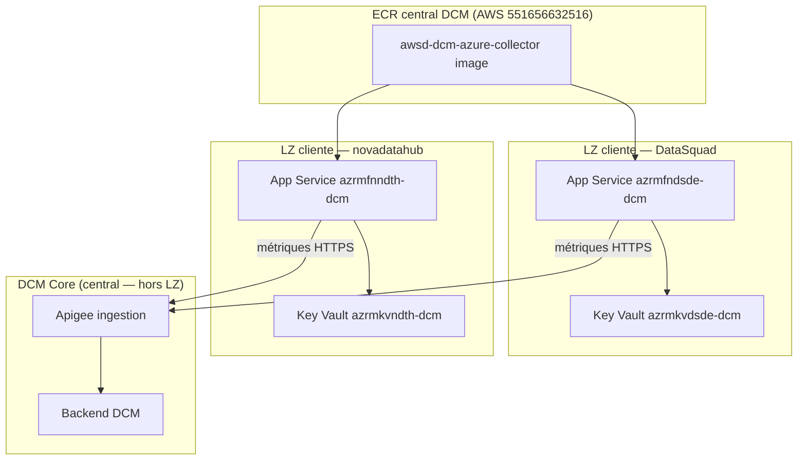

# Architecture — Où tourne le collector ?

## Règle d’or

Le collector tourne sur l’**App Service** créé par le Building Block (`azr<env>fn<app>-dcm`), dans la **subscription de la LZ cliente** (DataSquad, novadatahub, ou toute autre LZ — même modèle).

**Pas d’ACI** — le déploiement ACI `dcm-azure-collector-dev` était une erreur de workflow (supprimé).

## Schéma

## Registry central (AWS ECR, pas ACR Azure)

Décision archi (Jocelyn) : **toutes** les images collectors (AWS et Azure) sont dans l’**ECR DCM sur AWS** — pas dans l’ACR DataSquad (`azrmcrdsde04`).

- Compte AWS **dev** : `551656632516` (awss-wl-dcm)
- Compte AWS **prod** : `884068385310` (awsp-dcm)
- Registry dev : `551656632516.dkr.ecr.eu-central-1.amazonaws.com`
- Registry prod : `884068385310.dkr.ecr.eu-central-1.amazonaws.com`
- Repo dev : `awsd-dcm-azure-collector` (défaut workflow)
- Le BB **ne crée pas** de registry dans la LZ cliente
- L’App Service Azure pull l’image ECR avec identifiants registry (user `AWS` + token ECR), pas AcrPull / MI ACR

## LZ clientes — un même modèle

DataSquad et novadatahub sont **toutes deux des LZ clientes**. Même pipeline, même ECR, même workflows.

| | **DataSquad** | **novadatahub** |
|--|---------------|-----------------|
| **Statut** | LZ cliente | LZ cliente |
| **App Service** | `azrmfndsde-dcm` | `azrmfnndth-dcm` |
| **Subscription** | `sub-iasp-lz-DataSquad` | `sub-iasp-lz-novadatahub` |
| **Infra** | BB `azr-iac-bb-dataint-dcm` + satellite BASK | Idem |
| **Image** | ECR central `551656632516` | Même ECR |
| **Deploy key** | `datasquad-d` | `novadatahub-m` |
| **Workflow deploy** | `dcm-azure-collector-deploy-lz.yml` | `dcm-azure-collector-deploy-lz.yml` |
| **Workflow CI push** | `dcm-azure-collector.yml` (partagé) | `dcm-azure-collector.yml` (partagé) |

**Séparation des rôles :**
- **BB Terraform** → coquille infra (RG, KV, App Service vide, subnet, MI)
- **CI dataint-dcm-app** → build/push image ECR + `container set` sur App Service

## Repos

| Repo | Rôle |
|------|------|
| `azr-iac-bb-dataint-dcm` | Building Block Terraform (KV + App Service) — **pas d’ACR dans la LZ** |
| `BA-{LZ}-Infrastructure` | Satellite BASK `DataintDCM/ClientInfra` (ex. DataSquad-infra, BA-NOVADATAHUB-Infrastructure) |
| `dataint-dcm-app` | Code Python collector + workflows CI/CD (push ECR + deploy) |
| `BA-Data-Connect-Monitoring-infra` | DCM Core AWS — **pas** l’infra collector client |

Modèle IaC satellite (copier le pattern) : [DataSquad-infra DataintDCM/ClientInfra](https://github.com/TotalEnergiesCode/DataSquad-infra/tree/main/Project/DataintDCM/ClientInfra) — le repo est un **exemple de code**, la subscription DataSquad reste une **LZ cliente**.

Guide BB : [installation.md](https://github.com/TotalEnergiesCode/azr-iac-bb-dataint-dcm/blob/main/installation.md)
