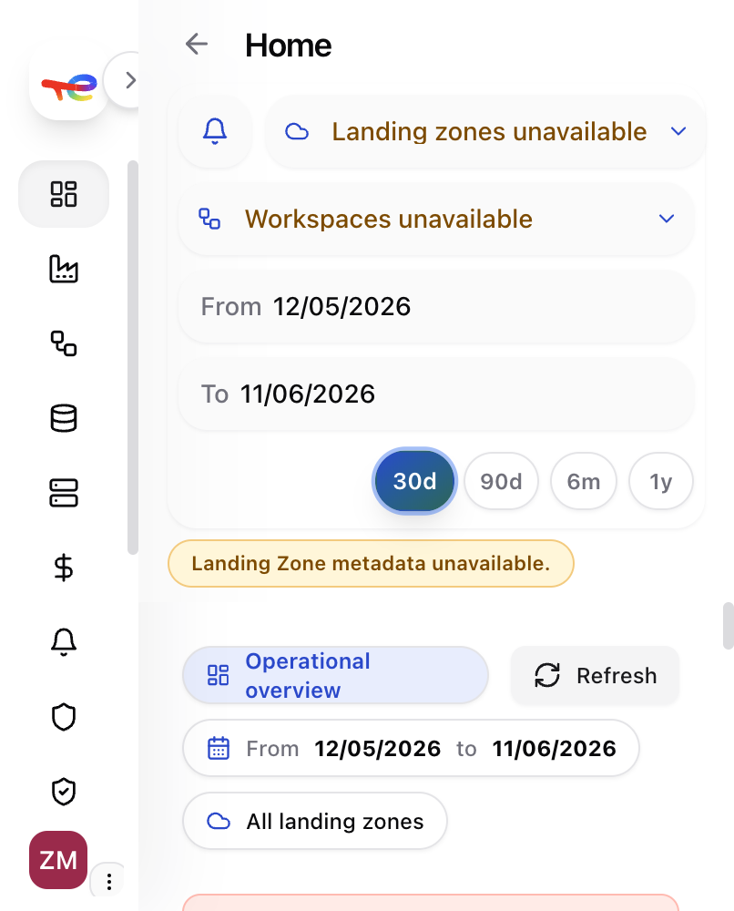
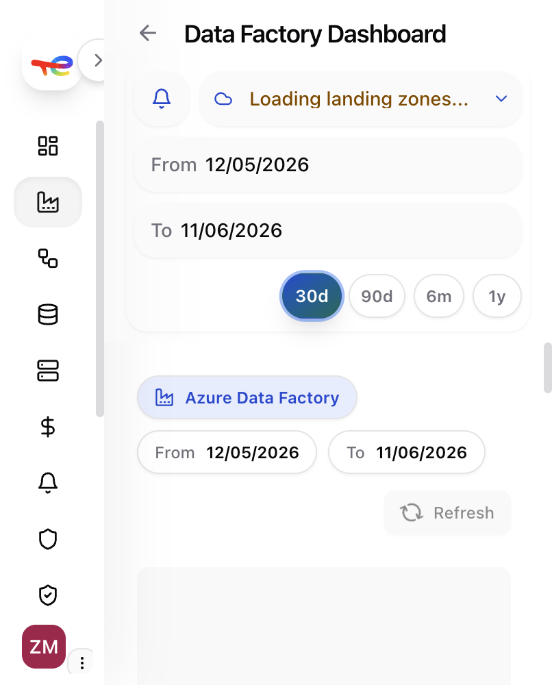
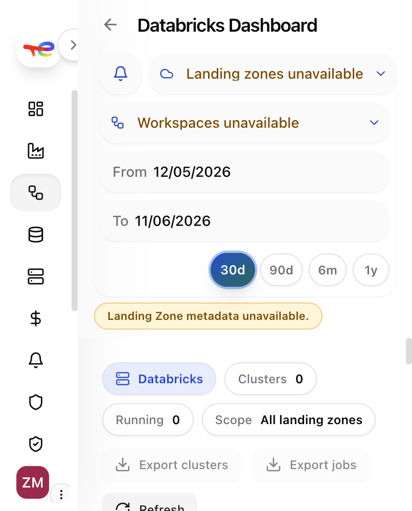
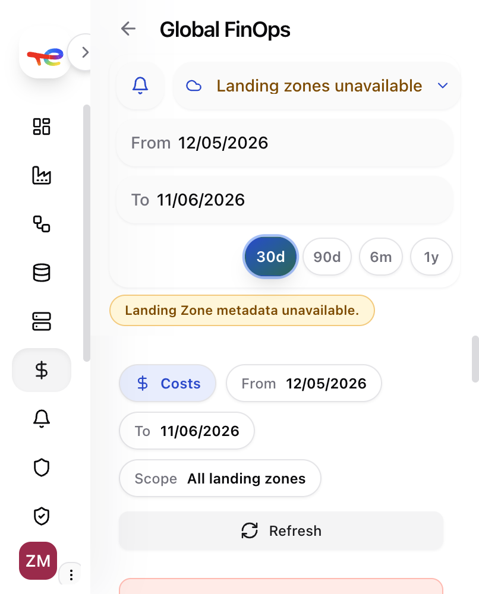
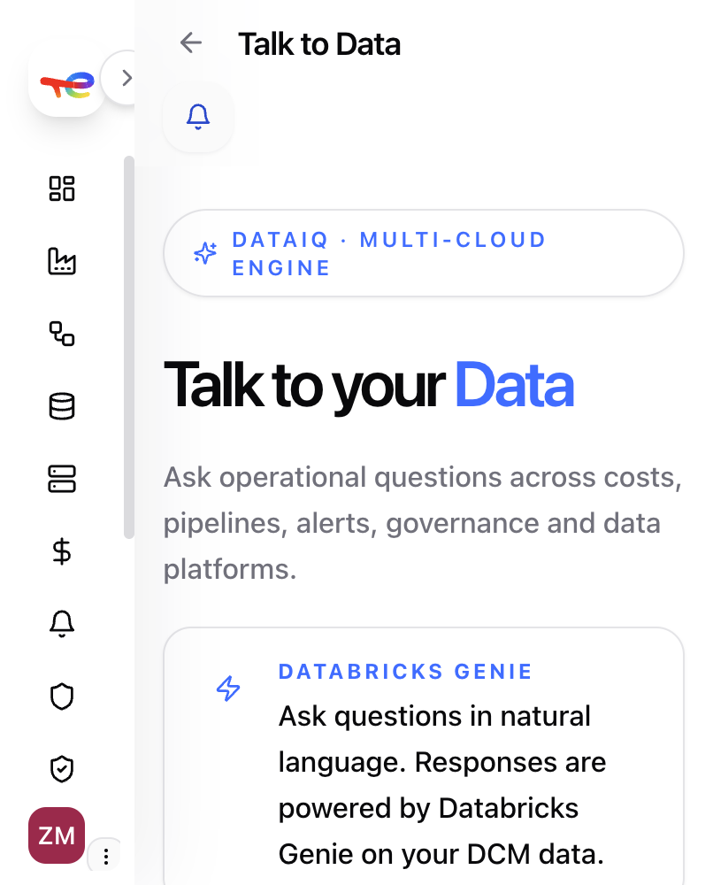
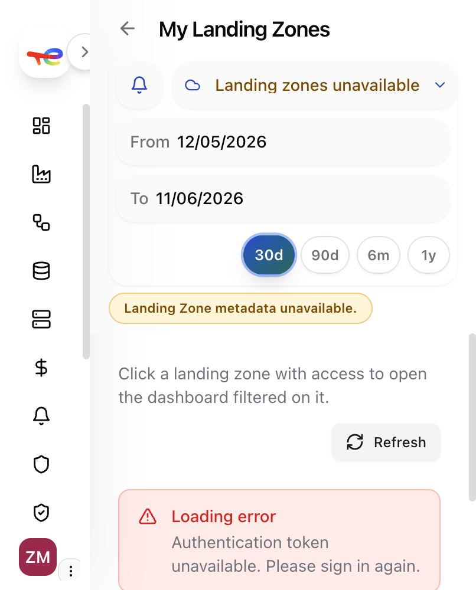
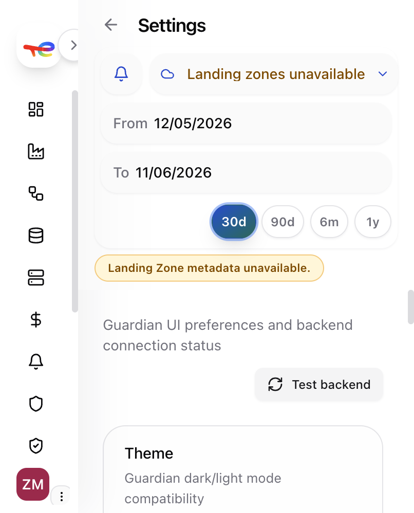
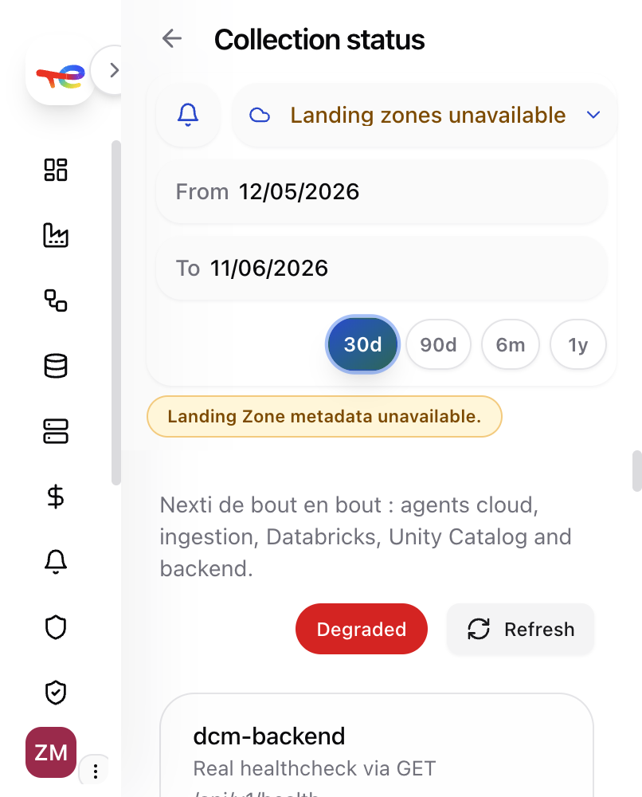

# Data connect — User Guide

**DCM Dashboard** · Multi-cloud observability (Azure + AWS)

---

## 1. What is Data connect?

Data connect is the web interface for **DCM (Data Connect Monitoring)**. It gives you a single place to monitor:

- Pipelines and data platforms (Azure Data Factory, Databricks, databases)
- Costs and FinOps
- Security alerts and governance checks
- User identities across clouds
- Data collection health

---

## 2. Sign in

| Environment | Behaviour |
|-------------|-----------|
| **Production** | Microsoft Entra ID (company SSO) |
| **Development** | Auth may be disabled — you land directly on the dashboard |

After sign-in you are redirected to **Home** (`/dashboard`).

---

## 3. Interface layout

Every page shares the same structure:

```
┌─────────────┬──────────────────────────────────────────┐
│  Sidebar    │  Header — filters, notifications, dates  │
│  (menu)     ├──────────────────────────────────────────┤
│             │  Page content                            │
└─────────────┴──────────────────────────────────────────┘
```

### Sidebar (left)

- Navigate between modules
- Expandable sections: **Data Factory**, **Databricks**, **Databases**
- Bottom: your avatar → **light/dark theme**, **Sign out**
- Collapse/expand with the arrow button (useful on smaller screens)

### Header (top)

Available on most pages:

| Control | Purpose |
|---------|---------|
| **Notifications** (bell) | Recent alerts |
| **Landing zone** | Filter data to one or more landing zones |
| **Databricks workspace** | Filter Databricks pages to specific workspaces |
| **Date range** | Start / end dates + presets **30d · 90d · 6m · 1y** |
| **Refresh** | Reload current page data |

> Global filters apply to all modules except **Talk to Data** and **Administration**.

---

## 4. Navigation map

| Menu item | What you see |
|-----------|--------------|
| **Home** | Cross-platform KPIs and quick links to modules |
| **Data Factory** | ADF pipelines, alerts, FinOps, governance |
| **Databricks** | Jobs, clusters, Unity Catalog, data product usage, reports |
| **Databases** | Azure/AWS databases — performance, alerts, costs, governance |
| **Clusters** | Compute clusters (EMR, etc.) |
| **Global FinOps** | Consolidated multi-cloud costs |
| **Global Alerts** | Alerts across all platforms |
| **Cloud security** | Security alerts |
| **Standard Checks** | Compliance / governance checks |
| **Users** | Identity inventory (Databricks, AWS IAM, Azure AD) |
| **My Landing Zones** | Your access rights + request access |
| **Talk to Data** | AI assistant (Databricks Genie) — natural language queries |
| **Collection status** | End-to-end data pipeline health |
| **Settings** | Theme, backend test, notification preferences |
| **Administration** | Super-admin only |

---

## 5. Key screens

### 5.1 Home

Operational overview for the selected period and landing zones. KPI cards link to detailed modules.



**Typical use:** start your day here — check health, then drill into a module.

---

### 5.2 Data Factory

Monitor Azure Data Factory pipelines, failures, costs, and governance.



Sub-pages (sidebar submenu):

- **Dashboard** — overview
- **Pipelines** — run history and failures
- **Alerts** — ADF-specific alerts
- **Costs & FinOps** — spend breakdown
- **Governance** — compliance checks

---

### 5.3 Databricks

Jobs, clusters, workspaces, Unity Catalog, and data product usage.



Use the **workspace filter** in the header to narrow results to one Databricks workspace.

Sub-pages:

- **Dashboard** · **Alerts** · **Costs & FinOps** · **Governance**
- **Unity Catalog** — catalog explorer
- **Data Product Usage** — consumption metrics
- **Monitoring Reports** — scheduled reports

---

### 5.4 Global FinOps

Multi-cloud cost view across Azure and AWS.



**Typical use:** compare spend by service, cloud provider, or landing zone over a period.

Module-specific FinOps pages also exist under Data Factory, Databricks, and Databases.

---

### 5.5 Talk to Data

Ask questions in plain English. Powered by **Databricks Genie** on your DCM data.



**Example questions:**

- *Compare my Azure and AWS costs for this month*
- *Which pipelines are failing?*
- *Analyze the security of my databases*
- *What is my governance score?*

Click **Open DataIQ** to start the chat. No date/landing-zone filters on this page.

---

### 5.6 My Landing Zones

See which landing zones you can access. Request access for zones you do not have.



**Workflow:**

1. Open **My Landing Zones**
2. Find a zone marked **denied** or without access
3. Click **Request access**
4. Wait for admin approval
5. Once granted, click the zone to open Home filtered on that LZ

---

### 5.7 Settings

UI preferences and backend connectivity.



| Section | Action |
|---------|--------|
| **Theme** | Toggle light / dark mode (saved in browser) |
| **Backend DCM** | Health status of `dcm-backend` |
| **Test backend** | Manual connectivity check |
| **Notifications** | Choose which alert domains appear in the bell |

---

### 5.8 Collection status

End-to-end health of the data collection chain:

`Cloud agents → Ingestion API → SQS → Databricks jobs → Unity Catalog → Backend → Frontend`



Use this page when data looks stale or pages show errors. Click **Refresh** to re-check.

---

## 6. Common workflows

### Monitor platform health

1. Go to **Home**
2. Set period (e.g. **30d**)
3. Select landing zone if needed
4. Click a module card for details

### Investigate costs

1. **Global FinOps** (or module FinOps page)
2. Adjust date range and landing zone
3. Explore by service / resource

### Triage alerts

1. **Global Alerts** or module alerts page
2. Filter by severity / status
3. Open alert detail

### Check who is inactive

1. **Users**
2. Look for users inactive **> 90 days** (highlighted in red)
3. Filter by identity type (Databricks, AWS IAM, Azure AD)

---

## 7. Notifications

- **Bell icon** (header) — recent alerts
- **Settings → Notifications** — choose domains and landing zones
- Critical security alerts always remain visible for your role

---

## 8. Roles

| Role | Access |
|------|--------|
| **Standard user** | Modules allowed by landing-zone scope |
| **Super admin** | All modules + **Administration** |

---

## 9. Troubleshooting

| Symptom | What to do |
|---------|------------|
| *Landing zones unavailable* | Backend down or no LZ metadata — check **Collection status** |
| *Workspaces unavailable* | Same for Databricks workspaces |
| *Loading latest view…* (stuck) | Click **Refresh**; check **Settings → Test backend** |
| *Authentication token unavailable* | Sign out and sign in again |
| Empty charts / tables | Widen date range; verify you have LZ access in **My Landing Zones** |
| **Degraded** on Collection status | Inspect component list; contact platform team if backend or Databricks is down |

---

## 10. Export to PDF

From the repo root:

```bash
# Option A — VS Code / Cursor: open this file → Print → Save as PDF

# Option B — pandoc (if installed)
pandoc packages/dcm-frontend/docs/user-guide/USER_GUIDE.md \
  -o packages/dcm-frontend/docs/user-guide/USER_GUIDE.pdf \
  --resource-path=packages/dcm-frontend/docs/user-guide

# Option C — npx (no install)
npx md-to-pdf packages/dcm-frontend/docs/user-guide/USER_GUIDE.md
```

---

*Generated from live screenshots — June 2026 · dcm-frontend*
